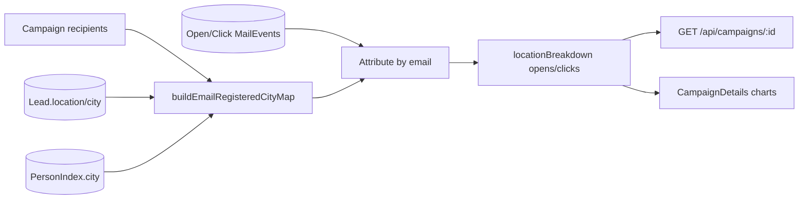

# Architecture

## Email campaign location analytics

- Per-campaign: `buildRegisteredLocationBreakdown(campaignId, recipients)` in `server/utils/campaignRegisteredLocation.js`.
- Cross-campaign: `buildCumulativeRegisteredLocationBreakdown(engagedEmails)` in `analyticsController.getCumulativeMetrics`.
- IP geo (`geoLookup.js`, `track.js`) unchanged for tracking; charts no longer use it for breakdown.
- Maintenance: `node server/scripts/rebuildCampaignLocationBreakdown.js <campaignId> [--prod]`; Resend sync: `backfillCampaignFromResend.js` then CRM rebuild.
