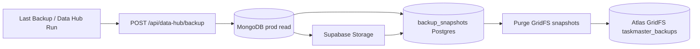
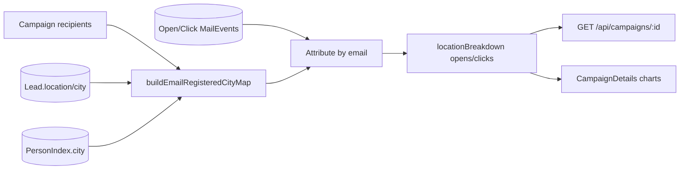

# Architecture

## Backup flow (Supabase primary)



- Default `BACKUP_DESTINATION=supabase` when `SUPABASE_*` configured.
- List backups: `GET /api/data-hub/backups` reads Supabase metadata first.
- Progress: in-memory `getBackupProgress()` polled at `GET /api/data-hub/backup/progress`.

## Supabase secondary store

```mermaid
flowchart LR
  mongo[(Mongo primary)]
  mirrors[post-save mirrors + cron sync]
  pg[(Supabase Postgres)]
  rollups[mail_event_tag_rollups / geo_rollups]
  mongo --> mirrors --> pg
  analytics[/api/analytics/cumulative] --> rollups
  rollups --> pg
```

- Schema: `server/supabase/schema.sql`
- Services: `server/services/supabase/*`
- Mongo not purged for logs/analytics until explicit user approval.

## Email campaign location analytics



- Per-campaign: `buildRegisteredLocationBreakdown(campaignId, recipients)` in `server/utils/campaignRegisteredLocation.js`.
- Cross-campaign: `buildCumulativeRegisteredLocationBreakdown(engagedEmails)` in `analyticsController.getCumulativeMetrics`.
- IP geo (`geoLookup.js`, `track.js`) unchanged for tracking; charts use CRM city.
