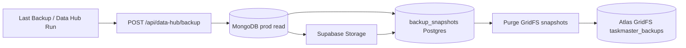
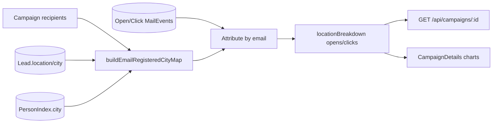

# Data Architecture

## Primary store: MongoDB Atlas

- **Production DB:** `taskmaster_production`
- **Local DB:** `taskmaster_local` (shared M0 cluster)
- **ODM:** Mongoose with `tenantPlugin` for multi-tenancy
- **72 models** — see [MASTER.md](../MASTER.md) §12 for full model list
- **Person spine:** `Person`, `PersonIdentifier`, `PersonHubView` — spec: `docs/DATA_MASTER_ARCHITECTURE.md`

---

## Secondary store: Supabase Postgres + Storage

MongoDB remains **primary**. Supabase offloads logs, audits, backup snapshots, and mail analytics rollups.

### Data streams

| Stream | Supabase table / bucket |
| --- | --- |
| Daily snapshots | `backup_snapshots`, `backup_files`, Storage bucket `taskmaster-backups` |
| App logs | `app_logs` |
| System logs | `system_logs` |
| CRM audits | `crm_audits` |
| XP / QA audits | `xp_audit_logs`, `qa_test_runs` |
| Mail rollups | `mail_event_tag_rollups`, `mail_geo_rollups` |
| CRM stat cache | `crm_stat_snapshots` |

### Key files

| Path | Role |
| --- | --- |
| `server/config/supabase.js` | Config, `isSupabaseEnabled()` |
| `server/supabase/schema.sql` | Postgres schema |
| `server/services/supabase/registerMirrors.js` | Mongoose post-save hooks |
| `server/services/supabase/syncService.js` | Batch sync logic |
| `server/services/supabase/restQuery.js` | PostgREST for Render (IPv4) |
| `server/workers/supabaseSyncWorker.js` | Background sync worker |

### Render IPv4 fix (2026-06-10)

- `db.*.supabase.co` direct Postgres is IPv6-only; Render outbound is IPv4
- **Fix:** `SUPABASE_PG_MODE=rest` on Render — metadata writes via PostgREST, storage uploads unchanged (HTTPS)
- Local/scripts: direct `SUPABASE_DB_URL` via `pg` pool

---

## Backup flow



- Default `BACKUP_DESTINATION=supabase` when `SUPABASE_*` configured
- **Admin widget:** Dashboard `Last Backup` + Data Hub toolbar **DB Backup**
- **Retention:** `BACKUP_RETENTION_COUNT` (default 2); Mongo GridFS cleared after each success
- **Cron:** Render `CoreKnot-daily-backup` or `npm run backup:daily`

### Backup scripts

```bash
npm run supabase:setup --prefix server
npm run supabase:migrate --prefix server
npm run supabase:health --prefix server
npm run backup:verify-supabase --prefix server
npm run backup:daily --prefix server
```

---

## Mongo → Postgres ETL (NestJS cutover)

Preview Supabase Postgres is filled from Mongo via `nestjs-server/scripts/etl/mongo-to-postgres.ts`.

| Script | Role |
| --- | --- |
| `npm run etl:preview` | Preview DB load (`run-preview-etl.js`) |
| `npm run etl:prod-cutover` | Production cutover runner |
| `nestjs-server/scripts/etl/validate-counts.ts` | Row-count parity vs `shared/etlCoverage.js` |
| `scripts/migrationReadiness.js` | End-to-end migration gate |
| `scripts/productionReadiness.js` | Prod env + upload smoke checks |
| `server/scripts/verifyLocalMigration.js` | Local Nest strangler readiness |

Coverage map: `shared/etlCoverage.js`. Topology: `docs/DATA_ENV_TOPOLOGY.md`, `docs/PREVIEW_SUPABASE_CUTOVER.md`.

---

## Email campaign location analytics

Charts use **registered CRM city** — not IP geo (email tracking geo is LOCKED separately).



| Source | Used for charts |
| --- | --- |
| `Lead.location` / `Lead.city` | Primary |
| `PersonIndex.city` | Fallback when no Lead row |
| MailEvent Open/Click | Counts only — city from CRM map, not event IP |

**Files:** `server/utils/campaignRegisteredLocation.js`, `RegisteredLocationBarChart` component

**Rebuild scripts:**
```bash
node server/scripts/rebuildCampaignLocationBreakdown.js <campaignId> [--dry-run] [--prod]
node server/scripts/backfillCampaignFromResend.js <campaignId> [--dry-run] [--prod]
```

---

## Data Hub inlets

Admin at `/admin` (`DataHubPage.jsx`). Inlets merge into unified person graph:

Exly, Leads, TSC/HolySheet, Booked Calls, Enquiries, Mail, Community, Artist Path, Newsletter, Outsourced

**Service:** `DataHubService.syncAllInlets()`  
**Scripts:** `reconcileDataHub.js`, `syncDataHubToProd.js`
