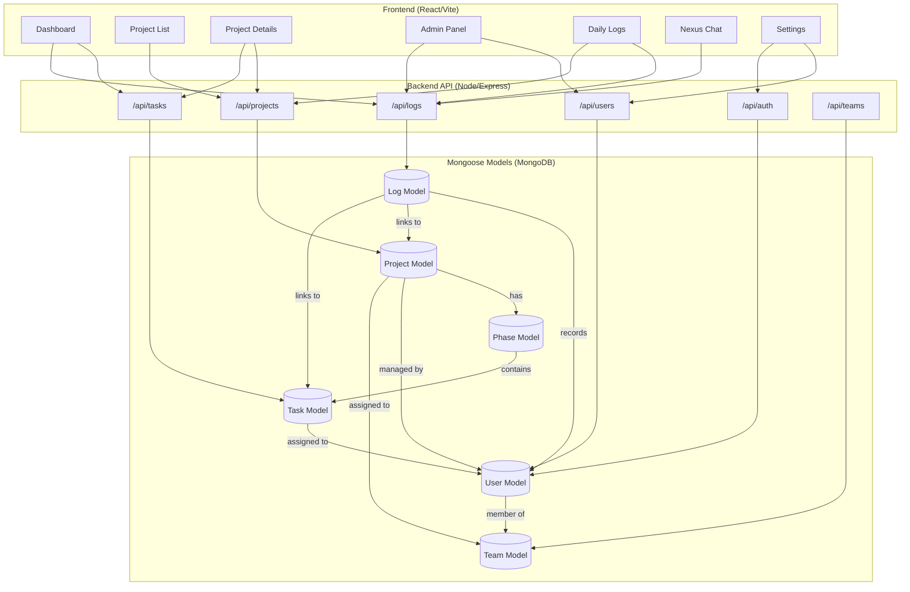

# Taskmaster: Enterprise Work Management

Taskmaster (formerly CoreKnot) is a premium, high-fidelity work orchestration platform designed for maximum operational clarity. It eliminates complexity through an "idiot-proof" interface, robust task automation, and a centralized administrative command center.


## 🚀 Key Features

- **Intuitive Dashboard**: A streamlined "Control Center" for tracking your projects and tasks without the jargon.
- **Dynamic Task Tracking**: Fluid transitions between Todo, Working, Review, and Done states with automatic progress rollups.
- **Daily Activity Logs**: Effortless time tracking and work logging with automated captures for every system event.
- **Admin Panel**: Centralized user management, team orchestration, and a live system activity feed.
- **Nexus Chat**: Real-time communication integrated directly with project workflows.
- **High-Fidelity UI**: Premium design system utilizing OKLCH colors, glassmorphism, and fluid Framer Motion animations.

## 🛠 Technology Stack

- **Frontend**: React 18, Vite, Tailwind CSS v4, Framer Motion, Lucide Icons.
- **Backend**: Node.js, Express, JWT Authentication.
- **Database**: MongoDB with Mongoose ODM.
- **Architecture**: RESTful API with automated logic rollups and activity logging.

## 🏗 System Architecture

Taskmaster follows a robust n-tier architecture connecting a reactive frontend to a persistent document-driven backend.

### Integrated System Graph



## 🏁 Getting Started

### Prerequisites
- **Node.js**: v16+
- **MongoDB**: Local instance running at `mongodb://localhost:27017/coreknot` (or update `.env`)

### Installation & Startup

1. **Backend Setup**:
   ```bash
   cd server
   npm install
   npm run dev
   ```
   *Server runs on http://localhost:5000*

2. **Frontend Setup**:
   ```bash
   cd client
   npm install
   npm run dev
   ```
   *Client runs on http://localhost:5173*

3. **Seeding (Optional)**:
   To populate the system with core team members and sample projects:
   ```bash
   cd server
   node seeder.js
   ```

## 🔐 Authentication & Access

### Default Admin Accounts (Password: 1234)
- `raghavraj@theshakticollective.in`
- `harshika@theshakticollective.in`
- `rohith@theshakticollective.in`
- `ops@theshakticollective.in`
- `atharva@theshakticollective.in`

### Debug Access
During development, a **DEBUG BYPASS** button is available on the login screen for immediate root admin access.

## 📂 Project Structure

```text
/server         - Node/Express API, Mongoose Models, Controllers
/client         - React/Vite/Tailwind v4 Frontend
/agentic_memory - AI-assisted project documentation and architecture maps
/crm            - Integrated HolySheet CRM modules
```

---
*Built with precision for The Shakti Collective.*
