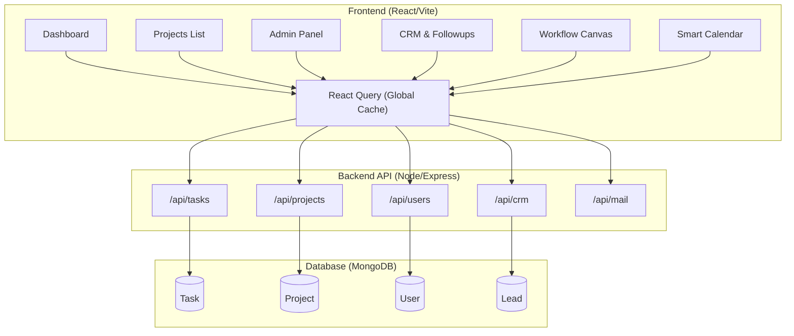

# Taskmaster v1.7.10

**Taskmaster** is a premium, high-density work management and CRM platform built for high-performance teams. It unifies complex project tracking, multi-channel real-time communication, and automated sales pipeline structures into a single, highly optimized operational workspace.

---

## 🚀 Key Features & Ecosystem Subsystems

### 1. Work & Project Management

* **Real-Time Productivity Dashboard:** Continuous live tracking of operational task metrics alongside rapid one-click execution states featuring a custom **10-second undo safety buffer**.
* **Multi-View Initatives Engine:** Native support for seamless visual switching between interactive tabular Lists, structured Kanban boards, and chronological Gantt charts. Includes automatic parent-child progress rollups throughout a deep, hierarchical architectural map: `Project` $\rightarrow$ `Phase` $\rightarrow$ `Task` $\rightarrow$ `Subtask`.
* **Visual Workflow Canvas:** Drag-and-drop structural node builder powered by React Flow, enabling complex internal business logic and operational flows to be visually modeled and executed.
* **Precision Daily Work Logging:** High-density timesheet logger containing direct project tagging filters and strict same-day data modification/deletion security rules.
* **Centralized Asset & Office Registry:** An organizational inventory layout tracking physical workplace hardware, software licensing, localized items, and direct access references to global VIP corporate contact lists.

### 2. Customer Relationship Management (CRM)

* **Master Data Cleaning Pipeline:** Automated data sanitization engine operating through custom script components (`import_ultimate_master.js` and `purge_nameless_emailless.js`). Conducts in-memory deduplication and parsing checks across **46,000+ lead records** to prevent duplicate key index collisions and clear out un-routable entries.
* **Advanced Multi-Tiered Funnel:** Granular lead state management tracking prospects across structured buckets (`New`, `Contacted`, `Warm`, `Hot`, `Converted`), with custom source attribute filters, bulk CSV upload streams, and real-time bidirectional synchronization links with external spreadsheet registers via HolySheet API.
* **Interactive Follow-up Schedule & Quick Complete:** Checkbox-driven inline completions inside table or modal layouts, updating planned pipelines instantly with automated timestamp logs and native date/time picker schema validation enforcement.
* **Persistent Interaction Stream:** Organized chronological timeline logs capturing sales representative remarks, custom interaction notes, and individual action items.
* **Proactive Visual Indicators:** Color-coded alert metrics highlighting overdue actions, paired with rep-specific dashboard view boundaries.
* **Role-Based Data Isolation (RBAC):** Built-in query security layer ensuring standard sales professionals are strictly confined to leads matching their assigned record metadata (`assignedRepId`), while organizational administrators retain full global visibility.
* **Team Load Distribution Routing:** Applies a **"Least-Loaded Representative"** routing algorithm to automatically calculate active team backlogs and assign newly arrived or uploaded leads evenly across sales departments.
* **Immutable CRM Audit Trails:** Dedicated ledger infrastructure powered by the `CRMAudit` collection, capturing field-level change history to ensure absolute transparency and strict accountability.

### 3. Marketing, Communications & Proxy Telemetry

* **Admin Auto-Mailer:** Complete broadcast control layout enabling designated administrators to create, test, distribute, and track mass mailing campaigns, handle global SMTP profile records, and analyze performance aggregates.
* **Proxy Link & Tracking Pixel Wrapper:** Automatically rewrites outbound campaign HTML content, generating unique 16-byte cryptographically random tokens to route link clicks through secure tracking proxies (`/api/track/click/:clickId`) and transparent 1x1 hidden image pixels (`/api/track/open/:pixelId.gif`).
* **Svix-Verified Callback Pipeline:** Deep integration with inbound Resend webhooks verified through strict cryptographic signature checks using the `svix` library to monitor open rates, link clicks, deliveries, and bounce events.
* **Anti-Spam Crawler Filters:** Integrated user-agent screening logic to evaluate incoming telemetry headers and exclude automated bot traffic (e.g., Microsoft Safelinks, Barracuda) from polluting real human engagement data.
* **Decoupled Unsubscribe Synchronization:** Manual synchronization routines (`POST /api/crm/sync-unsubscribed`) pulling opt-out logs from Google Sheets via HolySheet API, completely isolated from main server request loops.
* **Team Chat Subsystem:** Real-time channel-based internal messaging components supporting user mentions (`@user`), canvas space indexing, and deep task referencing.

### 4. Integrations & Extensibility

* **Smart Calendar Subsystem:** Persistent MongoDB-backed calendar layer supporting custom visibility boundaries (`Public` vs. `Private`) and bidirectional Google Calendar API OAuth2 synchronization.
* **Multi-Platform Artists Hub:** Analytics tracking dashboard designed to gather, normalize, and visualize live data feeds pulling directly from Spotify, YouTube, and Meta streaming APIs.
* **Exly Automation Bridge:** Custom webhook receiver designed to ingest registration lists, track unlinked bookings, and handle missing identity attributes by automatically checking incoming items against existing email or phone parameters.
* **Multi-Project Linked Assets Engine:** Shared reference asset repository supporting cloud storage references (Google Drive, Docs, Sheets, Slides, Meet, and external URLs) linked to multiple operational projects concurrently, complete with dynamic icon recognition and direct multi-account Google Workspace authentication shortcuts.
* **Compliance & Data Sovereignty:** Publicly accessible data transparency portals (`/privacy` and `/userdata`) fulfilling validation requirements mandated by Meta, Google, and GDPR frameworks.

---

## 🏗️ System Architecture & Data Flow

Taskmaster runs on a highly optimized MERN stack tailored for real-time responsiveness and enterprise-grade concurrency.

### Full System Map



### Data Linkage Logic

* **Project Hierarchy Mechanics:** Establishes precise document linkages connecting `Project` $\rightarrow$ `Phase` $\rightarrow$ `Task` with multi-level subtask nesting supporting complex tracking paths.
* **Role-Based Access Control (RBAC):** Strict driver-level query isolation separating `admin`, `sales`, and standard `user` permissions. Sales representatives are programmatically blocked from viewing or mutating records outside their assigned boundary.
* **Distributed Concurrency Locking:** Implements explicit, time-stamped ownership trackers (`lockedBy`, `lockedAt`) across high-frequency fields to prevent data overwrites or check-then-act collisions during multi-agent team editing.

---

## ⚡ Performance Optimization Layer

Taskmaster is engineered for speed, prioritizing minimal Time to Interactive (TTI) and zero layout shifts.

### 1. Smart Data Caching (React Query & Supabase)

* **Zero-Flicker Layout Rendering:** Global server state is handled via `@tanstack/react-query` configured with a 5-minute `staleTime` window, allowing immediate layout displays from memory cache while fetching silently in the background.
* **Optimistic UI Updates:** State mutations instantly rewrite local data layouts client-side using `queryClient.setQueryData()` prior to network query resolution, reducing perceived user interaction latency to 0ms.
* **Real-Time Edge Subscription Network:** Direct linkage to Supabase WebPush channels (`subscribeToChannel`) to broadcast mutation metrics across connected client screens instantly.

### 2. Backend Efficiency

* **Trigger.dev Task Offloading:** Heavy, long-running operational processes (such as bulk email dispatch loops, spreadsheet synchronization, and nightly metric rollups) are offloaded to background worker nodes via Trigger.dev, leaving the main Express event loop unblocked.
* **Lean Hydration Bypassing:** All read-only database tracking fetches employ Mongoose `.lean()`, bypassing heavy document serialization models to increase structural JSON payload response speeds by ~3-5x.
* **Strategic Database Indexing:** Highly queried database lookups (`userId`, `projectId`, `phone`, `email`, `campaignId`, and array fields like `recipients.messageId` and `recipients.email`) contain explicit unique or single-field database index configurations to drop collection scan costs down to an absolute minimum.
* **Gzip/Brotli Network Compression:** Compression middleware is globally active to minimize payload file sizes across JSON response networks.

### 3. Pro-Max Design Aesthetics

* **4px Modular Scale Grid:** Every spatial layout dimension, container boundary, padding, and margin parameter inside the Tailwind CSS architecture mathematically strictly adheres to a modular 4px grid scale.
* **Zero-Flash Theme Engine:** A blocking evaluation script sits at the application root level to interpret native OS dark-mode choices (`prefers-color-scheme`) prior to React client-side framework hydration, completely preventing visual flash artifacts.
* **High-Density Semantics Map:** Information architecture uses clean pastel color-encoding matrices (`Success`/`Warning`/`Danger`/`Info`) explicitly reserved for semantic data presentation, eliminating purely decorative styling artifacts.

---

## 🛠️ Getting Started

### Prerequisites

* **Node.js** (v18+)
* **MongoDB** (Local Community Edition instance or MongoDB Atlas Cloud Cluster)
* **Google Cloud Console Developer Credentials** (Required for Workspace Calendar OAuth2 synchronization)
* **Resend API Authorization Keys** (Required for automated broadcast workflows)
* **Supabase / UploadThing / Trigger.dev Client Keys** (For total ecosystem feature parity)

### Installation

1. **Clone & Setup Server Backend Environment**
```bash
git clone https://github.com/YOUR_ORG/Taskmaster.git
cd Taskmaster/server
npm install
cp .env.example .env # Configure MONGO_URI, JWT_SECRET, RESEND, etc.
npm run dev

```


2. **Setup Client Frontend Application**
```bash
cd ../client
npm install
npm run dev

```


3. **Initialize Database Sandbox Staging Environment (Optional)**
```bash
cd ../server
node seeder.js

```


---

## 📑 Version Changelog Release Ledger

### v1.7.10

* **Search Console & Analytics Integration:** Added Google Site Verification and GA4 tracking natively.
* **CRM Refinement:** Improved UI components for lead presentation and stabilized webhook telemetry structures.
* **Dependencies & Build:** Resolved React/Vite module resolution errors and trimmed deprecated options in jsconfig.

### v1.7.7

* **Metrics Concurrency Stabilization:** Resolved potential update data losses across tracking indicators using Mongoose atomic operators (`$inc` and `$set`) to bypass read-modify-write memory bottlenecks.
* **Asynchronous Telemetry Interceptors:** Configured hidden tracking pixel paths and URL proxies to process analytical logic entirely inside non-blocking background event loops via `setImmediate` tasks.
* **Bot Crawler Protections:** Integrated explicit `user-agent` verification filters to automatically screen out anti-spam security robots from polluting human analytics records.
* **Index Infrastructure Deployment:** Implemented explicit index matrices on campaign lookup keys (`recipients.messageId`, `recipients.email`, and `campaignId`) to completely eliminate high-cost full collection scans.
* **Google Compliance Architecture Refactor:** Structural update to public routes introducing a dedicated unauthenticated landing page layout alongside easy-access privacy and data deletion compliance disclosures (`/privacy` and `/userdata`) to pass strict vendor verification verification audits.

### v1.7.6

* **Array Deduplication Patches:** Corrected duplicate communication transmission anomalies by building strict array verification deduplication filters within mailing workers.
* **HolySheet Optimization Hub:** Linked unsubscribe opt-out monitoring tasks directly to automated spreadsheet registers via direct HolySheet API connection points.
* **Race Condition Overhauls:** Resolved asynchronous dispatch execution collisions inside background task queues.

---

## 📄 License

Distributed under the MIT License. See [`LICENSE`](https://www.google.com/search?q=LICENSE) for more specific information.

---

*Architected and developed for extreme efficiency by CoreKnot.*
