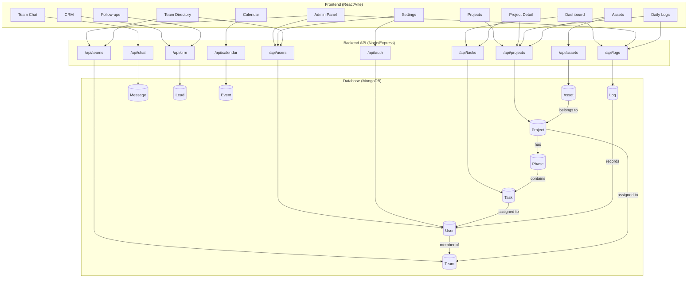

# Taskmaster v1.0.0

**Taskmaster** is a premium team productivity and CRM platform designed for high-performance teams.

## What It Does

| Feature | Description |
|---|---|
| **Dashboard** | Unified workspace with real-time task tracking and productivity metrics |
| **Projects** | Multi-view project management (List/Kanban/Gantt) with automated progress rollups |
| **Calendar** | Persistent MongoDB-backed calendar with public/private event visibility |
| **Follow-ups** | Automated CRM follow-up system with smart notifications |
| **Daily Logs** | Effortless work logging with project tagging and performance tracking |
| **CRM** | Advanced lead management with CSV deduplication and automated assignment |
| **Assets** | Centralized project resource management with multi-link support |
| **Admin Panel** | Comprehensive system oversight, user management, and activity auditing |

## Tech Stack

| Layer | Technology |
|---|---|
| Frontend | React 18, Vite, Tailwind CSS v4, Framer Motion, Lucide Icons |
| Backend | Node.js, Express, JWT Authentication |
| Database | MongoDB with Mongoose ODM |
| Architecture | RESTful API with auto-logging and progress rollups |

## System Architecture



## Getting Started

### Prerequisites
- **Node.js** v16+
- **MongoDB** running locally at `mongodb://localhost:27017/coreknot`

### Quick Start

```bash
# 1. Start the backend
cd server
npm install
npm run dev
# Server runs on http://localhost:5000

# 2. Start the frontend (new terminal)
cd client
npm install
npm run dev
# App opens at http://localhost:5173
```

### Seed Test Data (Optional)
```bash
cd server
node seeder.js
```

## Project Structure

```
/server             — Node/Express API, Mongoose Models, Controllers
/client             — React/Vite Frontend
/agentic_memory     — Architecture docs and project documentation
```

### Key Frontend Pages

| Page | File | Purpose |
|---|---|---|
| Dashboard | `Dashboard.jsx` | Task overview with completion + undo |
| Projects | `ProjectsView.jsx` | List all projects |
| Project Detail | `ProjectDetail.jsx` | List/Kanban/Gantt/Team views per project |
| Daily Logs | `DailyLogPage.jsx` | Log work entries with time tracking |
| Team Chat | `ChatPage.jsx` | Real-time messaging with channels |
| Team Directory | `TeamView.jsx` | Browse all team members |
| CRM | `CRMPage.jsx` | Lead management with CSV import |
| Assets | `AssetsPage.jsx` | Project resources and links |
| Admin Panel | `AdminPanel.jsx` | User/team management + activity feed |
| Settings | `SettingsPage.jsx` | Profile, avatar, preferences |
| Login | `LoginPage.jsx` | Authentication entry |
| Register | `RegisterPage.jsx` | New account creation |

### Key Backend Routes

| Route | Purpose |
|---|---|
| `/api/auth/*` | Login, register, token validation |
| `/api/tasks/*` | CRUD tasks, status/progress updates |
| `/api/projects/*` | CRUD projects, member management |
| `/api/users/*` | User directory, profile, role management |
| `/api/teams/*` | Team creation and listing |
| `/api/logs/*` | Daily work logs and system activity |
| `/api/chat/*` | Channel-based messaging |
| `/api/crm/*` | Lead CRUD, CSV import, batch operations |
| `/api/assets/*` | Asset CRUD with project linking |

---
*Built for The Shakti Collective.*
