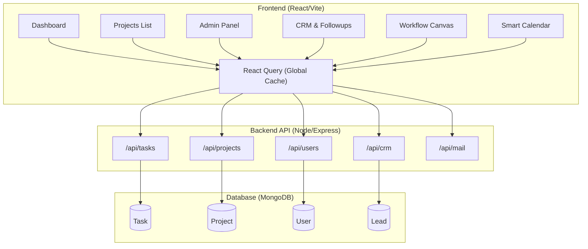

# Taskmaster v1.7.7

[](https://reactjs.org/)
[](https://vitejs.dev/)
[](https://nodejs.org/)
[](https://www.mongodb.com/)
[](https://tailwindcss.com/)
[](https://tanstack.com/query/v3/)
[](https://supabase.com/)
[](https://trigger.dev/)
[](LICENSE)

**Taskmaster** is a premium, high-density work management and CRM platform built for high-performance teams. It combines project management, real-time communication, and advanced CRM capabilities into a single, optimized workspace.

---

## Key Features & Ecosystem

Taskmaster is designed as a fully integrated ecosystem replacing disjointed tools (Jira, Salesforce, Slack) with a singular source of truth.

### Work & Project Management
- **Real-Time Dashboard**: Live task tracking, productivity metrics, and one-click completion with a 10s undo buffer.
- **Multi-View Projects**: Manage complex initiatives using List, Kanban, and Gantt views. Features automated progress rollups and hierarchical task architectures (Project > Phase > Task).
- **Workflow Canvas**: A node-based visual process architecting tool for mapping complex business logic via drag-and-drop mechanics (Powered by React Flow).
- **Daily Logs & Same-Day Editing**: Precision work logging with project tagging and strict same-day editing/deleting security rules.
- **Office & Contacts Registry**: Centralized registry for managing physical office hardware, software licenses, physical items, and important VIP contacts globally available across the platform.

### Customer Relationship Management (CRM)
- **Master Data Cleaning Pipeline**: Automated in-memory deduplication and sanitization engine (`import_ultimate_master.js` and `purge_nameless_emailless.js`) ensuring zero duplicate key index collisions and pristine database integrity across 46,000+ lead records.
- **Advanced Lead Pipeline**: Comprehensive lead funnel management (New/Contacted/Warm/Hot/Converted), source filtering, bulk CSV imports, and real-time bidirectional synchronization with HolySheet API.
- **Interactive Follow-up Schedule & Mark as Done**: Checkbox-driven instant follow-up completion from table or modal view with automatic timestamp logging and pipeline advancement. Native date/time picker enforcement across all schedule entry fields.
- **Interactive Interaction & Notes Stream**: Persistent timeline tracking of sales remarks, custom touchpoint notes, and planned action items.
- **Overdue Alerts & Follow-up Reminders**: Scheduled reminders with overdue visual indicators and rep-specific schedule views.
- **Role-Based Data Isolation**: Automatic user-level data segregation where sales professionals view their specific assigned leads and performance analytics, while administrators oversee full organizational metrics.
- **Team-Based Assignment**: Automatic "Least-Loaded" representative assignment distributing leads evenly across active sales teams.
- **CRM Audit Trails**: Immutable tracking of lead modifications via the `CRMAudit` collection, ensuring accountability and full data provenance.

### Marketing & Communications
- **Admin Auto-Mailer**: Complete broadcast campaign management engine.
- **Collective Admin Views**: Allows all users with an admin role to collectively view, manage, send, and delete all campaigns, SMTP profiles, and stats across the organization.
- **Native Analytics Sync**: Deep integration with Resend Webhooks (Svix-verified) for native analytics sync (Opens, Clicks, Bounces, Delivery).
- **Team Chat**: Real-time internal messaging with channel-based organization, user mentions, and task referencing.

### Integrations & Extensibility
- **Smart Calendar**: Persistent MongoDB-backed calendar with Public/Private visibility scopes and two-way Google Calendar OAuth2 synchronization.
- **Artists Hub**: Multi-platform analytics dashboard hydrating live feeds from Spotify, YouTube, and Meta.
- **Exly Integration**: Webhook receiver and automated CRM lead hydration with real-time performance analytics metrics. Features pagination for unlinked bookings and robust duplication checks matching incoming entries on existing emails/phones when transactionId is missing.
- **Edge Assets**: Project-scoped resource management utilizing UploadThing for direct edge-based file storage.
- **Legal & Compliance**: Automated public compliance pages (`/privacy` and `/userdata`) fulfilling Meta, Google, and GDPR data sovereignty mandates.

---

## System Architecture & Data Flow

Taskmaster operates on a highly optimized MERN stack tailored for real-time responsiveness and enterprise-grade concurrency.

### Full System Map



### Data Linkage Logic
- **Project Hierarchy**: Project -> Phase -> Task. Sub-task relationships enable deep dependency trees.
- **Role-Based Access Control (RBAC)**: Users are strictly isolated into admin, sales, and user privileges. Sales reps only access leads matching their assignedRepId.
- **Concurrency Locks**: Distributed locking (`lockedBy`, `lockedAt`) on CRM entities prevents race conditions during simultaneous editing by multiple reps.

---

## Performance Optimization Layer

Taskmaster is engineered for speed, prioritizing minimal Time to Interactive (TTI) and zero layout shifts.

### 1. Smart Data Caching (React Query & Supabase)
- **Zero-Flicker Navigation**: All server state is cached globally using `@tanstack/react-query` with a 5-minute `staleTime`.
- **Optimistic UI**: Mutations (e.g., creating a task, logging work) update the UI **instantly** via `queryClient.setQueryData()` before the network request resolves, providing a perceived latency of 0ms.
- **Real-Time Edge**: Supabase Realtime channels (`subscribeToChannel`) emit push events for instant, cross-client synchronization.

### 2. Backend Efficiency
- **Trigger.dev Automation**: Long-running processes (mail dispatches, daily metric rollups) are offloaded to Trigger.dev, keeping the Express event loop free for high-throughput CRUD operations.
- **Lean Queries**: All read-only database fetches employ Mongoose `.lean()`. Bypassing document hydration speeds up API responses by ~3-5x.
- **Strategic Indexing**: Highly queried paths (`userId`, `projectId`, `phone`, `email`) are explicitly indexed in MongoDB, ensuring O(1) read efficiency even at scale.
- **Response Compression**: Gzip/Brotli compression is actively applied to all JSON payloads to minimize bandwidth utilization.

### 3. Pro-Max Design Aesthetics
- **4px Grid System**: All spatial dimensions in the Tailwind CSS configuration strictly adhere to a 4px modular scale for mathematical perfection.
- **Zero-Flash Theme Engine**: A blocking script at the root level evaluates user OS preferences (`prefers-color-scheme`) prior to React hydration to prevent dark-mode flickering.
- **High-Density Semantics**: Uses pastel color-encoding matrices (Success/Warning/Danger/Info) exclusively for data representation, avoiding purely decorative styling.

---

## Getting Started

### Prerequisites
- **Node.js** (v18+)
- **MongoDB** (Local instance or MongoDB Atlas)
- **Google OAuth Credentials** (Required for Calendar sync)
- **Resend API Key** (Required for mailing functionality)
- **Supabase / UploadThing / Trigger.dev Keys** (For full feature parity)

### Installation

1. **Clone & Setup Server**
   ```bash
   git clone https://github.com/YOUR_ORG/Taskmaster.git
   cd Taskmaster/server
   npm install
   cp .env.example .env # Configure MONGO_URI, JWT_SECRET, RESEND, etc.
   npm run dev
   ```

2. **Setup Client**
   ```bash
   cd ../client
   npm install
   npm run dev
   ```

3. **Initialize Database Sandbox (Optional)**
   ```bash
   cd ../server
   node seeder.js
   ```

---

## Tech Stack & Tooling

We built Taskmaster standing on the shoulders of incredible open-source and commercial tools:

- **Frontend Core**: [React 18](https://react.dev/), [Vite](https://vitejs.dev/)
- **Styling & Motion**: [Tailwind CSS v4](https://tailwindcss.com/), [Framer Motion](https://www.framer.com/motion/), [Lucide React](https://lucide.dev/)
- **State & Data Fetching**: [React Query (TanStack)](https://tanstack.com/query/latest)
- **Backend Core**: [Node.js](https://nodejs.org/), [Express.js](https://expressjs.com/)
- **Database Layer**: [MongoDB](https://www.mongodb.com/), [Mongoose ODM](https://mongoosejs.com/)
- **Infrastructure & Automation**:
  - [Supabase](https://supabase.com/) (Realtime WebSockets)
  - [Trigger.dev](https://trigger.dev/) (Background Job Orchestration)
  - [UploadThing](https://uploadthing.com/) (Asset & File Storage)
  - [Resend](https://resend.com/) & [Svix](https://www.svix.com/) (Email Delivery & Webhook Verification)
- **Visuals & Graphs**: [React Flow](https://reactflow.dev/), [Recharts](https://recharts.org/)

---

## License

Distributed under the MIT License. See [`LICENSE`](LICENSE) for more information.

---
Architected and developed for extreme efficiency by CoreKnot.


### v1.7.6
- Fixed email duplicate sends with array deduplication
- Integrated Google Sheets (HolySheet) for unsubscribed list management
- Fixed race condition in background queue dispatch

### v1.7.7
- Decoupled automated Google Sheet unsubscribe sync, making it manual via POST /api/crm/sync-unsubscribed
- Solved metrics race conditions using Mongoose atomic operators ($inc and $set)
- Implemented non-blocking tracking pixel and redirect wrappers running database writes in background setImmediate threads
- Integrated User-Agent bot checks to screen out anti-spam crawlers from metrics
- Added database index configurations on recipients.messageId, recipients.email, and campaignId
- Refactored frontend routing hierarchy with public LandingPage root and protected absolute dashboard paths for Google OAuth compliance

