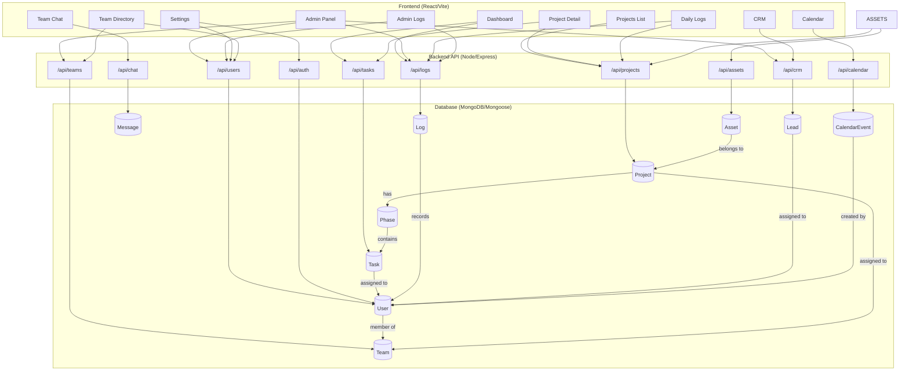

# System Architecture & Data Flow

How the Taskmaster ecosystem works — frontend to backend to database.

## Full System Map

## Module Overview

| Module | What It Does | Key Interactions |
|---|---|---|
| **Frontend** | Renders the UI, manages local state | Calls API via Axios, animates via Framer Motion |
| **Auth** | JWT-based login/register | Protects all `/api/*` routes except login/register |
| **Tasks** | Create, update, complete tasks | Status transitions trigger progress rollups + auto-logging |
| **Projects** | Organize work into projects | Contains phases, tasks, members, and teams |
| **Admin Panel** | Manage users, teams, roles | User directory, team creation, activity feed |
| **Daily Logs** | Time tracking + work entries | Manual entries + auto-captured task completions |
| **Team Chat** | Channel-based messaging | Mentions, file references, task creation from chat |
| **CRM** | Lead/contact management | CSV import, status tracking, rep assignment |
| **Assets** | Project resource links | Up to 3 links per asset, project-scoped |
| **Calendar** | Event scheduling | DB persistence, Public/Private visibility |

## Data Relationships

### Project → Phase → Task
Projects contain Phases (stages), which contain Tasks. Completing tasks auto-updates Phase and Project progress percentages.

### User → Team → Project
Users belong to Teams. Projects are assigned to Teams, giving all members access to the project's tasks.

### Log → Everything
The Log model records all system activity:
- `TASK_COMPLETION` — when a task status changes
- `DAILY_LOG` — manual work entries from users
- `CHAT_MESSAGE` — messages sent in chat
- `USER_LOGIN` — authentication events

### Lead → User
CRM leads are assigned to users (reps) for follow-up. Leads track status (New/Hot/Warm/Cold/Converted) and quality rating (1-5).

### Asset → Project
Assets store important links for a project. Each asset can hold up to 3 URLs.

### CalendarEvent → User
Calendar events are owned by users. Public events are visible to everyone; private events only to the owner.
