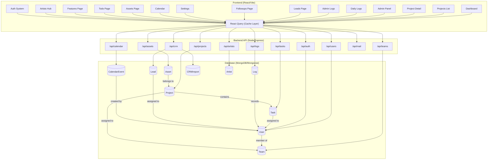

# System Architecture & Data Flow

How the Taskmaster ecosystem works — frontend to backend to database.

## Full System Map

## Performance & Caching Architecture

### Caching Layer (React Query)
The system uses `@tanstack/react-query` to manage server state.
- **Deduplication**: Multiple components can request the same data but only one network request is made.
- **Caching**: Data is cached for 5 minutes (`staleTime: 5m`). Navigating between pages is instantaneous.
- **Optimistic Updates**: Changes appear in the UI immediately while the server syncs in the background.

### Backend Optimization
- **Lean Queries**: All read-only database fetches use `.lean()`. This bypasses Mongoose hydration, making API responses significantly faster.
- **Indexing**: Database fields used for filtering (`userId`, `projectId`, `createdAt`) are indexed for fast lookup speed.
- **Compression**: Gzip/Brotli compression is applied to all JSON responses to minimize bandwidth usage.

### Pro-Max Design System (UI/UX)
The system implements a high-density "Pro-Max" design standard focusing on efficiency and visual excellence.
- **Zero-Flash Theme Engine**: Injects a blocking script at the root level to sync theme preferences (localStorage/System) before hydration.
- **Semantic Token System**: All components use a strict mapping of semantic tokens (`var(--color-bg-workspace)`, `var(--color-text-primary)`).
- **Micro-Animations**: Utilizes `framer-motion` for fluid transitions, spring-physics interactions, and high-performance layout shifts.

### Infrastructure Services
- **Trigger.dev**: Durable background job execution (e.g., long-running mail dispatches, data rollups) without tying up the Express event loop.
- **Supabase**: Real-time data synchronization edge networks and potential SSR/cookie-based integration.
- **UploadThing**: High-performance, edge-based file storage and asset management for documents and attachments.

## Module Overview

| Module | What It Does | Key Interactions |
|---|---|---|
| **Frontend** | Renders the UI, manages local state | Uses React Query hooks for optimized data fetching |
| **Auth** | JWT-based login/register | Protects all `/api/*` routes except login/register/success |
| **Tasks** | Create, update, complete tasks | Status transitions trigger progress rollups + auto-logging |
| **Projects** | Organize work into projects | Contains tasks, members, and teams |
| **Workflow Canvas**| Node-based visual process builder | High-density drag-and-drop workflow architecting |
| **Admin Panel** | Manage users, teams, CRM, and mail | Multi-tab UI for root administration |
| **Daily Logs** | Time tracking + work entries | Manual work entries with goal progress tracking |
| **CRM (Leads)** | Lead/contact management | CSV import, status tracking, representative assignment |
| **CRM (Followups)** | Scheduled sales calls | Tabbed view of Today, Overdue, and Upcoming followups |
| **Assets** | Project resource links & files | UploadThing integration for direct file storage |
| **Calendar** | Event scheduling | Internal DB persistence + Google Calendar sync |
| **Artists Hub** | Roster & Live Analytics | Tracks multi-platform API feeds (Spotify, YouTube, Meta) with `isSynced` linking model |

## Data Relationships

### Project → Task
Projects contain Tasks. Completing tasks updates Project progress percentages.

### User → Team → Project
Users belong to Teams. Projects are assigned to Teams, giving all members access to the project's tasks.

### Log → Everything
The Log model records all system activity:
- `TASK_COMPLETION` — when a task status changes
- `DAILY_LOG` — manual work entries from users
- `CRM_IMPORT` — history of lead uploads

### Lead → User
CRM leads are assigned to users (reps) for follow-up. Leads track status and next follow-up dates.

### Asset → Project
Assets store important links for a project.

### CalendarEvent → User
Calendar events are owned by users. Public events are visible to everyone; private events only to the owner.

### Artist → Live Analytics
Artists store profile information, events, and a linked `isSynced` status. Live analytics feeds are hydrated dynamically from Spotify, YouTube, and Meta.
