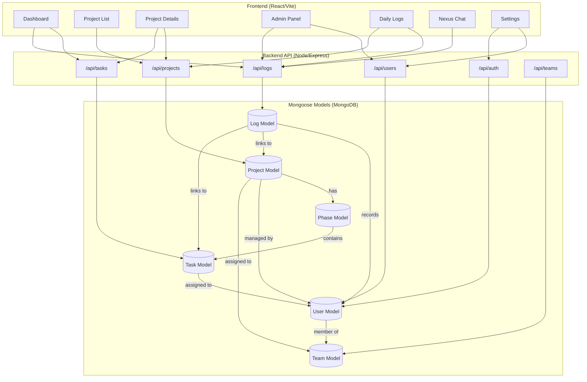

# System Architecture & Data Flow

This document maps the entire Taskmaster ecosystem, showing how the Frontend interacts with the Backend API and how data is structured in the Database.

## Integrated System Graph

## Documentation Registry

| Module | Responsibility | Key Interactions |
| :--- | :--- | :--- |
| **Frontend** | UI Rendering & Local State | Consumes API via Axios, uses Framer Motion for premium feel. |
| **Auth System** | JWT-based Security | Protects all `/api/*` routes except `/api/auth/login`. |
| **Task Engine** | Workflow Logic | Handles status transitions (Todo -> Done) and auto-logging. |
| **Admin Deck** | User & Team Management | Multi-team assignments and role-based access control (RBAC). |
| **Log Stream** | Audit & Productivity | Tracks every system event and manual user work logs. |

## Data Schema Connections

### 1. Project -> Phase -> Task
Projects are divided into multiple **Phases** (Stages), which contain individual **Tasks**. Completion of tasks automatically rolls up to update Phase and Project progress percentages.

### 2. User -> Team -> Project
Users are organized into **Teams**. A Project can be assigned to one or more Teams, granting all members of those teams access to the project tasks.

### 3. Log -> Everything
The **Log** model acts as the central nervous system, recording:
- `TASK_COMPLETION`: When a task status changes.
- `DAILY_LOG`: Manual work entries from users.
- `CHAT_MESSAGE`: System-wide communication.
- `USER_LOGIN`: Security audit trails.
