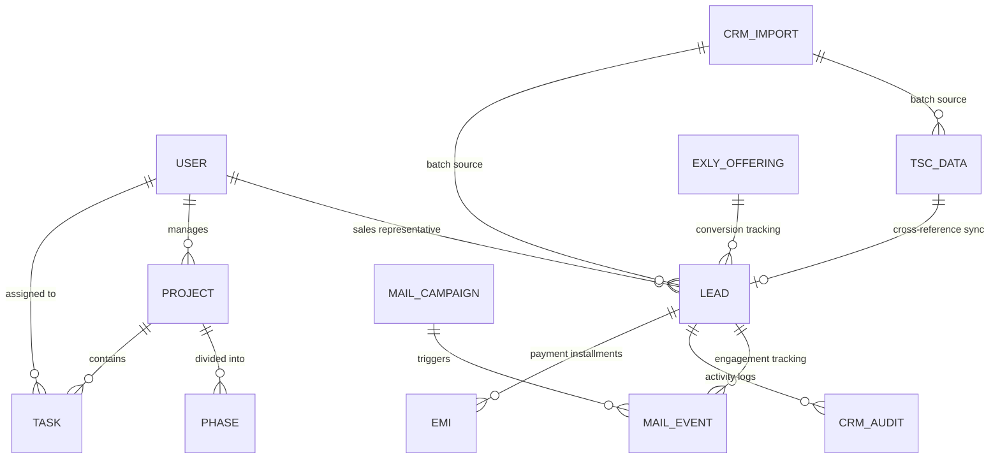

# Taskmaster Backend Architecture & Schema Reference

This document provides a technical blueprint of the Taskmaster backend ecosystem, detailing the MongoDB/Mongoose schema structure, data types, and cross-model relationships.

---

## 🏗️ System Overview
*   **Runtime**: Node.js
*   **Framework**: Express.js
*   **Database**: MongoDB (v6.0+)
*   **ORM/ODM**: Mongoose
*   **Auth Strategy**: JWT + Google OAuth2.0

---

## 🖇️ Model Linkage Graph

---

## 📊 Core Model Definitions

### 1. User (`User.js`)
The central authority for authentication and permissioning.
| Field | Type | Description |
| :--- | :--- | :--- |
| `name` | `String` | Full personnel identity. |
| `email` | `String` | Unique communication link (indexed). |
| `role` | `Enum` | `user`, `admin`, `sales`. |
| `googleId` | `String` | OAuth2.0 unique identifier. |
| `repId` | `String` | Internal identifier for CRM mapping (e.g., `sr01`). |
| `teams` | `Array<String>` | List of workgroups the user belongs to. |

### 2. Lead (`Lead.js`)
The primary entity for the sales funnel and CRM operations.
| Field | Type | Description |
| :--- | :--- | :--- |
| `name` | `String` | Lead identity. |
| `email` | `String` | Lead contact link. |
| `phone` | `String` | Primary contact number (indexed). |
| `leadStatus` | `String` | Current funnel stage (New, Hot, Converted, etc.). |
| `callStatus` | `String` | Last interaction state (Connected, Busy, DNP). |
| `nextFollowupDate` | `String` | Scheduled date for next interaction (YYYY-MM-DD). |
| `nextFollowupTime` | `String` | Scheduled time for next interaction (HH:mm). |
| `assignedRepId` | `ObjectId` | **Ref: User**. The representative managing the lead. |
| `importId` | `ObjectId` | **Ref: CRMImport**. Batch identifier. |

### 3. TSC Data (`TscData.js`)
The master data archive for incoming prospects before CRM conversion.
| Field | Type | Description |
| :--- | :--- | :--- |
| `name` | `String` | Prospect identity. |
| `originSource` | `String` | The channel through which the data was acquired. |
| `campaign` | `String` | Associated marketing campaign (indexed). |
| `importId` | `ObjectId` | **Ref: CRMImport**. The batch this data belongs to. |
| `metadata` | `Mixed` | Flexible storage for CSV columns not mapped to core fields. |

### 4. Task (`Task.js`)
Operational units within projects.
| Field | Type | Description |
| :--- | :--- | :--- |
| `title` | `String` | Short task summary. |
| `status` | `Enum` | `todo`, `in-progress`, `in-review`, `done`. |
| `projectId` | `ObjectId` | **Ref: Project**. Parent container. |
| `assignees` | `Array<ObjectId>` | **Ref: User**. Personnel working on the task. |
| `dueDate` | `Date` | Target completion timestamp. |
| `progress` | `Number` | Percentage completion (0-100). |

### 5. CRM Audit (`CRMAudit.js`)
Immutable trail of lead modifications.
| Field | Type | Description |
| :--- | :--- | :--- |
| `leadId` | `ObjectId` | **Ref: Lead**. Target of the change. |
| `userId` | `ObjectId` | **Ref: User**. The person who made the change. |
| `fieldChanged` | `String` | The attribute that was updated. |
| `oldValue` | `String` | Previous state. |
| `newValue` | `String` | Current state. |

### 6. Exly Offering (`ExlyOffering.js`)
Stores metadata and performance statistics for offerings created on Exly.
| Field | Type | Description |
| :--- | :--- | :--- |
| `offeringId` | `String` | Unique offering slug. |
| `title` | `String` | Display name of the program. |
| `price` | `Number` | Configured offering fee. |
| `totalBookings` | `Number` | Total lead bookings recorded. |
| `totalRevenue` | `Number` | Aggregated monetary bookings value. |
| `conversionRate` | `Number` | Ratio of converted leads to total bookings. |

---

## 🔗 Data Linkage Logic

### TSC to Lead Synchronization
Data flows from **TSC Data** (Raw) to **Lead** (Active) via a cross-collection lookup.
*   **Linkage Key**: `phone` or `email`.
*   **Logic**: When a TSC record is viewed, the system queries the `Lead` collection for a matching phone/email. If found, the `leadData` is injected into the TSC view object, marking it as "Processed".

### Representative Ownership
*   Leads are assigned via `assignedRepId`.
*   Non-admin users can only query leads where `assignedRepId === req.user._id`.
*   Auto-assignment utilizes a "Least-Loaded" strategy, calculating `countDocuments` for each rep and assigning to the one with the lowest active load.

### Project Hierarchy
*   **Project** > **Phase** > **Task**.
*   Tasks can also have a `parentTaskId` for recursive sub-task structures.

### Email Analytics & Webhooks
*   **Provider**: Resend API integration.
*   **Tracking Domain**: Custom tracking domain (`mail.theshakticollective.in`) rewrites URLs for native analytics.
*   **Event Pipeline**: Resend pushes events (`email.opened`, `email.clicked`, `email.bounced`, `email.delivered`) via webhooks.
*   **Security**: Express `req.rawBody` buffer capture combined with `svix` cryptographic signature verification ensures webhook payload authenticity.

---

## 🔒 Security Architecture
1.  **JWT Middleware**: Verifies the `Authorization: Bearer <token>` header for all protected routes.
2.  **Role-Based Access Control (RBAC)**:
    *   `admin`: Full CRUD access across all modules.
    *   `sales`: Can only view/edit assigned leads and relevant TSC data.
    *   `user`: Restricted to project and task management.
3.  **Concurrency Control**: The `Lead` model uses `lockedBy` and `lockedAt` fields to prevent two users from editing the same record simultaneously (30-minute lock window).
