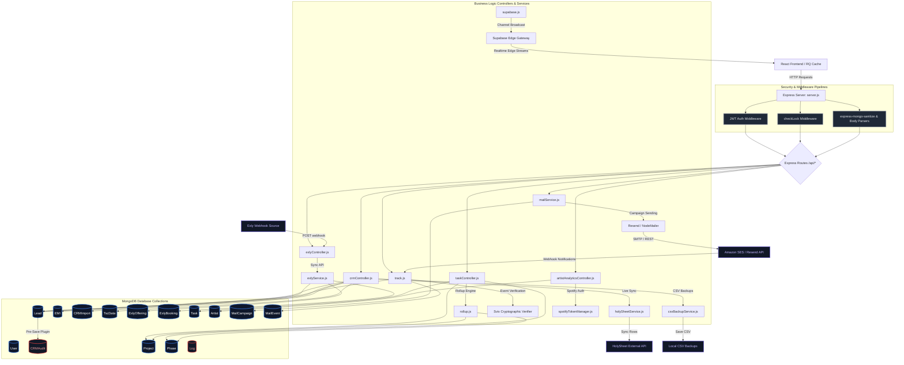
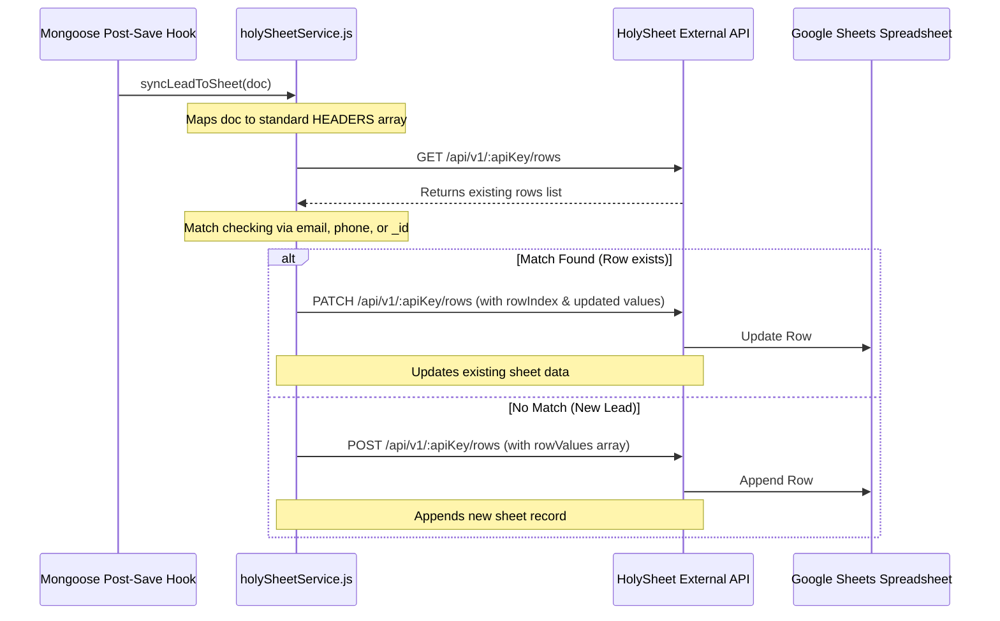
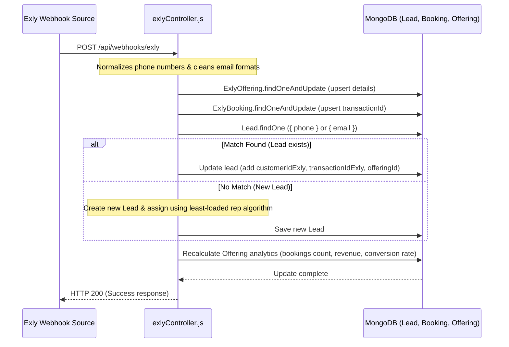
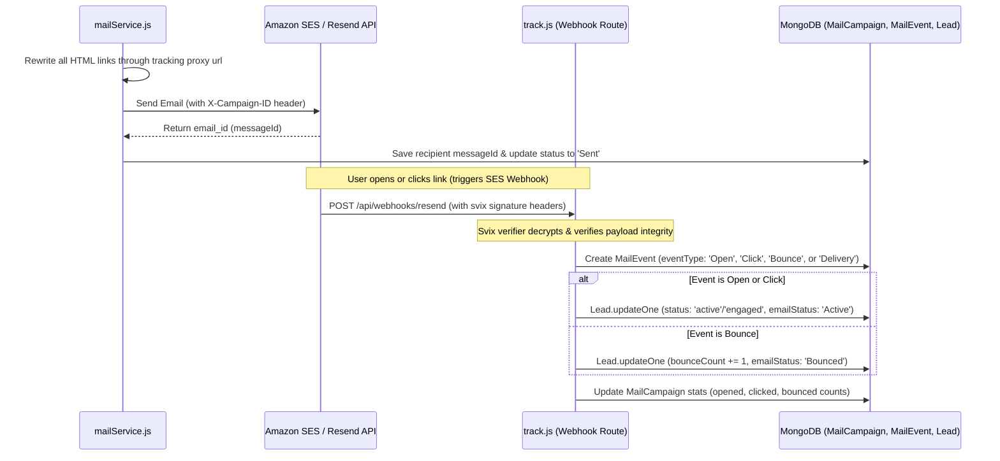

# Taskmaster Unified Backend System Architecture

This document provides a highly detailed, production-grade technical blueprint of the Taskmaster backend ecosystem. It outlines the schema architecture, database relationships, dynamic computation models, integration pipelines, and security protocols linking all subsystems.

---

## 1. System Topology & Linkage Graph

The diagram below details how Express routers, controller files, Mongoose data models, background services, and external API gateways are interconnected.



---

## 2. Core Data Entities & Schemas

### A. User Management (`User.js`)
Handles identity, credentials, roles, integration tokens, and CRM assignments.
*   **Key Fields**:
    *   `name` (String, required, indexed)
    *   `email` (String, required, unique, lowercase)
    *   `password` (String, optional - bypassed for Google OAuth users)
    *   `role` (String, enum: `['user', 'admin', 'sales', 'artist_management']`, default: `'user'`)
    *   `avatar` (String)
    *   `gender` (String, enum: `['male', 'female', 'other']`, default: `'male'`)
    *   `phone` (String, indexed)
    *   `lastOnline` (Date)
    *   `online` (Boolean)
    *   `teams` (Array of Strings)
    *   `googleId` (String)
    *   `googleAccessToken` (String)
    *   `googleRefreshToken` (String)
    *   `googleCalendarLinked` (Boolean)
    *   `repId` (String, unique, sparse - matches representatives like `sr01`, `sr02`)
*   **Mongoose Lifecycle Hooks**:
    *   `pre('save')`: Automatically hashes password with `bcryptjs` (salt factor 10) if modified.

### B. CRM Leads (`Lead.js`)
The centerpiece of CRM operations. Links customer contact info, webinar engagement records, billing configurations, and assignments.
*   **Key Fields**:
    *   `rowId` (String, unique, sparse - legacy CSV reference)
    *   `customerIdExly` (String, indexed)
    *   `transactionIdExly` (String, indexed)
    *   `exlyOfferingId` (String, indexed)
    *   `exlyOfferingTitle` (String, indexed)
    *   `name` (String, required)
    *   `email` (String, indexed)
    *   `phone` (String, required, indexed)
    *   `city` (String, indexed)
    *   `webinarDates` (String)
    *   `attended` (String: `'Y'`, `'N'`, or `''`)
    *   `attendanceDurationMin` (String)
    *   `qnaAnswered` (String)
    *   `artistType` (String)
    *   `fullTimeWillingness` (String)
    *   `primaryRole` (String)
    *   `learningGoal` (String)
    *   `learnedMusic` (String)
    *   `currentJourney` (String)
    *   `meaningfulConnect` (String, default: `'PENDING'`)
    *   `leadQuality` (String, default: `'1'`)
    *   `callStatus` (String, default: `'Pending'`)
    *   `leadStatus` (String, default: `'New'`)
    *   `remarks` (String)
    *   `notes` (Array of subdocuments: `text`, `author`, `date`)
    *   `source` (String, default: `'Organic / Direct'`, indexed)
    *   `planOption` (String)
    *   `nextFollowupDate` (String)
    *   `nextFollowupTime` (String)
    *   `setReminder` (Boolean)
    *   `assignedRepId` (ObjectId, ref: `'User'`, indexed)
    *   `createdBy` (ObjectId, ref: `'User'`)
    *   `importId` (ObjectId, ref: `'CRMImport'`)
    *   `emailStatus` (String, enum: `['Active', 'Unsubscribed', 'Invalid', 'Pending', 'Bounced']`, default: `'Pending'`, indexed)
    *   `status` (String, enum: `['active', 'inactive', 'engaged']`, default: `'active'`)
    *   `bounceCount` (Number, default: 0, indexed)
    *   `unsubscribed` (Boolean, default: false, indexed)
    *   `unsubscribeReason` (String)
    *   `lockedBy` (String)
    *   `lockedAt` (Date)
*   **Mongoose Lifecycle Hooks**:
    *   `pre('save')`: Sanitizes inputs (trims names, lowercases email, extracts numbers for phone, validates date format for `nextFollowupDate`).
    *   `post('save')` & `post('findOneAndUpdate')` & `post('updateOne')` & `post('updateMany')`: Dispatches updates to the asynchronous, non-blocking BullMQ background queue (`backgroundQueue.queueHolySheetSync` and `backgroundQueue.queueCsvBackup`) to prevent blocking API execution.
*   **Indexes**:
    *   Single-field Unique: `{ phone: 1 }`, `{ email: 1 }` (email is sparse)
    *   Compound Filter: `{ assignedRepId: 1, nextFollowupDate: 1, nextFollowupTime: 1 }`, `{ assignedRepId: 1, leadStatus: 1 }`
    *   Text Search: `{ name: 'text', email: 'text', phone: 'text', remarks: 'text' }`

### C. EMI Payment Breakdown (`EMI.js`)
Tracks payment installments for converted leads.
*   **Key Fields**:
    *   `leadId` (ObjectId, ref: `'Lead'`, required, indexed)
    *   `installmentNo` (Number, required)
    *   `amount` (Number, required)
    *   `dueDate` (Date, required)
    *   `paidDate` (Date)
    *   `status` (String, enum: `['Pending', 'Paid', 'Overdue']`, default: `'Pending'`)
    *   `remarks` (String)

### D. CRM Import Batch Tracker (`CRMImport.js`)
Records batch CSV import history, enabling audit rollbacks.
*   **Key Fields**:
    *   `filename` (String, required)
    *   `leadCount` (Number, required)
    *   `importedBy` (ObjectId, ref: `'User'`, required)
    *   `importType` (String)

### E. CRM Audit Logging (`CRMAudit.js`)
Stores granular field-level modification deltas for data integrity.
*   **Key Fields**:
    *   `leadId` (ObjectId, ref: `'Lead'`, required, indexed)
    *   `userId` (String, default: `'SYSTEM'`)
    *   `userRole` (String, default: `'SYSTEM'`)
    *   `fieldChanged` (String, required)
    *   `oldValue` (String)
    *   `newValue` (String)
    *   `timestamp` (Date, default: `Date.now`)

### F. Prospect Archive Data (`TscData.js`)
Standard raw archive for leads imported from legacy sheets before CRM promotion.
*   **Key Fields**:
    *   `name`, `email`, `phone`, `city`, `state`, `role`, `originSource`, `destination`, `campaign` (all indexed strings)
    *   `importId` (ObjectId, ref: `'CRMImport'`)
    *   `metadata` (Mixed, default: `{}`)
    *   `tags` (Array of Strings, indexed)
    *   `emailStatus` (String, default: `'Pending'`)
*   **Indexes**:
    *   Unique Compound: `{ phone: 1, email: 1 }`
    *   Text Search: `{ name: 'text', email: 'text', phone: 'text' }`

### G. Exly Offering (`ExlyOffering.js`)
Configured programs, courses, and webinars synchronizing dynamic conversion and revenue metrics.
*   **Key Fields**:
    *   `offeringId` (String, unique, required, indexed)
    *   `title` (String, required, indexed)
    *   `eventDate` (String)
    *   `eventTime` (String)
    *   `type` (String, default: `'program'`)
    *   `price` (Number, default: 0)
    *   `currency` (String, default: `'INR'`)
    *   `status` (String, default: `'active'`)
    *   `totalBookings` (Number, default: 0)
    *   `totalRevenue` (Number, default: 0)
    *   `conversionRate` (Number, default: 0)

### H. Exly Booking (`ExlyBooking.js`)
Raw list of registration events captured from the webhook pipeline or manual synchronizations.
*   **Key Fields**:
    *   `transactionId` (String, indexed) - Optional transaction identifier.
    *   `customerId` (String, indexed)
    *   `offeringId` (String, indexed)
    *   `offeringTitle` (String, indexed)
    *   `name` (String)
    *   `email` (String)
    *   `phone` (String)
    *   `pricePaid` (Number, default: 0)
    *   `state` (String)
    *   `payoutStatus` (String)
    *   `bookedOn` (Date, default: `Date.now`, indexed)

### I. Projects & Workflow Components
*   **Project (`Project.js`)**: Parent container holding tags, member lists, and calculated task status rollups.
    *   *Fields*: `name`, `description`, `outletId`, `owner` (ref: `'User'`), `members` (ref: `'User'`), `status` (`'active'`, `'archived'`, `'completed'`), `progress` (0-100), `totalTasksCount`, `completedTasksCount`.
*   **Phase (`Phase.js`)**: Grouping container mapping project phases.
    *   *Fields*: `name`, `projectId` (ref: `'Project'`), `progress` (0-100), `status`.
*   **Task (`Task.js`)**: Granular workflow items containing nesting hierarchy references.
    *   *Fields*: `title`, `description`, `status` (`'todo'`, `'in-progress'`, `'in-review'`, `'done'`), `priority` (`'low'`, `'medium'`, `'high'`, `'critical'`), `projectId` (ref: `'Project'`), `phaseId` (ref: `'Phase'`), `parentTaskId` (ref: `'Task'`), `assignees` (ref: `'User'`), `progress` (0-100), `completedAt`, `dependencies` (ref: `'Task'`).

### J. Artist streaming analytics (`Artist.js`)
Unified analytics database detailing API scraping feeds from YouTube, Spotify, and Meta platforms.
*   **Key Fields**:
    *   `name` (String, required)
    *   `socials` (Embedded links: `youtube`, `instagram`, `facebook`, `spotify`, etc.)
    *   `analytics`:
        *   `youtube`: Subscribers, Views, WatchTime, Average View Duration (`avd`), Traffic sources, Returning viewers.
        *   `instagram`: Followers, Reels performance, Follower velocity, Audience quality, Profile visit ratio.
        *   `spotify`: Monthly listeners, Followers, Streams per listener, Playlist additions, Monthly active listeners (`mal`), Trigger cities.
        *   `facebook`: Likes, Followers, Post reach (Organic vs. Paid), Engagement metrics.
    *   `trackedVideos` (Array: Video IDs, CTR, Views, Watch time)
    *   `oauthCredentials`: Encrypted/Secure subdocuments containing OAuth access/refresh tokens for Spotify, YouTube, and Meta.
    *   `analyticsHistory` (Array of snapshots: `timestamp`, `platform`, `metrics`)
    *   `isSynced` (Boolean, default: `false`)

### K. Campaign Mailer Schemas
*   **MailCampaign (`MailCampaign.js`)**: Bulk campaign target definitions.
    *   *Fields*: `name`, `subject`, `content`, `status` (`'Draft'`, `'Pending'`, `'Sending'`, `'Completed'`), `senderProfileId` (ref: `'EmailProfile'`), `recipients` (Array: `leadId`, `email`, `status`, `sentAt`, `messageId`), `stats` (`sent`, `opened`, `clicked`, `bounced`, `invalid`).
*   **MailEvent (`MailEvent.js`)**: Individual delivery logging.
    *   *Fields*: `messageId`, `eventType` (`'Send'`, `'Delivery'`, `'Open'`, `'Click'`, `'Bounce'`), `email`, `campaignId` (ref: `'MailCampaign'`).

---

## 3. Dynamic Real-Time Calculations

### A. Virtual Follow-ups View Pipeline
Follow-up schedules utilize a high-performance materialized caching layer powered by Redis Sorted Sets (`ZSET`).
1.  **Materialized Cache Strategy**: When a lead is saved with a scheduled `nextFollowupDate` and `nextFollowupTime`, its score is computed as a epoch timestamp. The lead's minimal details are stored under `followup:details:<leadId>` and its ID added to ZSETs `followups:rep:<repId>` and `followups:global`.
2.  **Execution Path**: 
    *   Dashboard requests attempt to read directly from Redis in $O(\log N + M)$ complexity.
    *   If Redis is offline or the cache miss occurs, the system transparently falls back to MongoDB aggregation query:
        ```javascript
        { nextFollowupDate: { $exists: true, $ne: '' } }
        ```
3.  **Virtual Evaluation**: Resolves status live:
    *   Returns `'Completed'` if `callStatus === 'Connected' || leadStatus === 'Converted'`.
    *   Returns `'Pending'` for all other states.

### B. Auto-Routing Rep Assignment Algorithm
To prevent uneven assignments across reps, Taskmaster applies a least-loaded assignment algorithm when creating or importing raw prospects:
$$\text{Assigned Rep} = \min_{r \in \text{Sales Users}} \left( \text{Active Lead Count}_r \right)$$

1.  Checks database for all users with `role: 'sales'`.
2.  Executes atomic `countDocuments({ assignedRepId: rep._id, leadStatus: { $ne: 'Converted' } })` for each.
3.  Assigns the newly created lead to the rep with the lowest count.
4.  In case of a tie, the system defaults to a round-robin fallback.

### C. Project Progress & Task Rollups
On task updates (`createTask`, `updateTask`, `deleteTask`), the system triggers a progress recalculation:
$$\text{Average Progress} = \text{round}\left( \frac{\sum_{i=1}^{n} \text{Task Progress}_i}{n} \right)$$

*   If the task belongs to a specific project phase, `calculateRollup` updates the `Phase` progress first.
*   Next, it recalculates the average progress across all tasks in the project and updates the `Project` document.
*   Task counts (`totalTasksCount` and `completedTasksCount`) are updated atomically inside Mongoose transaction sessions.

### D. Database Repair Startup Scan
On boot, `server.js` executes an async self-healing routine for artist analytical records to prevent data dips (where charts drop to zero due to temporary connection failures):
1.  Loads all `Artist` documents containing historical snapshots in `analyticsHistory`.
2.  Matches current follower baselines for Spotify and Instagram:
    ```javascript
    const currentIg = artist.analytics?.instagram?.followers || 0;
    const currentSp = artist.analytics?.spotify?.followers || 0;
    ```
3.  Filters out history entries where follower stats dropped to `0` while current stats are above `0` (indicating a parsing error during that snapshot window).
4.  Updates the record dynamically and saves it back to the database, ensuring historical analytics graphs remain clean.

---

## 4. Integration Pipelines

### A. Google Sheets Sync (HolySheet)



### B. Exly Offering & Booking Sync Webhook



### C. SES Mailer Engine & Callback Loop



---

## 5. Security & Middleware Pipelines

### A. Authentication & Route Guarding
*   **JWT Verification**: The authentication middleware reads the `Authorization: Bearer <token>` header. It decodes the payload, validates it against the database, and hydrates the `req.user` context with the user's role and database ID.
*   **Role-Based Access Control (RBAC)**: Enforced selectively at route definitions:
    *   `admin`: Complete administrative permissions (user management, database backups, CRM imports).
    *   `sales`: RESTRICTED access to CRM leads. The system modifies all lead-matching queries to restrict scope: `{ assignedRepId: req.user._id }`.
    *   `user`: Restricted to task tracking and project status updates.
    *   `artist_management`: Dedicated permissions to view and update Spotify/YouTube OAuth keys for tracking configurations.

### B. Concurrency Lock Control
To prevent multiple representatives from overwriting the same lead, the backend enforces atomic lock acquisition using a single database operation:
*   **Atomic Claiming**: The `checkLock` middleware attempts to claim the lock by executing `findOneAndUpdate` with query constraints checking if the lead is unlocked or if the lock has expired (duration > 15 minutes):
    ```javascript
    const lockedLead = await Model.findOneAndUpdate(
      {
        _id: id,
        $or: [
          { lockedBy: { $exists: false } },
          { lockedBy: null },
          { lockedBy: userId.toString() },
          { lockedAt: { $lt: fifteenMinutesAgo } }
        ]
      },
      {
        $set: { lockedBy: userId.toString(), lockedAt: new Date() }
      },
      { new: true }
    );
    ```
*   **Self-Healing Lock Windows**: Stale locks automatically expire after 15 minutes.
*   **Response Status**: Returns `HTTP 423 Locked` if the lock belongs to another active user.
*   **Lock Release**: Implicitly released on lock expiration or explicitly on subsequent update cycles.

### C. Input Sanitization Pipelines
All inputs undergo sanitization to maintain data integrity and prevent security issues:
*   **Whitespace Collapse**: Names and search queries are trimmed, and multiple consecutive internal spaces are collapsed:
    ```javascript
    name = name.trim().replace(/\s+/g, ' ');
    ```
*   **Email Standardization**: Emails are lowercased and stripped of whitespace before matching or persistence:
    ```javascript
    email = email.toLowerCase().trim();
    ```
*   **Phone Number Normalization**: Non-numeric characters (dashes, parentheses, spaces) are stripped. The system extracts only digits to ensure clean indexes and prevent query mismatches:
    ```javascript
    phone = phone.replace(/\D/g, '');
    ```
*   **Security Sanitizers**: `express-mongo-sanitize` is loaded globally to prevent query injection attacks by stripping characters beginning with `$` or `.`.

### D. Unified Model Relationships & Cascade Eviction
To keep relational integrity solid without orphan rows:
*   **Virtual Population**: The Project schema defines native Mongoose virtual population to fetch structural phases and tasks without manual application logic:
    ```javascript
    ProjectSchema.virtual('phases', {
      ref: 'Phase',
      localField: '_id',
      foreignField: 'projectId'
    });
    ```
*   **Cascade Deletion Hooks**: Document-level Mongoose hooks (`pre('remove')` and `pre('deleteOne')`) dynamically cascade deletion across `Phase` and `Task` collections to prevent dead data footprint accumulation.

### E. Automated Rolling Backup Engine
Rather than blocking the main Node server or relying on Linux-only cron setups:
*   **Automated Backup Script (`scratch/run_backup.js`)**: A script designed to extract all database collections to JSON format.
*   **Rolling Retention**: Analyzes the `backups` directory, keeping only the 2 most recent backups and automatically purging older snapshots.
*   **Cross-OS Portability**: Scheduled via Windows Task Scheduler (`schtasks`) locally or `crontab` on production servers:
    *   **Windows Task Scheduler**:
        ```powershell
        schtasks /create /tn "TaskmasterDBBackup" /tr "node C:\path\to\server\scratch\run_backup.js" /sc daily /st 02:00
        ```
    *   **Linux Crontab**:
        ```bash
        0 2 * * * node /path/to/server/scratch/run_backup.js
        ```

### F. Exly Webhook Duplicate Prevention Engine
To prevent duplicate booking records during webhook triggers or manual synchronization when `transactionId` is absent:
1. **Fallback Matching Strategy**: If `transactionId` is provided in the webhook payload, the system queries by `{ transactionId }`. If it is absent, the system queries on `{ offeringId, $or: [ { email }, { phone } ] }`.
2. **Execution Integrity**: Because the database unique index uses `{ email, phone, offeringId, bookedOn }`, the query fallback ensures that existing entries are updated via atomic `$set` operations rather than inserting new documents, neutralizing duplicate entries regardless of minor variations in transaction timestamps.

### G. Collective Admin Mail Campaign Management
The mailing platform enables unified collaboration by adjusting routing access parameters:
1. **Role-Based Query Aggregation**: For endpoints `/api/mail/profiles`, `/api/mail/campaigns`, and `/api/mail/stats`, the Express middleware verifies `req.user.role`.
2. **Logic Override**: If the user is an `admin`, the router bypasses the `{ createdBy: req.user._id }` query filter (setting `filter = {}`). This allows admins to collectively view, send, manage, and delete all SMTP profiles and campaign metrics across the organization, while normal representatives remain restricted to their own creations.
