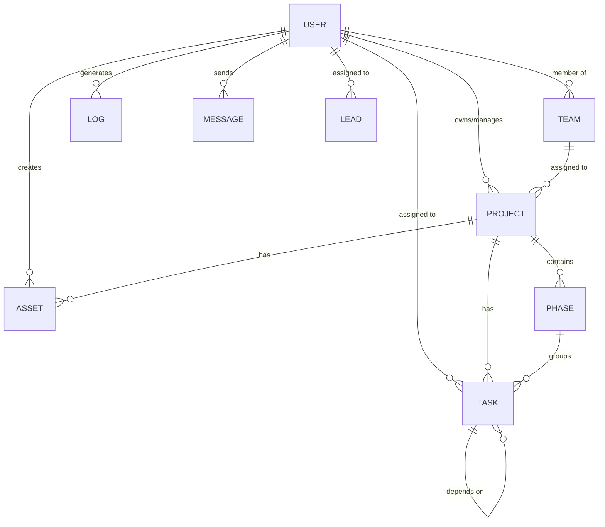
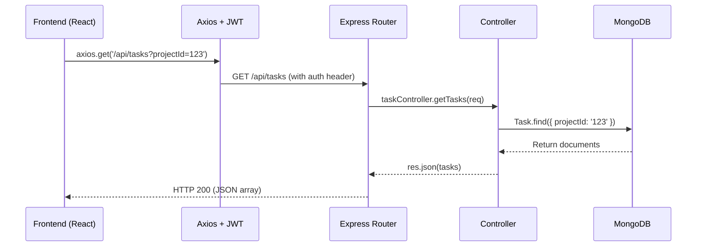
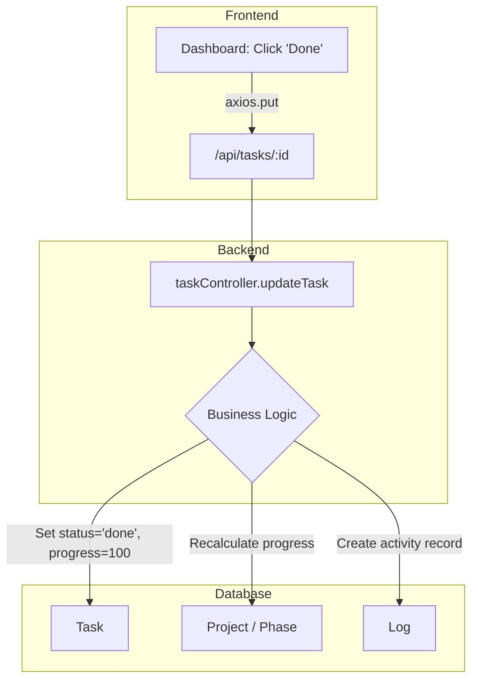

# Taskmaster: Backend-Frontend Linkage Documentation

How the frontend pages connect to backend APIs, and how the database models relate to each other.

---

## 1. Database Models (Mongoose/MongoDB)

### Model Relationships

### Model Fields

| Model | Key Fields | Links To |
|---|---|---|
| **User** | `name`, `email`, `role`, `teams`, `avatar`, `phone` | — |
| **Team** | `name`, `color`, `description` | `createdBy` → User |
| **Project** | `name`, `status`, `progress`, `teams` | `owner` → User, `members` → User[] |
| **Phase** | `name`, `progress`, `status` | `projectId` → Project |
| **Task** | `title`, `status`, `priority`, `progress`, `completedAt` | `projectId` → Project, `phaseId` → Phase, `assignees` → User[] |
| **Log** | `action`, `details`, `targetType` | `userId` → User, `targetId` → (any) |
| **Message** | `content`, `channel` | `senderId` → User, `mentions` → User[] |
| **Lead** | `name`, `phone`, `email`, `leadStatus`, `leadQuality` | `assignedRepId` → User |
| **Asset** | `name`, `links[]` | `projectId` → Project, `createdBy` → User |

---

## 2. How Frontend Connects to Backend

### Request Flow

---

## 3. API Reference

### Authentication

| Endpoint | Method | Used By | What It Does |
|---|---|---|---|
| `/api/auth/login` | POST | LoginPage | Log in, get JWT token |
| `/api/auth/register` | POST | RegisterPage | Create new account |
| `/api/auth/me` | GET | AuthContext | Validate token, get current user |

### Projects

| Endpoint | Method | Used By | What It Does |
|---|---|---|---|
| `/api/projects` | GET | ProjectsView | List all projects |
| `/api/projects/:id` | GET | ProjectDetail | Get one project's details |
| `/api/projects` | POST | ProjectCreate | Create a new project |
| `/api/projects/:id` | PUT | ProjectSettingsModal | Update project name/description |
| `/api/projects/:id` | DELETE | ProjectsView, ProjectSettingsModal | Delete a project |

### Tasks

| Endpoint | Method | Used By | What It Does |
|---|---|---|---|
| `/api/tasks` | GET | Dashboard, ProjectDetail | Fetch tasks (filter by project) |
| `/api/tasks` | POST | TaskCreateModal, ChatPage | Create a new task |
| `/api/tasks/:id` | PUT | ProjectDetail, TaskDetailModal | Update task status/priority |
| `/api/tasks/:id` | DELETE | TaskDetailModal | Delete a task |

### Users & Teams

| Endpoint | Method | Used By | What It Does |
|---|---|---|---|
| `/api/users/directory` | GET | AdminPanel | List all users (paginated) |
| `/api/users/team` | GET | TeamView, ChatPage, ProjectCreate | Get team members list |
| `/api/users/profile` | PUT | SettingsPage | Update name, phone, avatar |
| `/api/users/:id/role` | PUT | AdminPanel | Toggle admin/user role |
| `/api/users/:id` | DELETE | AdminPanel | Delete a user |
| `/api/teams` | GET | TeamView, AdminPanel | List all teams |
| `/api/teams` | POST | AdminPanel | Create a new team |

### Daily Logs

| Endpoint | Method | Used By | What It Does |
|---|---|---|---|
| `/api/logs` | GET | DailyLogPage, AdminLogsPage | Get logs (filter by date/user) |
| `/api/logs` | POST | DailyLogPage | Create a manual work log entry |
| `/api/logs` | DELETE | AdminPanel | Clear all activity logs |

### Chat

| Endpoint | Method | Used By | What It Does |
|---|---|---|---|
| `/api/chat` | GET | ChatPage | Fetch messages (by channel) |
| `/api/chat` | POST | ChatPage | Send a new message |

### CRM

| Endpoint | Method | Used By | What It Does |
|---|---|---|---|
| `/api/crm/leads` | GET | CRMPage | List all leads |
| `/api/crm/leads` | POST | CRMLeadModal | Create a new lead |
| `/api/crm/leads/:id` | PUT | CRMPage, CRMLeadModal | Update lead status/priority |
| `/api/crm/leads/upload` | POST | CRMPage | Import leads from CSV |
| `/api/crm/imports` | GET | AdminPanel | List CRM import history |
| `/api/crm/imports/:id` | DELETE | AdminPanel | Delete an import batch |

### Assets

| Endpoint | Method | Used By | What It Does |
|---|---|---|---|
| `/api/assets` | GET | AssetsPage | List all assets |
| `/api/assets` | POST | AssetsPage | Create a new asset |
| `/api/assets/:id` | DELETE | AssetsPage | Delete an asset |

---

## 4. End-to-End Traces

What happens when a user does something, step by step:

| Action | Frontend | API Call | Controller | DB Update | Side Effects |
|---|---|---|---|---|---|
| **Complete a task** | Dashboard → "Done" button | `PUT /api/tasks/:id` | `updateTask` | Task.status='done', progress=100 | Auto-logs activity; recalculates project progress |
| **Create a project** | ProjectCreate → "Create" | `POST /api/projects` | `createProject` | Project.create() | Sets owner, adds members |
| **Update profile** | Settings → "Save" | `PUT /api/users/profile` | `updateProfile` | User.findByIdAndUpdate | Updates name, phone, avatar |
| **Register** | RegisterPage → "Sign Up" | `POST /api/auth/register` | `register` | User.create() | Hashes password via pre-save hook |
| **Toggle role** | AdminPanel → "Toggle Admin" | `PUT /api/users/:id/role` | `updateUserRole` | User.role toggled | Changes access permissions |
| **Send message** | ChatPage → Send | `POST /api/chat` | `sendMessage` | Message.create() | Broadcasts to channel |
| **Add team** | AdminPanel → "Add" | `POST /api/teams` | `createTeam` | Team.create() | Available for user assignment |
| **Log daily work** | DailyLogPage → "Save Entry" | `POST /api/logs` | `createLog` | Log.create() | Tracks time + project |
| **Import CSV leads** | CRMPage → "Import" | `POST /api/crm/leads/upload` | `uploadLeads` | Lead.insertMany() | Batch creates contacts |
| **Add asset** | AssetsPage → "Save Asset" | `POST /api/assets` | `createAsset` | Asset.create() | Links to project |

### Example: Completing a Task

1. User clicks "Done" on a task card in Dashboard
2. Frontend sends `PUT /api/tasks/TASK_ID` with `{ status: 'done' }`
3. Express routes to `taskController.updateTask`
4. Controller sets `progress: 100` and `completedAt: new Date()`
5. `Task.findByIdAndUpdate` saves to MongoDB
6. Post-update: project progress recalculated, activity log created
