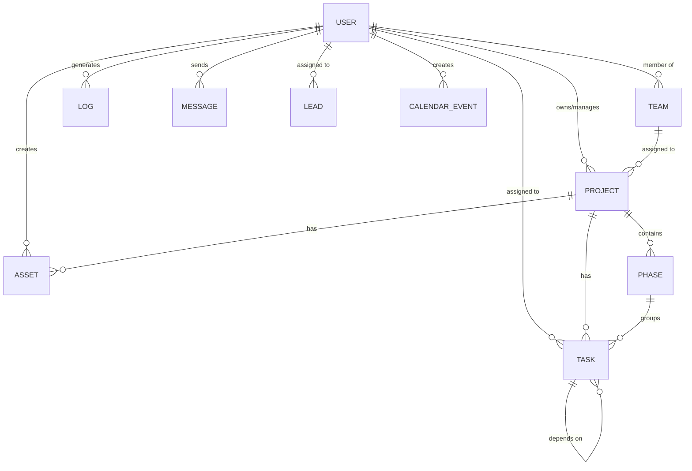
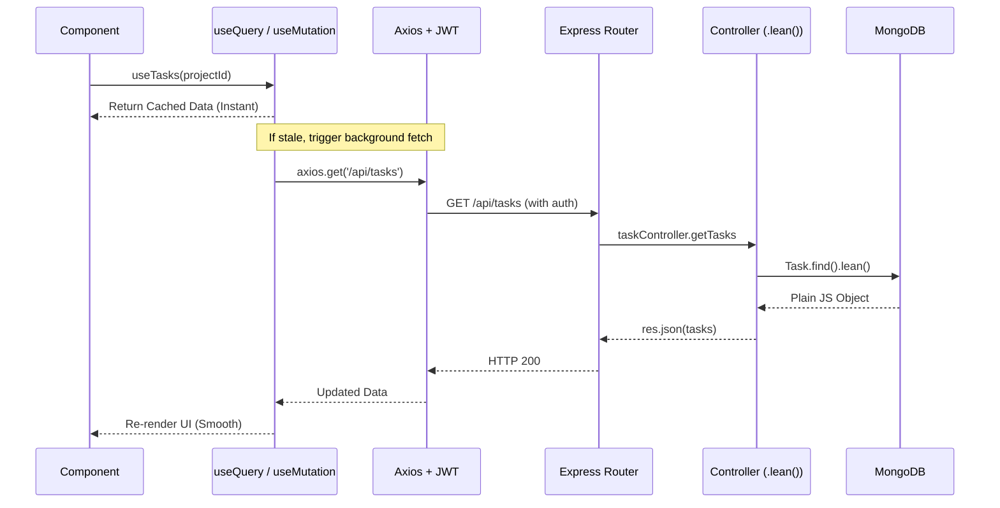
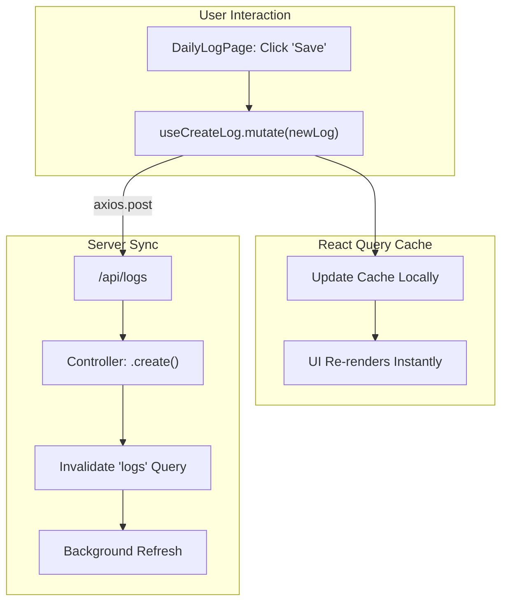

# Taskmaster: Backend-Frontend Linkage Documentation

How the frontend pages connect to backend APIs, and how the database models relate to each other.

---

## 1. Database Models (Mongoose/MongoDB)

### Model Relationships

### Model Fields

| Model | Key Fields | Links To |
|---|---|---|
| **User** | `name`, `email`, `role`, `teams`, `avatar`, `phone` | — |
| **Team** | `name`, `color`, `description` | `createdBy` → User |
| **Project** | `name`, `status`, `progress`, `teams` | `owner` → User, `members` → User[] |
| **Phase** | `name`, `progress`, `status` | `projectId` → Project |
| **Task** | `title`, `status`, `priority`, `progress`, `completedAt` | `projectId` → Project, `phaseId` → Phase, `assignees` → User[] |
| **Log** | `action`, `details`, `targetType` | `userId` → User, `targetId` → (any) |
| **Message** | `content`, `channel` | `senderId` → User, `mentions` → User[] |
| **Lead** | `name`, `phone`, `email`, `leadStatus`, `leadQuality` | `assignedRepId` → User |
| **Asset** | `name`, `links[]` | `projectId` → Project, `createdBy` → User |
| **CalendarEvent** | `title`, `date`, `visibility` | `createdBy` → User |

---

## 2. How Frontend Connects to Backend

### Data Fetching Layer (React Query)

The frontend uses a centralized hook system in `client/src/hooks/useTaskmasterQueries.js` powered by `@tanstack/react-query`. This provides:
1. **Caching**: Data is stored globally for 5 minutes.
2. **Background Sync**: Data is refetched in the background when the user focuses the window.
3. **Optimistic Updates**: UI updates immediately on mutations (e.g., adding a log) before the server confirms.

### Request Flow

---

## 3. API Reference

### Authentication

| Endpoint | Method | Used By | What It Does |
|---|---|---|---|
| `/api/auth/login` | POST | LoginPage | Log in, get JWT token |
| `/api/auth/register` | POST | RegisterPage | Create new account |
| `/api/auth/me` | GET | AuthContext | Validate token, get current user |

### Projects

| Endpoint | Method | Hook / Used By | What It Does |
|---|---|---|---|
| `/api/projects` | GET | `useProjects` | List all projects |
| `/api/projects/:id` | GET | `useProjects` | Get one project's details |
| `/api/projects` | POST | ProjectCreate | Create a new project |
| `/api/projects/:id` | PUT | ProjectSettingsModal | Update project details |
| `/api/projects/:id` | DELETE | ProjectsView | Delete a project |

### Tasks

| Endpoint | Method | Hook / Used By | What It Does |
|---|---|---|---|
| `/api/tasks` | GET | `useTasks` | Fetch tasks (filter by project) |
| `/api/tasks` | POST | TaskCreateModal | Create a new task |
| `/api/tasks/:id` | PUT | `useMutation` | Update task status/priority |
| `/api/tasks/:id` | DELETE | TaskDetailModal | Delete a task |

### Users & Teams

| Endpoint | Method | Used By | What It Does |
|---|---|---|---|
| `/api/users/directory` | GET | AdminPanel | List all users (paginated) |
| `/api/users/team` | GET | TeamView, ChatPage, ProjectCreate | Get team members list |
| `/api/users/profile` | PUT | SettingsPage | Update name, phone, avatar |
| `/api/users/:id/role` | PUT | AdminPanel | Toggle admin/user role |
| `/api/users/:id` | DELETE | AdminPanel | Delete a user |
| `/api/teams` | GET | TeamView, AdminPanel | List all teams |
| `/api/teams` | POST | AdminPanel | Create a new team |

### Daily Logs

| Endpoint | Method | Hook / Used By | What It Does |
|---|---|---|---|
| `/api/logs` | GET | `useLogs` | Get logs (filter by date/user) |
| `/api/logs` | POST | `useCreateLog` | Create manual log (Optimistic) |
| `/api/logs` | DELETE | AdminPanel | Clear all activity logs |

### Chat

| Endpoint | Method | Used By | What It Does |
|---|---|---|---|
| `/api/chat` | GET | ChatPage | Fetch messages (by channel) |
| `/api/chat` | POST | ChatPage | Send a new message |

### CRM

| Endpoint | Method | Used By | What It Does |
|---|---|---|---|
| `/api/crm/leads` | GET | CRMPage | List all leads |
| `/api/crm/leads` | POST | CRMLeadModal | Create a new lead |
| `/api/crm/leads/:id` | PUT | CRMPage, CRMLeadModal | Update lead status/priority |
| `/api/crm/leads/upload` | POST | CRMPage | Import leads from CSV |
| `/api/crm/imports` | GET | AdminPanel | List CRM import history |
| `/api/crm/imports/:id` | DELETE | AdminPanel | Delete an import batch |

### Assets

| Endpoint | Method | Used By | What It Does |
|---|---|---|---|
| `/api/assets` | GET | AssetsPage, ProjectAssets | List assets (optional projectId filter) |
| `/api/assets` | POST | AssetsPage, ProjectAssets | Create a new asset |
| `/api/assets/:id` | DELETE | AssetsPage, ProjectAssets | Delete an asset |
| `/api/calendar` | GET | CalendarView, Dashboard | Fetch public + owned events |
| `/api/calendar` | POST | CalendarEntryModal | Create persistent event |
| `/api/calendar/:id` | DELETE | CalendarView | Delete an event |
| `/api/notifications` | GET | NotificationTray, Sidebar | Fetch recent system notifications |
| `/api/notifications/read-all` | PATCH | NotificationTray | Mark all notifications as read |
| `/api/notifications/status-counts` | GET | Sidebar | Get unread counts for all modules |

---

## 4. End-to-End Traces

| Action | Frontend Hook | API Call | Optimization | Side Effects |
|---|---|---|---|---|
| **Complete a task** | `useMutation` | `PUT /api/tasks/:id` | Background refetch | Auto-logs; project progress rollup |
| **Log daily work** | `useCreateLog` | `POST /api/logs` | **Optimistic UI** | Immediate UI update, then background sync |
| **View Dashboard** | `useTasks`, `useLogs` | `GET /api/*` | **Global Cache** | Instant load if data is in cache |
| **Import Leads** | `useMutation` | `POST /api/crm/upload` | Batch insert | Creates multiple records at once |

### Example: Optimistic Log Creation

1. User enters work details and clicks "Save".
2. `useCreateLog` hook immediately updates the local cache with a temporary ID.
3. The UI shows the new entry **before** the network request starts.
4. Axios sends the POST request to the backend.
5. On success, React Query invalidates the 'logs' key, ensuring the data is perfectly synced with the database.
