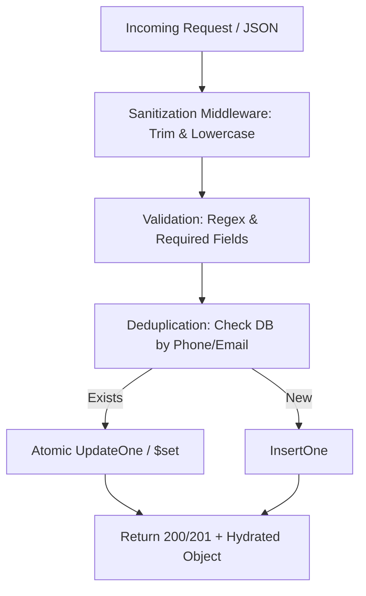

# Standardized Data Entry & API Endpoint Guidelines

**Status:** Immutable Architectural Specification  
**Scope:** Database Schemas, API Request/Response Formats, Frontend Input Controls, Data Sanitization

---

## 1. 🏛️ Purpose & Core Philosophy

This document defines the strict data standardization rules for the Taskmaster platform. Whenever creating a new data entry point (frontend form) or API endpoint (backend route/controller), these guidelines guarantee uniform data formatting, bulletproof deduplication, and zero data corruption.

### The 3 Core Tenets
1. **Single Source of Truth**: All data must be normalized at the boundary (before hitting MongoDB) so that lookups and aggregations are 100% reliable.
2. **Zero Manual Parsing**: Dates, times, emails, and phone numbers must use native pickers and strict validators. No freeform text inputs for structured fields.
3. **Upsert over Blind Insert**: Every batch upload or API creation must check existing indexes (compound phone + email) to update existing records rather than creating duplicates.

---

## 2. 🧱 Universal Data Types & Formatting Rules

Whenever defining a Mongoose schema or validating an Express API request body, adhere strictly to these data types and normalizations:

### 📧 Email Address (`email`)
* **Type**: `String`
* **Sanitization**: `.toLowerCase().trim()`. All leading, trailing, and inner spaces removed. Control characters (`\x00-\x1F`) stripped.
* **Validation**: Must pass strict email regex (`/^[^\s@]+@[^\s@]+\.[^\s@]+$/`). Minimum length 6 chars.
* **Storage Example**: `"shreyashmishra886@gmail.com"`

### 📞 Phone Number (`phone`)
* **Type**: `String`
* **Sanitization**: Strip all non-numeric characters except the leading `+`.
* **Standardization**: Enforce E.164 international format. If exactly 10 digits without country code, prefix with `+91` automatically.
* **Storage Example**: `"+917828693987"`

### 🗺️ Location / City (`city`, `state`, `location`)
* **Type**: `String`
* **Sanitization**: Store strictly in lowercase only (`.toLowerCase()`). Remove any special characters like `(`, `)`, `.`, `,` (`.replace(/[().,]/g, '')`). Collapse multiple spaces into a single space and trim (`.replace(/\s+/g, ' ').trim()`).
* **Storage Example**: `"prayagraj"`, `"joginder nagar"`, `"delhi"`

### 👤 Identity / Names (`name`, `title`)
* **Type**: `String`
* **Sanitization**: Strip all HTML/script tags (`<script>`, `<div>`). Collapse multiple inner whitespaces into a single space (`.replace(/\s+/g, ' ')`). Trim leading and trailing spaces.
* **Storage Example**: `"Shreyash Mishra"`

### 📅 Dates (`date`, `dueDate`, `nextFollowupDate`)
* **Type**: `String` (for exact calendar days) or `Date` (for exact timestamps).
* **Format**: ISO 8601 Standard (`YYYY-MM-DD`).
* **Frontend Rule**: Must use native HTML5 `<input type="date" />`. Prevent manual typing via `onKeyDown={(e) => e.preventDefault()}` and open picker on click `e.target.showPicker?.()`.
* **Storage Example**: `"2025-11-18"`

### ⏰ Times (`time`, `nextFollowupTime`)
* **Type**: `String`
* **Format**: 24-hour military format (`HH:mm`).
* **Frontend Rule**: Must use `<input type="time" />` with native picker enforcement.
* **Storage Example**: `"14:30"`

### 🏷️ Status / Enums (`status`, `leadStatus`, `callStatus`)
* **Type**: `String`
* **Validation**: Must validate against strict schema `enum` arrays. PascalCase or lowercase standard.
* **Allowed Values (CRM)**: `['New', 'Hot', 'In-Progress', 'Converted', 'Archived']`
* **Allowed Values (Call)**: `['Pending', 'Connected', 'Busy', 'Did Not Pick', 'Invalid Number']`

### 🔑 Identifiers & Foreign Keys
* **Type**: `mongoose.Schema.Types.ObjectId`
* **Naming Standard**: Must end with `Id` (`projectId`, `assignedRepId`, `leadId`, `userId`). Never expose raw hex IDs directly in UI text without human-readable population (`.populate()`).

---

## 3. 📝 Standard Schema & Field Naming Conventions

All database models must use camelCase naming for fields and pascalCase for model names.

```javascript
// Example Standard Schema Definition
const StandardEntitySchema = new mongoose.Schema({
  name: { type: String, required: true, trim: true },
  email: { type: String, index: true, lowercase: true, trim: true },
  phone: { type: String, index: true },
  status: { type: String, enum: ['Active', 'Pending', 'Archived'], default: 'Pending' },
  assignedRepId: { type: mongoose.Schema.Types.ObjectId, ref: 'User', default: null },
  dueDate: { type: String }, // 'YYYY-MM-DD'
  dueTime: { type: String }, // 'HH:mm'
  tags: [{ type: String, trim: true }],
  metadata: { type: mongoose.Schema.Types.Mixed, default: {} }
}, { timestamps: true });
```

---

## 4. 🚀 API Endpoint Creation Blueprint

Whenever constructing a new Express route and controller for data entry, follow this 4-step pipeline:



### Step 1: Input Interception & Sanitization
Before any business logic runs, pass inputs through `sanitizer.js`:
```javascript
const cleanEmail = sanitizeEmail(req.body.email);
const cleanPhone = normalizePhone(req.body.phone);
const cleanName = sanitizeName(req.body.name);
```

### Step 2: Index Deduplication Strategy
Never execute `Model.create()` blindly. Always search for existing identities first:
```javascript
const filter = { $or: [] };
if (cleanEmail) filter.$or.push({ email: cleanEmail });
if (cleanPhone) filter.$or.push({ phone: cleanPhone });

const existing = filter.$or.length > 0 ? await Entity.findOne(filter) : null;
```

### Step 3: Atomic Upsert Operation
If existing, update non-key fields. If new, insert full record:
```javascript
const result = await Entity.findOneAndUpdate(
  filter.$or.length > 0 ? filter : { _id: new mongoose.Types.ObjectId() },
  { 
    $set: { name: cleanName, updatedAt: new Date(), ...otherData },
    $setOnInsert: { email: cleanEmail, phone: cleanPhone, createdAt: new Date() }
  },
  { new: true, upsert: true }
);
```

### Step 4: Audit & Activity Logging
If modifying sensitive CRM records or assignments, push a log entry to `CRMAudit`:
```javascript
await CRMAudit.create({
  leadId: result._id,
  userId: req.user._id,
  fieldChanged: 'assignedRepId',
  oldValue: String(oldRepId),
  newValue: String(newRepId)
});
```

---

## 5. 💻 Frontend Data Entry Rules (React / JSX)

When building UI forms and modals for data submission:

1. **Controlled Inputs Exclusively**: Always bind value and onChange. Never use uncontrolled refs for core form submissions.
2. **Native Date/Time Pickers**:
   ```jsx
   // Mandatory implementation for date entries
   <input 
     type="date"
     value={formData.date || ''}
     onClick={(e) => e.target.showPicker?.()}
     onFocus={(e) => e.target.showPicker?.()}
     onKeyDown={(e) => e.preventDefault()} // Blocks manual typing
     onChange={(e) => setFormData({...formData, date: e.target.value})}
   />
   ```
3. **Instant Cache Invalidation**: On successful API mutation, trigger React Query invalidation immediately:
   ```javascript
   queryClient.invalidateQueries(['leads']);
   queryClient.invalidateQueries(['crm', 'stats']);
   ```
4. **Plain English Jargon Policy**: Use human-readable terms on buttons and form labels.
   * `Submit Payload` ➔ **Save Changes**
   * `Personnel Assignment` ➔ **Assigned Member**
   * `Execution Target` ➔ **Due Date**

---

## 6. 🎨 Domain-Specific Entity Specification (Example: Artists Form)

Whenever creating a structured onboarding form or CSV import schema for multi-dimensional entities like **Artists**, data must be captured across structured, typed parameters.

### Form Field Parameter Blueprint for Artists

When building the `<ArtistCreateForm />` or `POST /api/artists`, enforce these precise inputs:

| UI Label / Input Name | DB Field Name | Data Type & UI Control | Required / Rules | Sanitization / Normalization |
| :--- | :--- | :--- | :--- | :--- |
| **Artist Full Name** | `name` | `String` (Input Text) | **Required**. Single primary key. | Strip HTML, collapse double spaces (`.replace(/\s+/g, ' ')`). |
| **Biography / Intro** | `bio` | `String` (Textarea) | Optional. Max 1000 characters. | Markdown or plain text. Strip malicious `<script>` tags. |
| **Profile Photo URL** | `profileImage` | `String` (Upload / URL) | Optional. Direct CDN or UploadThing URL. | Verify `https://` prefix. Default to standard avatar placeholder if missing. |
| **Official Website** | `website` | `String` (Input URL) | Optional. | Auto-prepend `https://` if user types `www.domain.com`. |
| **YouTube Channel Link** | `socials.youtube` | `String` (Input URL) | Optional. | Extract channel handle `@handle` or full URL. |
| **Instagram Handle** | `socials.instagram` | `String` (Input Text) | Optional. | Strip leading `@` or URL prefix before storage. |
| **Spotify Artist Link** | `socials.spotify` | `String` (Input URL) | Optional. | Validate Spotify URL format (`open.spotify.com/artist/...`). |
| **YouTube Channel ID** | `oauthCredentials.youtube.channelId` | `String` (Input Text) | Optional. Used for API tracking. | Exact 24-character ID (starts with `UC...`). |
| **Instagram Account ID** | `oauthCredentials.meta.igAccountId` | `String` (Input Numeric) | Optional. Used for Meta API sync. | Numeric ID. Trim whitespace. |
| **Spotify Artist ID** | `oauthCredentials.spotify.artistId` | `String` (Input Alphanumeric) | Optional. Used for Spotify API sync. | Extract 22-character ID from Spotify URI/URL. |
| **Live Sync Active** | `isSynced` | `Boolean` (Toggle Switch) | Default: `false`. | When enabled, triggers background automated analytics hydration. |
| **Managing Team** | `team` | `Array<ObjectId>` (Multi-Select) | References `User` model. | Array of representative ObjectIds. |

### Sample JSON Payload (`POST /api/artists`)

```json
{
  "name": "Yugm Folk Band",
  "bio": "Contemporary folk fusion band bringing roots music to modern stages.",
  "profileImage": "https://utfs.io/f/sample-artist-avatar.jpg",
  "website": "https://yugmfolk.com",
  "socials": {
    "youtube": "https://youtube.com/@yugmfolk",
    "instagram": "yugmofficial",
    "spotify": "https://open.spotify.com/artist/4X9z68u43p57912"
  },
  "oauthCredentials": {
    "youtube": { "channelId": "UCk2X9z68u43p57912" },
    "spotify": { "artistId": "4X9z68u43p57912" },
    "meta": { "igAccountId": "1784140981294821" }
  },
  "isSynced": true,
  "team": ["6538a1b2c3d4e5f600112233"]
}
```

### UI Implementation Best Practices for Complex Forms
1. **Categorized Accordions/Tabs**: Separate Core Details, Social Handles, and API Keys into distinct collapsible sections to prevent cognitive overload.
2. **Layman Tooltips**: Next to technical fields (like `YouTube Channel ID` or `Spotify Artist ID`), add an inline `(i)` popover button showing a 2-sentence visual guide on how to find that exact identifier.
3. **Optimistic Preview**: As the user inputs social handles, render live social badge previews in the sidebar so they instantly verify correct formatting.
