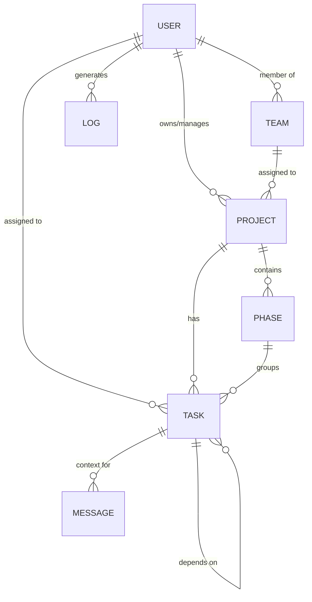
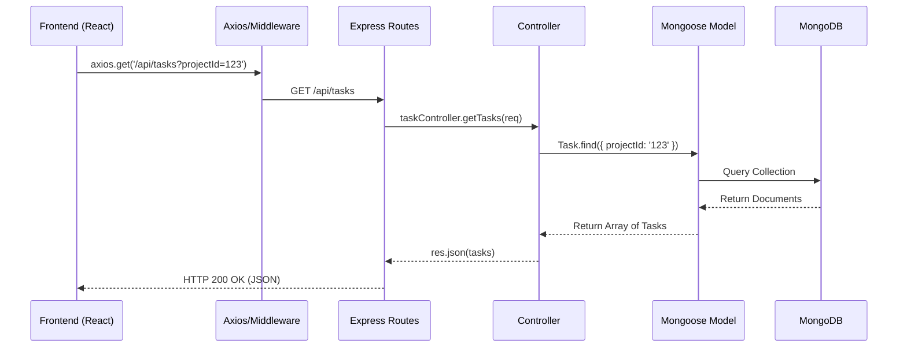
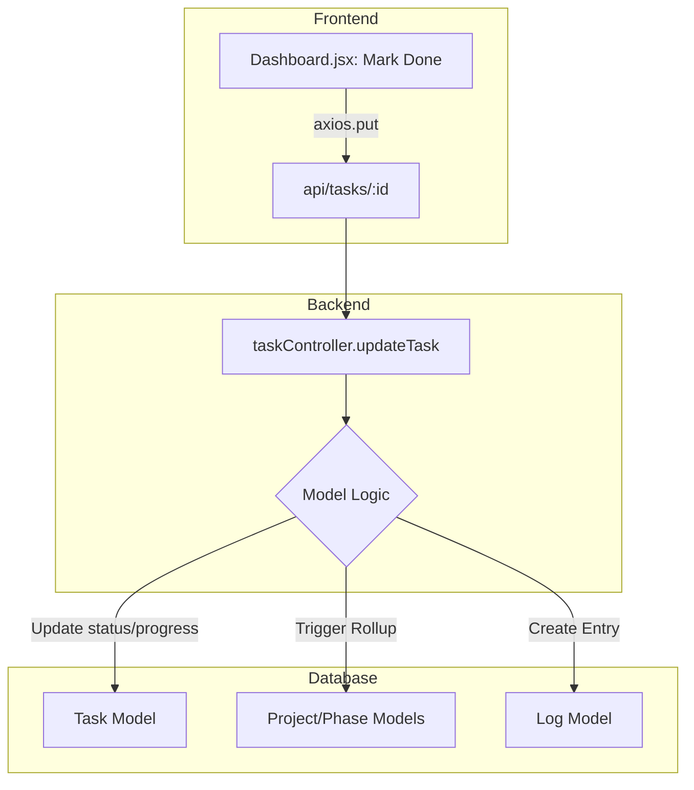

# Taskmaster: Backend-Frontend Linkage Documentation

This document outlines how the backend models are structured, how they link to each other, and how the frontend interacts with them through API endpoints.

## 1. Data Architecture (Mongoose Models)

The backend uses MongoDB with Mongoose. Below is the relationship map between core models.

### Model Relationships Flowchart

### Model Definitions
| Model | Key Fields | Links to |
| :--- | :--- | :--- |
| **User** | `name`, `email`, `role`, `teams`, `avatar` | N/A |
| **Team** | `name`, `description` | `createdBy` (User) |
| **Project** | `name`, `outletId`, `status`, `teams` | `owner` (User), `members` (User) |
| **Phase** | `name`, `progress`, `status` | `projectId` (Project) |
| **Task** | `title`, `status`, `priority`, `progress` | `projectId` (Project), `phaseId` (Phase), `assignees` (User) |
| **Log** | `action`, `details`, `targetType` | `userId` (User), `targetId` (Generic) |
| **Message** | `content`, `outletId` | `senderId` (User), `taskId` (Task) |

---

## 2. Model Schema Linkage (Foreign Keys)

This section details how Mongoose ObjectIds are used to link different data entities.

### User References
*   **User -> Teams**: Stored as an array of strings (Team names) for rapid filtering.
*   **Team -> User**: `createdBy` field references the `User` who initialized the team.

### Project & Task Hierarchy
*   **Project -> User**: 
    - `owner`: Reference to the primary `User`.
    - `members`: Array of `User` references.
    - `memberRoles.user`: Link to specific `User` for role assignments.
*   **Phase -> Project**: `projectId` ensures every phase belongs to a parent project.
*   **Task -> Project/Phase**:
    - `projectId`: Primary project link.
    - `phaseId`: Optional link to a specific project phase.
    - `assignees`: Array of `User` references who are working on the task.
    - `parentTaskId`: Reference to another `Task` for sub-task structures.
    - `dependencies`: Array of `Task` references for blocking/ordering.

### Activity & Communication
*   **Log -> User**: `userId` tracks who performed the action.
*   **Message -> User/Task**:
    - `senderId`: Reference to the `User` sending the message.
    - `mentions`: Array of `User` references mentioned in text.
    - `taskId`: Optional link if a message is converted into a task.

---

## 3. API Communication Flow

The frontend communicates with the backend via a RESTful API hosted at `/api`.

### End-to-End Flow Example: Fetching Tasks

---

## 3. API Reference & Frontend Usage

### Authentication
| Endpoint | Method | Frontend Source | Purpose |
| :--- | :--- | :--- | :--- |
| `/api/auth/login` | POST | `LoginPage.jsx` | Authenticate user & get token |
| `/api/auth/register` | POST | `RegisterPage.jsx` | Create new user account |
| `/api/auth/me` | GET | `AuthContext.jsx` | Validate token & get current user |

### Project Management
| Endpoint | Method | Frontend Source | Purpose |
| :--- | :--- | :--- | :--- |
| `/api/projects` | GET | `ProjectsView.jsx` | List all accessible projects |
| `/api/projects/:id` | GET | `ProjectDetail.jsx` | Get specific project details |
| `/api/projects` | POST | `ProjectCreate.jsx` | Create a new project |

### Task Management
| Endpoint | Method | Frontend Source | Purpose |
| :--- | :--- | :--- | :--- |
| `/api/tasks` | GET | `Dashboard.jsx` | Fetch tasks for user/project |
| `/api/tasks/:id` | PUT | `ProjectDetail.jsx` | Update task status or progress |
| `/api/tasks` | POST | `ChatPage.jsx` | Create task (often via AI/Chat) |

### User & Team Admin
| Endpoint | Method | Frontend Source | Purpose |
| :--- | :--- | :--- | :--- |
| `/api/users/directory` | GET | `AdminPanel.jsx` | Fetch all users for admin list |
| `/api/users/:id/role` | PUT | `AdminPanel.jsx` | Update user permission level |
| `/api/teams` | POST | `AdminPanel.jsx` | Create a new organizational team |

---

## 5. Technical Linkage Deep-Dive (End-to-End)

This table tracks the exact flow from a user action to a database update.

| Feature | Frontend Component | API Request | Backend Controller | DB Operation | Model(s) Updated | Side Effects |
| :--- | :--- | :--- | :--- | :--- | :--- | :--- |
| **Complete Task** | `Dashboard.jsx` | `PUT /api/tasks/:id` | `updateTask` | `findByIdAndUpdate` | `Task` | Recalculates Project progress; Creates `Log` entry. |
| **Create Project** | `ProjectCreate.jsx` | `POST /api/projects` | `createProject` | `Project.create()` | `Project` | Sets owner/members; Auto-assigns `outletId`. |
| **Update Profile** | `SettingsPage.jsx` | `PUT /api/users/profile` | `updateProfile` | `findByIdAndUpdate` | `User` | Updates avatar, name, and phone. |
| **User Sign-up** | `RegisterPage.jsx` | `POST /api/auth/register`| `register` | `User.create()` | `User` | Hashes password via Mongoose pre-save hook. |
| **Role Change** | `AdminPanel.jsx` | `PUT /api/users/:id/role`| `updateUserRole` | `findByIdAndUpdate` | `User` | Changes permission levels (Admin/User). |
| **Send Message** | `ChatPage.jsx` | `POST /api/chat` | `sendMessage` | `Message.create()` | `Message` | Broadcasts to socket (if active). |
| **Add Team** | `AdminPanel.jsx` | `POST /api/teams` | `createTeam` | `Team.create()` | `Team` | Available for filtering in user directory. |

### Visualizing a Single Link (Example: Completing a Task)

### Example: Completing a Task (Trace)
1.  **UI Interaction**: User clicks "Done" on a task card within the `Dashboard.jsx` interface.
2.  **Frontend Call**: React triggers an `axios.put('/api/tasks/TASK_ID', { status: 'done' })` request.
3.  **Backend Routing**: Express matches the route to `taskController.updateTask`.
4.  **Business Logic**: 
    - Controller detects `status: 'done'`.
    - Automatically sets `progress: 100` and `completedAt: new Date()`.
5.  **Database Update**: `Task.findByIdAndUpdate` executes in MongoDB.
6.  **Post-Update Hook**: 
    - `calculateRollup` runs to update the parent Project's overall progress.
    - `Log.create` generates an activity record for the user's daily log.
