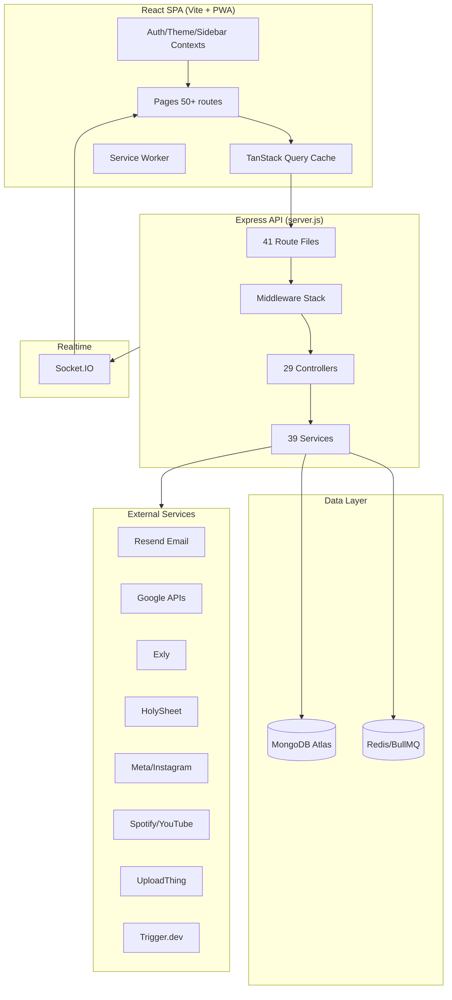

# CoreKnot (Taskmaster) — Complete AI Agent Project Context

> **Purpose:** Single authoritative export for any AI coding agent working on this codebase.  
> **Product name:** CoreKnot (repo folder: `Taskmaster`, GitHub: `CoreKnot`)  
> **Version:** 1.7.38 (as of README; package.json may show 1.7.30)  
> **Last compiled:** 2026-06-01  
> **Read this entire document before making changes.**

---

## Table of Contents

1. [Executive Summary](#1-executive-summary)
2. [Repository Layout](#2-repository-layout)
3. [Tech Stack](#3-tech-stack)
4. [Production & Deployment](#4-production--deployment)
5. [Local Development](#5-local-development)
6. [Environment Variables](#6-environment-variables)
7. [System Architecture](#7-system-architecture)
8. [Authentication & Authorization](#8-authentication--authorization)
9. [Multi-Tenancy](#9-multi-tenancy)
10. [Backend — Complete Reference](#10-backend--complete-reference)
11. [Frontend — Complete Reference](#11-frontend--complete-reference)
12. [Feature Modules (Deep Dive)](#12-feature-modules-deep-dive)
13. [Email Engine (LOCKED)](#13-email-engine-locked)
14. [Background Jobs, Cron & Webhooks](#14-background-jobs-cron--webhooks)
15. [External Integrations](#15-external-integrations)
16. [Shared Cross-Package Contracts](#16-shared-cross-package-contracts)
17. [Critical Business Rules](#17-critical-business-rules)
18. [Observability & Diagnostics](#18-observability--diagnostics)
19. [Database Transactions & Concurrency](#19-database-transactions--concurrency)
20. [Scripts & Migrations](#20-scripts--migrations)
21. [UI/UX Conventions](#21-uiux-conventions)
22. [Locked Zones — Do Not Modify](#22-locked-zones--do-not-modify)
23. [Known Architectural Patterns](#23-known-architectural-patterns)
24. [Complete Route Map](#24-complete-route-map)
25. [Complete API Surface](#25-complete-api-surface)
26. [Complete Model Catalog](#26-complete-model-catalog)
27. [Related Documentation Index](#27-related-documentation-index)

---

## 1. Executive Summary

CoreKnot is an **enterprise multi-tenant CRM & operations hub** built for agency workflows (The Shakti Collective). It unifies:

- **Project & task management** with strict peer-review governance
- **CRM & sales pipelines** (leads, follow-ups, Exly bookings, HolySheet sync)
- **Email campaigns** with open/click tracking and geo resolution
- **Finance document management** with OCR (pdf-parse, tesseract.js)
- **HR/attendance** with IP-based office verification
- **Artist analytics** (Spotify, YouTube, Meta/Instagram OAuth)
- **Gamification** (XP, levels, weekly leaderboard)
- **Real-time notifications** (in-app, email, web push)
- **Admin/ops tooling** (system logs, QA runner, script runner)

Architecture: **decoupled React SPA (Vite + PWA) + Express REST API + MongoDB + Redis/BullMQ + Socket.IO**.

---

## 2. Repository Layout

```
Taskmaster/                          # Root (also called CoreKnot)
├── client/                            # React 18 SPA (Vite 5, Tailwind v4)
│   ├── public/                        # PWA manifest, icons, robots, sitemap
│   ├── src/
│   │   ├── main.jsx                   # Provider tree entry
│   │   ├── App.jsx                    # Routes, axios interceptors, lazy loading
│   │   ├── index.css                  # Design tokens, Tailwind v4
│   │   ├── sw.js                      # Service worker (injectManifest)
│   │   ├── contexts/                  # Auth, Theme, Sidebar, Toast, Confirm
│   │   ├── hooks/                     # useTaskmasterQueries (~1400 lines), useSystemLogs, etc.
│   │   ├── lib/                       # realtime, notifications, systemLogBridge, pageAnalytics
│   │   ├── utils/                     # 33 utility files (CRM, attendance, mail, etc.)
│   │   ├── constants/                 # calendarOptions, etc.
│   │   ├── config/                    # integrations.config.js (OAuth paths)
│   │   ├── pages/                     # 57 page files across 15 subdirs
│   │   └── components/                # 108+ component files
│   ├── vite.config.js
│   ├── vercel.json                    # API proxy to Render
│   └── package.json                   # CoreKnot-client v1.7.30
├── server/                            # Node.js Express API
│   ├── server.js                      # Entry point, middleware, startup
│   ├── routes/                        # 41 route files
│   ├── controllers/                   # 29 controller files
│   ├── models/                        # 58 Mongoose models + plugins
│   ├── services/                      # 39 service files
│   ├── middleware/                    # auth, logger, trace, error, concurrency
│   ├── utils/                         # 39 utility files
│   ├── workers/                       # statsWorker, webhookWorker, importWorker, logArchiverWorker
│   ├── jobs/                          # backupJob (disabled inline)
│   ├── scripts/                       # 57 maintenance/migration scripts
│   ├── templates/                     # HTML email templates
│   ├── config/                        # environment, integrations, realtime, uploadthing
│   ├── plugins/                       # tenantPlugin.js
│   ├── crm/lib/                       # schema, csv-store, rep-assignment
│   └── package.json                   # CoreKnot API v1.7.30
├── shared/                            # Cross-runtime shared logic
│   ├── taskReviewRules.js             # Strict task review governance
│   ├── projectRoles.js                # Project role ranks
│   ├── systemLogContract.js           # Severity, module enums, toast contract
│   └── taskPriorityDates.js           # Task date helpers
├── docs/                              # Architecture docs (this file lives here)
├── render.yaml                        # Render cron for daily backup
└── README.md                          # Human-facing overview
```

**Aliases:**
- Client Vite: `@` → `./src`, `@shared` → `../shared`
- Branding: UI shows "CoreKnot"; repo/git may say Taskmaster

---

## 3. Tech Stack

| Layer | Technology |
|-------|-----------|
| **Frontend** | React 18, Vite 5, Tailwind CSS v4, TanStack Query 5, Framer Motion, React Router 6 |
| **Backend** | Node.js 18+, Express, Mongoose ODM |
| **Database** | MongoDB Atlas |
| **Cache/Queue** | Redis (BullMQ), in-memory fallback when Redis unavailable |
| **Background jobs** | BullMQ, Trigger.dev, node-cron |
| **Realtime** | Socket.IO (JWT auth) |
| **Auth** | JWT (primary), Google OAuth 2.0, optional Clerk |
| **Email** | Resend (primary), SendGrid (fallback), Nodemailer/SMTP (profiles) |
| **File uploads** | UploadThing (finance documents) |
| **PWA** | vite-plugin-pwa, custom service worker |
| **Deploy** | Render (API), Vercel (static frontend CDN) |
| **Testing** | Jest (server/tests), QA automation (server/scripts/runQAScan.js) |

---

## 4. Production & Deployment

### Live URLs

| Service | URL | Notes |
|---------|-----|-------|
| **Frontend (production)** | `https://tsccoreknot.com` | Vercel static site |
| **API (Render)** | `https://CoreKnot-jfw0.onrender.com` | Primary API host |
| **Tracking base URL** | `https://CoreKnot-jfw0.onrender.com` | Email open/click pixels |
| **Marketing site** | `https://theshakticollective.in` | Book-a-call forwards to webhook |
| **Alternate API (SUSPENDED)** | `https://CoreKnot-api.onrender.com` | **Never use** — email tracking must not fall back here |

### Deployment topology

```
Browser → tsccoreknot.com (Vercel CDN)
              │
              ├─ Static assets (client/dist)
              └─ /api/* → proxy → CoreKnot-jfw0.onrender.com/api/*
                                        │
                                        ├─ MongoDB Atlas
                                        ├─ Redis (BullMQ)
                                        └─ External APIs (Resend, Google, Exly, etc.)
```

**Vercel config** (`client/vercel.json`):
- `/api/(.*)` → `https://CoreKnot-jfw0.onrender.com/api/$1`
- `/(.*)` → `/index.html` (SPA fallback)

**Render config** (`render.yaml`):
- Cron job `CoreKnot-daily-backup` at `31 18 * * *` (12:01 AM IST)
- Runs `node scripts/runDailyBackup.js`
- Backups to GridFS in `taskmaster_backups` DB, 7-day retention

**Production build:** In production, `server/server.js` serves `client/dist` as static SPA with cache headers.

### Critical production env

```
VITE_API_URL=https://CoreKnot-jfw0.onrender.com          # On Vercel
TRACKING_BASE_URL=https://CoreKnot-jfw0.onrender.com       # On Render
FRONTEND_URL=https://tsccoreknot.com
MONGODB_URI_PROD=<atlas connection>
```

**Payload size note:** Large campaign HTML + base64 attachments exceed Vercel's ~4.5MB proxy limit. Frontend must use `VITE_API_URL` pointing directly to Render API for campaign creation; attachments via `POST /api/campaigns/upload-attachment`.

---

## 5. Local Development

### Prerequisites
- Node.js v18+
- MongoDB (local or Atlas)
- Redis (recommended for queues; falls back to in-memory)

### Boot sequence

```bash
# 1. Install
cd server && npm install
cd ../client && npm install

# 2. Configure
cd ../server && cp .env.example .env   # Fill secrets
# client/.env: VITE_API_URL=http://localhost:5000 (optional)

# 3. Seed (first time)
node scripts/seedDepartmentsAndTaskTypes.js

# 4. Run (two terminals)
cd server && npm run dev    # http://localhost:5000
cd client && npm run dev    # http://localhost:5173
```

### Local auth bypass

```
DEBUG_BYPASS=true
DEBUG_BYPASS_TOKEN=bypass_token
Authorization: Bearer bypass_token
```

Works on localhost only; auto-logs in first admin user.

### Local mail tracking

Set `MAIL_USE_PROD_DB=true` so EmailLog/MailEvent writes go to production DB when testing tracking pixels locally (pixels hit public Render API).

---

## 6. Environment Variables

### Core (required)

| Variable | Purpose |
|----------|---------|
| `MONGODB_URI` | Dev/local database |
| `MONGODB_URI_PROD` | Production database |
| `JWT_SECRET` | JWT signing + tracking HMAC |
| `NODE_ENV` | development / production / test |
| `PORT` | Server port (default 5000) |

### Auth

| Variable | Purpose |
|----------|---------|
| `CLERK_SECRET_KEY` | Optional Clerk JWT verification |
| `DEBUG_BYPASS` / `DEBUG_BYPASS_TOKEN` | Localhost auth bypass |
| `DEFAULT_SEED_PASSWORD` | Auto-created Clerk users |
| `GOOGLE_CLIENT_ID/SECRET/REDIRECT_URI` | Google OAuth |

### URLs

| Variable | Purpose |
|----------|---------|
| `FRONTEND_URL` | Email CTAs, unsubscribe page |
| `APP_BASE_URL` / `CLIENT_URL` / `SERVER_URL` | App URL resolution |
| `VITE_API_URL` | Client axios base URL |
| `TRACKING_BASE_URL` | Email pixel base (must be live API) |
| `TRACKING_USE_LOCAL` / `TRACKING_PUBLIC_FALLBACK` | Tracking URL dev overrides |
| `CORS_ALLOWED_ORIGINS` | Extra CORS origins (comma-separated) |

### Redis / Queues

| Variable | Purpose |
|----------|---------|
| `REDIS_URL` | BullMQ, locks (default `redis://127.0.0.1:6379`) |
| `TRIGGER_API_KEY` / `TRIGGER_API_URL` | Trigger.dev background jobs |

### Email

| Variable | Purpose |
|----------|---------|
| `RESEND_API_KEY` | Primary email sender |
| `RESEND_WEBHOOK_SECRET` | Svix webhook verification |
| `SENDGRID_API_KEY` | Fallback mailer |
| `SMTP_HOST/PORT/USER/PASS` | Nodemailer / system_smtp mode |
| `EMAIL_ADDRESS/PASSWORD/SERVICE` | Provider presets |
| `GMAIL_APP_PASSWORD` | Gmail SMTP |
| `BREVO_SMTP_KEY/USER` | Brevo |
| `MAILJET_API_KEY/SECRET_KEY` | Mailjet |
| `SYSTEM_VERIFIED_FROM_EMAIL` | Default sender |
| `MAIL_USE_PROD_DB` | Local tracking → prod DB |

### Google

| Variable | Purpose |
|----------|---------|
| `GOOGLE_SERVICE_ACCOUNT_EMAIL/PRIVATE_KEY` | Sheets append (BookedCalls) |
| `GOOGLE_SERVICE_ACCOUNT_PATH` | Key file path |
| `SPREADSHEET_ID` | HolySheet/bookings sheet |

### OAuth (Artists)

| Variable | Purpose |
|----------|---------|
| `SPOTIFY_CLIENT_ID/SECRET/OAUTH_REDIRECT_URI` | Spotify |
| `YOUTUBE_CLIENT_ID/SECRET/OAUTH_REDIRECT_URI` | YouTube |
| `META_APP_ID/SECRET` | Meta/Instagram |
| `META_VERIFY_TOKEN` / `META_WEBHOOK_VERIFY_TOKEN` | Webhook handshake |
| `META_USER_TOKEN` | Graph API |
| `SONGSTATS_API_KEY` | Songstats |
| `ARTIST_SHARE_TOKEN_EXPIRES` | Share link JWT expiry |

### Push / Upload

| Variable | Purpose |
|----------|---------|
| `VAPID_PUBLIC_KEY/PRIVATE_KEY/SUBJECT` | Web push |
| `UPLOADTHING_TOKEN/SECRET` | UploadThing |

### Ops / Integrations

| Variable | Purpose |
|----------|---------|
| `BACKUP_ENABLED/RETENTION_DAYS/MONGODB_BACKUP_DB` | Daily backup |
| `BACKUP_NOTIFY_EMAIL/FROM_EMAIL/ADMIN_EMAIL` | Backup alerts |
| `OFFICE_PUBLIC_IP` / `OFFICE_IP_WHITELIST` | Attendance IP verification |
| `EXLY_API_KEY/URL` | Exly integration |
| `AISENSY_API_KEY` | WhatsApp (book-call confirmations) |
| `HOLYSHEET_BOOKED_CALLS_API_KEY` / `HOLYSHEET_API_KEY` | HolySheet |
| `ENCRYPTION_KEY` | Token encryption (ConnectedProfile) |
| `LOG_LEVEL` | Logger verbosity |

**Config module:** `server/config/environment.js` — mail provider selection logic.

---

## 7. System Architecture



### Request lifecycle

1. **Perf logger** → timing to `server/performance.log`
2. **trust proxy** → Render/Vercel IP forwarding
3. **helmet** → security headers
4. **compression** → gzip
5. **cors** → allowlist (localhost, tsccoreknot.com, theshakticollective.in, vercel.app)
6. **express.json** → 50MB limit, captures `req.rawBody` for webhook signatures
7. **mongo-sanitize** → NoSQL injection protection
8. **Rate limiters** → global `/api/`, auth `/api/auth/`, tracking `/open/`, `/click/`, webhooks
9. **SystemHealthService** → 503 if DB unhealthy
10. **traceMiddleware** → `X-Trace-Id` via AsyncLocalStorage
11. **MongoDB connect**
12. **Route handler** → inside `runWithContext({ tenantId, userId, traceId })`
13. **errorMiddleware** → centralized errors + system log

### Startup sequence (after listen)

1. `notificationService.init()` — cron every minute
2. `configureWebPush()` — VAPID keys
3. Workers: `statsWorker`, `webhookWorker`, `importWorker`, `logArchiverWorker`
4. `initRealtime(server)` — Socket.IO
5. Background DB repair — zero-value Artist analytics cleanup
6. `backupJob.start()` — **disabled** (use Render cron)

---

## 8. Authentication & Authorization

### Auth flow

```
Login/Register/Google OAuth
    → POST /api/auth/login | /register | /api/auth/google
    → JWT token issued
    → Client stores coreknot_token + coreknot_user in localStorage
    → axios.defaults.headers.Authorization = Bearer <token>
    → GET /api/auth/me on mount + every 30s (AuthContext)
    → ProtectedRoute checks token
    → PageRoute checks department pagePermissions
```

### Auth methods

1. **Email/password** — `/api/auth/login`
2. **Google OAuth** — redirect `/api/auth/google` → callback `/auth/google/success?token=&user=`
3. **Registration** — `/api/auth/register` with optional `departmentId`
4. **Clerk** (optional) — if `CLERK_SECRET_KEY` set, verify Clerk JWT → find/create User
5. **Debug bypass** — localhost only with `DEBUG_BYPASS=true`

### Role gates (department-based, NOT legacy user.role)

| Middleware | Access |
|-----------|--------|
| `protect` | Any authenticated user |
| `admin` | Department slug = `admin` |
| `opsOrAdmin` | admin or `operations` department |
| `artistOrAdmin` | admin or `artist-management` department |
| `opsOnly` (inline) | finance routes — ops or admin |
| `isOpsUser` (inline) | announcements, attendance approvals |

**Department slugs:** `admin`, `operations`, `sales`, `artist-management`, standard (no slug → base pages)

### Page permissions

Defined in `server/utils/pagePermissions.js` and mirrored in `client/src/utils/pagePermissions.js`.

**Presets:**

| Preset | Pages |
|--------|-------|
| `admin` | All pages |
| `operations` | Base + finance, announcements, ops_logs |
| `sales` | Base + leads, followups, bookings |
| `artist-management` | Base + artists |
| `standard` | Base pages only |

**Base pages:** dashboard, calendar, todo, inbox, projects, assets, schedule, logs, equipment, contacts, attendance

**Frontend enforcement:** `PageRoute` component wraps routes; redirects unauthorized users.

**Backend enforcement:** Individual routes use `admin`, `opsOrAdmin`, etc. middleware.

---

## 9. Multi-Tenancy

### Tenant plugin

**File:** `server/plugins/tenantPlugin.js`

Applied to **44 models** — auto-injects `tenantId` on validate; filters all queries unless `{ bypassTenant: true }`.

### Tenant context

**File:** `server/utils/tenantContext.js`

Uses **AsyncLocalStorage** to store `tenantId`, `userId`, `traceId` per request. Set in `authMiddleware` after JWT verification.

### Models WITHOUT tenant plugin (global or manual)

`Tenant`, `MailTemplate`, `ArtistMetrics`, `ArtistAuth`, `ArtistConnection`, `TaskAssignment`, `GamificationConfig`, `CRMStatSnapshot`, `Role`, `Permission`, `Attendance`, `LeaveRequest`, `DailyMission`, `QATestRun`, `XPAuditLog`, `NavbarPreference`, `DashboardPreset`, `TenantConfig`

### Bypass tenant

Used in locked email tracking code:
```javascript
MailEvent.find({ campaignId }).setOptions({ bypassTenant: true })
```

Track routes create events without user tenant context.

---

## 10. Backend — Complete Reference

### Entry point

`server/server.js` — mounts all routes, middleware, workers, static SPA in production.

### All route files (41)

Path: `server/routes/`

| File | Mount | Auth | Domain |
|------|-------|------|--------|
| `authRoutes.js` | `/api/auth` | Public (+ `/me` protected) | Register, login, Google OAuth, JWT |
| `authConnectRoutes.js` | `/api/auth` | protect + artistOrAdmin | Spotify/YouTube/Meta OAuth |
| `projectRoutes.js` | `/api/projects` | protect | Projects, workspaces, members, workload |
| `taskRoutes.js` | `/api/tasks` | protect | Tasks CRUD, bug report |
| `userRoutes.js` | `/api/users` | protect/admin | Profile, directory, admin user mgmt |
| `logRoutes.js` | `/api/logs` | protect | Activity logs, bug reports, QA |
| `systemLogRoutes.js` | `/api/system-logs` | protect/opsOrAdmin | Client logs, analytics, traces |
| `chatRoutes.js` | `/api/chat` | protect | Team chat messages |
| `teamRoutes.js` | `/api/teams` | protect/admin | Team CRUD |
| `artistRoutes.js` | `/api/artists` | Mixed | Artist CRUD, analytics, Meta webhooks |
| `artistV2Routes.js` | `/api/v2/artists` | protect/public | Songstats, shared token preview |
| `gamificationRoutes.js` | `/api/gamification` | protect | Missions, progress, leaderboard |
| `gamificationAdminRoutes.js` | `/api/gamification-admin` | protect + admin | XP config |
| `qaRoutes.js` | `/api/qa` | protect | QA test runs |
| `customizationRoutes.js` | `/api/customization` | protect | Dashboard presets, navbar |
| `track.js` | `/` + `/api/track` | **Public** | Open pixel, click redirect, unsubscribe |
| `crmRoutes.js` | `/api/crm` | protect/admin | Leads, imports, EMIs, follow-ups, HolySheet |
| `assetRoutes.js` | `/api/assets` | protect | Project asset links |
| `googleRoutes.js` | `/api/google` | protect | Holidays, calendar, Drive |
| `googleAccounts.js` | `/api/google/accounts` | protect | Multi-account Google OAuth |
| `proxyRoutes.js` | `/api/proxy` | protect + rate limit | Authenticated external API proxy |
| `dashboardRoutes.js` | `/api/dashboard` | protect | Dashboard summary |
| `calendarRoutes.js` | `/api/calendar` | protect | Calendar events |
| `departmentRoutes.js` | `/api/departments` | public + protect/admin | Departments, task types, permissions |
| `scheduleRoutes.js` | `/api/schedule` | protect | User schedule from tasks |
| `notificationRoutes.js` | `/api/notifications` | protect | In-app notifications, web push |
| `noteRoutes.js` | `/api/notes` | protect | User notes |
| `pinBoardRoutes.js` | `/api/pinboard` | protect | Pin board notes |
| `mailRoutes.js` | `/api/mail` | protect | Legacy mail: templates, profiles, HolySheet |
| `sesRoutes.js` | `/api/ses` | Public webhook | AWS SES events |
| `tscRoutes.js` | `/api/tsc` | protect + admin | TSC sheet data import |
| `campaignRoutes.js` | `/api/campaigns` | protect | **Primary** email campaigns |
| `analyticsRoutes.js` | `/api/analytics` | protect | Cumulative metrics, geo |
| `webhookRoutes.js` | `/api/webhooks` | Public | Book-call, Instagram, Resend |
| `officeAssetRoutes.js` | `/api/office-assets` | protect/opsOrAdmin | Hardware inventory |
| `contactRoutes.js` | `/api/contacts` | protect/opsOrAdmin | Contact directory |
| `exlyRoutes.js` | `/api/exly` | Public webhook; admin protected | Exly bookings, offerings |
| `financeRoutes.js` | `/api/finance` | protect; opsOnly | Invoices, folders, UploadThing |
| `attendanceRoutes.js` | `/api/attendance` | protect | Check-in/out, leave |
| `announcementRoutes.js` | `/api/announcements` | Public pixel; rest protect | Broadcast announcements |
| `adminScriptsRoutes.js` | `/api/admin/scripts` | protect + admin | Maintenance script runner |

**Inline in server.js:** `POST /api/crm/unsubscribe` — manual CRM opt-out + HolySheet sync.

### Controllers (29)

Path: `server/controllers/`

`authController`, `userController`, `projectController`, `taskController`, `crmController`, `syncController`, `webhookController`, `mailAnalyticsController`, `analyticsController`, `dashboardController`, `financeController`, `googleController`, `artistController`, `artistAnalyticsController`, `artistShareController`, `connectionAuthController`, `spotifyAuthController`, `youtubeAuthController`, `teamController`, `assetController`, `tscController`, `exlyController`, `customizationController`, `noteController`, `pinBoardController`, `proxyController`, `qaTestingController`, `sheetController`

### Services (39)

Path: `server/services/`

Key services:
- **Mail:** `mailService`, `mailDriver`, `emailProcessor`, `queueService`, `profileSendStats`
- **CRM:** `LeadService`, `ContactService`, `FollowupService`, `followupCache`, `holySheetService`
- **Tasks:** `TaskService`, `notificationService`, `notificationDispatcher`
- **Gamification:** `gamificationService`
- **Artists:** `analyticsService`, `analyticsCron`, `metaGraphService`, `connectionService`, `artistEnrichmentService`, `spotifyTokenManager`, `TokenManager`
- **Exly:** `exlyService`, `exlyOfferingMetrics`, `exlyOfferingMigration`
- **Infrastructure:** `backgroundQueue`, `eventDispatcher`, `triggerService`, `SystemHealthService`, `systemLogService`, `cacheService`
- **Backup:** `databaseBackupService`, `csvBackupService`, `backupNotificationService`
- **Other:** `pushNotificationService`, `departmentService`, `tenantProvisioning`, `monthlyReportService`, `qaTestingService`, `metricsNormalizer`

### Middleware

| File | Purpose |
|------|---------|
| `authMiddleware.js` | JWT/Clerk verify, set req.user/tenantId, runWithContext |
| `loggerMiddleware.js` | Log mutations to Log model (redacts secrets) |
| `traceMiddleware.js` | UUID trace IDs |
| `errorMiddleware.js` | Validation, 413, system log on errors |
| `concurrencyMiddleware.js` | `checkLock(Lead)` — 60s optimistic lock on lead edits |

### Key utilities (39)

Path: `server/utils/`

Critical files:
- `tenantContext.js` — AsyncLocalStorage
- `departmentPermissions.js` — Role checks
- `pagePermissions.js` — Page access registry
- `trackingUrls.js` — **LOCKED** tracking base URL
- `emailTracker.js` — **LOCKED** pixel/link injection
- `geoLookup.js` — **LOCKED** IP → city
- `campaignStats.js` — Recipient stat computation
- `resolveCampaign.js` — Campaign lookup by ID/string
- `smtpTransport.js`, `smtpPresets.js` — SMTP factory + rotation
- `mergeTags.js` — Template variable substitution
- `holySheet.js` — HolySheet helpers
- `sanitizer.js` — Name/email/phone normalization
- `attendanceDate.js`, `attendanceUsers.js` — IST dates
- `notificationActionUrl.js` — Deep links
- `encryption.js` — AES for OAuth tokens

---

## 11. Frontend — Complete Reference

### Provider tree (`main.jsx`)

```
QueryClientProvider (5min stale, 10min cache)
  └─ GoogleOAuthProvider
       └─ BrowserRouter
            └─ AuthProvider
                 └─ ThemeProvider
                      └─ SidebarProvider
                           └─ ToastProvider
                                └─ ConfirmProvider
                                     └─ App
```

PWA service worker registered via `virtual:pwa-register`.

### State management

| Layer | Implementation |
|-------|---------------|
| Server state | TanStack Query via `hooks/useTaskmasterQueries.js` (~90+ hooks) |
| Auth | `contexts/AuthContext.jsx` — token, user, login/logout, 30s poll |
| Theme | `contexts/ThemeContext.jsx` — dark/light, textSize, reducedMotion |
| Sidebar | `contexts/SidebarContext.jsx` — collapse, mobile, workspace |
| Toasts | `contexts/ToastContext.jsx` — wraps ERPNotificationProvider |
| Confirm | `contexts/ConfirmContext.jsx` — imperative confirm() modal |
| Pin board | `components/dashboard/PinBoardContext.jsx` — dashboard only |
| Local storage | `coreknot_token`, `coreknot_user`, `theme`, sidebar prefs |

**No Redux/Zustand.**

### API client patterns

**Axios global config** (AuthContext):
```javascript
axios.defaults.baseURL = import.meta.env.VITE_API_URL;
axios.defaults.headers.common['Authorization'] = `Bearer ${token}`;
```

**Interceptors** (App.jsx):
- Request: inject `X-Trace-Id`
- Response success: normalize projects, auto-toast mutations, new trace on `traceId`
- Response error: auto-toast via `emitSystemEvent`

**Toast control:**
- `x-skip-toast: true` — suppress
- `x-show-toast: true` — force
- `suppressAutoToasts(ms)` — temporary global suppress

### Realtime

`src/lib/realtime.js` — Socket.IO with Bearer token.

Channels:
- `system-logs` — admin/ops only
- `user-{id}` — own channel only

Used for: tasks, projects, logs, system logs, XP awards (`xp_awarded` event).

### Design system

**Barrel:** `src/components/ui/index.jsx` → `primitives.jsx`

Components: Button, Card, Input, Badge, DataTable, TabSwitcher, Switch, NexusModal, PageHeader, EmptyState, Spinner, etc.

**Styling:** Tailwind v4 + CSS variables in `index.css` (brand teal/cream, semantic tokens).

**Shared forms:** `src/components/forms/` — MemberSelect, ProjectSelect, PrioritySelect, StatusSelect, etc.

### Layout shell (`MainLayout.jsx`)

- `OutletSidebar` — collapsible nav (160px / 56px)
- `CommandPalette` — Cmd/Ctrl+K
- `NotificationBridge`, `PageAnalyticsTracker`, `PwaInstallBanner`
- `FlashHighlightListener` — deep link row highlight
- `QuickAddMenu` — floating FAB
- `BottomNavigation` — mobile (Dashboard, Projects, Inbox)
- `<Outlet />` page content

### Key component folders

| Folder | Contents |
|--------|----------|
| `admin/` | AdminMailContent, ExlyDataContent, TscDataContent, LeadAuditsContent, DepartmentsPanel |
| `artists/` | UnifiedReachCard, MetricChart, ConnectAccountButton, ArtistEditDrawer |
| `attendance/` | UnifiedTimeCard, MonthlyAttendanceGrid, SelfMonthlyAttendanceCalendar |
| `dashboard/` | StatCards, LeaderboardPodium, PinBoard, TaskTable, widget registry |
| `finance/` | UploadDocumentModal |
| `project/` | ProjectKanban, ProjectList, ProjectTeam, ProjectAssets, ProjectFinance |
| `tasks/` | TaskCreateModal, TaskDetailModal, TaskCompletionModal |
| `schedule/` | ScheduleGrid |

### Build config

**Vite** (`vite.config.js`):
- Plugins: react, tailwindcss, vite-plugin-pwa
- Aliases: `@` → `./src`, `@shared` → `../shared`
- PWA: injectManifest, `src/sw.js`, 3MB max precache
- Manual chunks: react, recharts, quill

**Scripts:** `dev`, `build`, `preview`, `lint`, `generate-icons`

---

## 12. Feature Modules (Deep Dive)

### Projects & Tasks

**Pages:** ProjectsView, ProjectCreate, ProjectDetail, TodoPage, SchedulePage

**Data model:**
- Project → contains Tasks → assigned via TaskAssignment join collection
- Task virtual `assignees` populated from TaskAssignment
- Project has phases (virtual), members with roles, linkedCalendars, progress counters

**Project roles** (`shared/projectRoles.js`):
```
owner: 100, manager: 80, admin: 70, artist_management: 60, member: 40, viewer: 20
```

**Task review workflow** (`shared/taskReviewRules.js`):
- Tasks **delegated** to someone else (assigner ≠ assignee) → completion goes to `in-review`
- Self-assigned tasks bypass review
- Only the **assigner** can approve/rollback review
- Review queue filtered by `canUserApproveReview()`

**Bug report flow:**
- `HelpBugButton.jsx` / `QuickAddMenu` → `POST /api/tasks/bug`
- Creates task in **Tech Stack & Maintenance** project
- Assigns to platform owner (`REDACTED_ADMIN@example.com`)
- `syncTechProjectMembers()` adds all users with `artist_management` role

### CRM & Sales

**Pages:** LeadsPage, FollowupsPage, ExlyBookingsPage

**Lead model key fields:**
- callStatus, leadStatus, follow-ups, emailStatus
- assignedRepId → User
- Unique phone/email per tenant
- Audit plugin for field-level change tracking
- Optimistic lock via `concurrencyMiddleware.checkLock(Lead)` — 60s

**Ingestion vectors:**
- CSV upload → BullMQ importWorker
- Google Sheets (HolySheet) → holySheetService
- Exly webhooks → exlyService
- Book-a-call webhook → rep assignment + AiSensy WhatsApp + Google Sheets

**Rep assignment:** `server/crm/lib/rep-assignment.js` — least-loaded online rep

**CRM stats:** Pre-aggregated in CRMStatSnapshot every 5 min (statsWorker)

### Email / Campaigns

**Dual campaign systems:**
1. **Modern:** `Campaign` model + `/api/campaigns` (primary)
2. **Legacy:** `MailCampaign` model + `/api/mail`

**Pages:** EmailsPage, CreateCampaignPage, CampaignDetails, Unsubscribe

**Sender modes (`Campaign.senderMode`):**

| Mode | Behavior |
|------|----------|
| `single` | One EmailProfile SMTP or global Resend |
| `pool` | Round-robin across senderProfileIds; skips at daily limit |
| `system_resend` | Uses RESEND_API_KEY env |
| `system_smtp` | Uses SMTP_HOST/USER/PASS env |

**Campaign metrics:** Derived from recipient statuses via `campaignStats.js` — delivered = Sent/Opened/Clicked only.

**Filtered resend:** Campaign Details → status filter → Resend creates new campaign with filtered recipients only.

**SMTP profiles:** EmailProfile with providerType, dailyLimit, sendStats. Presets in smtpPresets.js (server + client).

### Finance

**Page:** FinancePage

**Features:**
- Folder tree structure (FinanceDocument model)
- UploadThing for file storage
- OCR via pdf-parse + tesseract.js
- Approval workflow
- Project-linked documents

**API:** `/api/finance/*` — opsOnly for sensitive operations

### Attendance & Leave

**Pages:** AttendancePage, Settings AttendanceTab/LeaveTab

**Rules:**
- IST week boundaries
- Office IP verification via OFFICE_PUBLIC_IP / whitelist
- Weekends + office holidays = default leave
- Check-in/out with workMode, hours, discrepancy tracking
- Leave request approval workflow (ops/admin)

**Utils:** `attendanceUtils.js`, `attendanceUsers.js`, `officeHolidays.js`

### Artists / Social Analytics

**Pages:** ArtistsCollection, ArtistDetail (+ public preview route)

**OAuth providers:** Spotify, YouTube, Instagram/Meta (config in integrations.config.js)

**Data:**
- Artist → ArtistMetrics (1:1), ArtistAuth (1:1), ArtistConnection (multi)
- Live stats sync via analyticsService + analyticsCron
- Share links with JWT expiry (artistShareController)
- Songstats API via artistV2Routes

### Gamification

**Page:** AdminGamification (config), Dashboard leaderboard widget

**Mechanics:**
- XP from GamificationConfig per action
- User.exp, User.level, User.streak
- XPAuditLog for change audit
- Weekly leaderboard resets Monday 00:00 IST
- Realtime XP toast on `xp_awarded` socket event

### Exly Integration

**Pages:** ExlyCampaignsPage (admin), ExlyBookingsPage (sales linker)

**Metrics (v1.7.28+):**
- Paid bookings = pricePaid > 0
- Revenue = sum of pricePaid
- AOV = paid revenue ÷ paid count
- Logic in `server/utils/exlyMetrics.js`

### Announcements

**Page:** AnnouncementsPage

**Flow:**
- Manager creates broadcast → queued email dispatch
- Open tracking pixel per recipient
- Tri-channel: in-app + email + web push

### Inbox / Notifications

**Page:** InboxPage

**Tri-channel delivery** (notificationDispatcher.js):
1. In-app → Notification model → `/inbox`
2. Email → branded HTML from `server/templates/notification.html`
3. Web Push → pushNotificationService.js

**Categories:** task, crm, attendance, announcement, department, review, system

**Badge counts:** `GET /api/notifications/status-counts`

**Deep links:** actionUrl + FlashHighlight component

### Admin / Ops

**Pages:** AdminUsers, AdminPanel, AdminCRM (TscData), AdminScriptsPage, QATestingPage, SystemLogsPage, ExlyCampaignsPage, AdminGamification

**System logs:** Unified SystemLog model, trace middleware, ops-logs page with severity/module filters

**QA system:** AST analysis + API probing via runQAScan.js

---

## 13. Email Engine (LOCKED)

> **STATUS: FROZEN (May 2026). Do NOT modify unless user explicitly asks to unlock.**

Full spec: `docs/EMAIL_ENGINE_LOCKED.md`  
Cursor rule: `.cursor/rules/email-engine-locked.mdc`

### Locked files

- `server/utils/trackingUrls.js`
- `server/utils/emailTracker.js`
- `server/utils/geoLookup.js`
- `server/routes/track.js`
- `server/routes/campaignRoutes.js` (geo breakdown, displayCity, MailEvent queries)
- `server/models/MailEvent.js` (location/ipAddress fields)
- `server/models/MailTemplate.js` (format field)
- `client/src/pages/CampaignDetails.jsx` (activity stream geo + timestamp)
- `client/src/utils/mailEventLocation.js`
- HolySheet deselect-on-load in `client/src/components/admin/AdminMailContent.jsx`

### Locked behavior summary

1. **Opens:** Gmail proxy IPs blocked for geo; city inferred from same recipient's click via `buildClickCityByEmail`
2. **Clicks:** Real IP → geoip-lite → ip-api.com fallback. City only, no country codes
3. **No hardcoded cities** (no Mumbai fallback)
4. **Tracking base URL:** `TRACKING_BASE_URL` / CoreKnot-jfw0.onrender.com — never suspended API host
5. **Open pixel:** before `</body>`, visible 1×1, no `display:none`
6. **HolySheet:** all tabs deselected on fetch
7. **Activity stream:** `MMM dd, yyyy · HH:mm:ss` + `@ city` from `displayCity`

---

## 14. Background Jobs, Cron & Webhooks

### In-process cron (node-cron)

| Job | File | Schedule | Action |
|-----|------|----------|--------|
| Follow-ups + overdue | notificationService.js | Every minute | CRM reminders, overdue tasks/leads |
| CRM stat snapshots | workers/statsWorker.js | Every 5 min | Aggregate Lead metrics |
| Log archival | workers/logArchiverWorker.js | Sun 02:00 | Archive Log/CRMAudit >90 days |

### BullMQ workers (Redis)

| Queue | Worker | Jobs |
|-------|--------|------|
| WebhookQueue | webhookWorker.js | book-call → processBookedCallLogic |
| CsvImportQueue | importWorker.js | Bulk CSV lead import |
| HolySheet/CSV/gamification | backgroundQueue.js | Debounced sync jobs |

Redis-down paths fall back to synchronous processing or in-memory queues.

### Trigger.dev

`triggerService.js` — mail-dispatch-job, scheduled jobs (mock client if no API key)

### External cron (Render)

`render.yaml` → `runDailyBackup.js` nightly

### Public webhook endpoints

| Endpoint | Handler | Integration |
|----------|---------|-------------|
| POST /api/webhooks/book-call | webhookController → BullMQ | Booked call form |
| GET/POST /api/webhooks/instagram | Meta verification + events | Instagram |
| POST /api/webhooks/resend | Svix-verified | Resend email events |
| POST /webhooks/resend | track.js | Alternate Resend path |
| GET /open/:pixelId.gif | track.js | Open tracking pixel |
| GET /click/:clickId | track.js | Click redirect + geo |
| GET/POST /unsubscribe | track.js | Campaign unsubscribe |
| POST /api/ses/webhook | sesRoutes.js | AWS SES |
| POST /api/exly/webhook | exlyRoutes.js | Exly bookings |
| GET/POST /api/artists/webhook/meta | artistAnalyticsController | Meta artist webhooks |
| GET /api/announcements/track/open/:id/:recipientId | announcementRoutes | Announcement open pixel |

### Book-a-call flow

1. Public form on theshakticollective.in → POST /api/book-call (Next.js) → forwards to Taskmaster webhook
2. BullMQ WebhookQueue processes: IST conversion, rep assignment, AiSensy WhatsApp, Google Sheets (BookedCalls tab)
3. Redis-down → synchronous fallback

---

## 15. External Integrations

| Service | Usage | Key Files |
|---------|-------|-----------|
| MongoDB Atlas | Primary database | server.js |
| Redis | BullMQ, locks, cache | sharedRedis.js, wslRedis.js |
| Resend | Primary email + webhooks | mailDriver.js, track.js |
| SendGrid | Prod fallback mailer | mailDriver.js, environment.js |
| Nodemailer/SMTP | Dev + profile rotation | smtpTransport.js, smtpPresets.js |
| Clerk | Optional auth | authMiddleware.js |
| Google OAuth/APIs | Login, Calendar, Drive, Sheets | googleAuth.js, googleController.js |
| UploadThing | Finance file uploads | config/uploadthing.js |
| HolySheet | CRM sheet sync | holySheetService.js |
| Exly | Bookings/offerings | exlyService.js |
| Meta/Instagram | OAuth, webhooks, Graph API | metaGraphService.js |
| Spotify/YouTube | Artist OAuth + analytics | connectionAuthController.js |
| Songstats | Artist stats API | artistV2Routes.js |
| AiSensy | WhatsApp notifications | webhookController.js |
| Trigger.dev | Background orchestration | triggerService.js |
| Socket.io | Realtime | config/realtime.js |
| Web Push | Browser notifications | pushNotificationService.js |
| geoip-lite / ip-api | Email geo (**LOCKED**) | geoLookup.js |
| Svix | Resend webhook verification | webhookRoutes.js |
| Tesseract.js / pdf-parse | Finance OCR | financeController.js |

**Integration registry:** `server/config/integrations.config.js`

**Proxy services** (`/api/proxy/:service/*`): youtube, openai, exly, holysheet — auth required, server-side key injection.

---

## 16. Shared Cross-Package Contracts

Path: `shared/`

### taskReviewRules.js
- `requiresReviewForUser(assignments, userId)` — delegated assignment check
- `canUserApproveReview(user, assignments)` — assigner-only approval
- `isSelfWorkOnlyTask(assignments)` — no delegated assignees
- `getReviewQueueAssignmentFilter(userId)` — MongoDB filter for review queue

### projectRoles.js
- `PROJECT_ROLE_RANK` — role hierarchy
- `getProjectRoleForUser(project, userId)`
- `canUserReviewTask(user, assignerId)`

### systemLogContract.js
- `SEVERITY`: INFO, SUCCESS, WARN, ERROR
- `MODULE`: CRM, ATTENDANCE, FINANCE, PROJECTS, EMAIL, AUTH, SYSTEM, BACKUP, WEBHOOK
- `normalizeSystemEventEntry()` — unified toast/log shape
- `inferModuleFromRoute()` — route → module mapping

### taskPriorityDates.js
- Task date/priority helpers shared between client and server

---

## 17. Critical Business Rules

### Task review (strict governance)

1. Task assigned by User A to User B (A ≠ B) → completion status = `in-review`
2. Only User A (assigner) can approve → `completed` or rollback
3. Self-assigned tasks (creator = assignee) → direct completion, no review
4. Rules enforced in both `taskController.js` and frontend task modals
5. Shared logic: `shared/taskReviewRules.js`

### CRM lead locking

- 60-second optimistic lock on lead edits via `concurrencyMiddleware.checkLock(Lead)`
- Prevents concurrent edit conflicts

### Attendance

- Office check-in requires IP match against whitelist
- Weekends + configured holidays = automatic leave
- IST timezone for all date calculations

### Gamification

- Weekly leaderboard resets Monday 00:00 IST
- Lifetime XP/levels preserved across weekly resets

### Exly revenue

- Only `pricePaid > 0` counts as paid booking
- Never use list price for revenue calculations

### Finance

- Ops/admin only for approval workflows
- UploadThing fileKey stored on FinanceDocument

### Notifications

- External dispatches (email, socket) happen **after** DB transaction commits
- Prevents notifying about rolled-back operations

---

## 18. Observability & Diagnostics

### SystemHealthService

- Probes MongoDB + Redis every 15s
- Returns HTTP 503 Maintenance Mode if DB unhealthy
- Protects database integrity during outages

### Trace propagation

- `X-Trace-Id` header on all requests/responses
- AsyncLocalStorage context: tenantId, userId, traceId
- Stored in SystemLog on errors

### System logs

- Model: SystemLog (180d TTL)
- Activity logs: Log model (90d TTL)
- Ops page: `/management/ops-logs`
- Shared contract: `shared/systemLogContract.js`

### Client-side logging

- `systemLogBridge.js` — emitSystemEvent, persists client errors to `/api/system-logs`
- `pageAnalytics.js` — page view tracking
- Axios interceptors auto-toast errors

### Performance

- Backend: `.lean()` on all read queries, gzip compression, indexed fields
- Frontend: React Query 5min stale cache, lazy route loading with retry
- Perf log: `server/performance.log`

---

## 19. Database Transactions & Concurrency

Full spec: `docs/transaction_architecture.md`

### Pattern

All multi-document mutations use `session.withTransaction()` (NOT manual start/commit):

```javascript
const session = await mongoose.startSession();
try {
  await session.withTransaction(async () => {
    // operations — must be idempotent
  });
} finally {
  session.endSession();
}
```

### Scope

- `taskController.js`: createTask, updateTask, deleteTask, reportBug
- `notificationService.js`: checkOverdue CRON
- `TaskService.js`: receives session from controllers

### Collections in transactions

Tasks, TaskAssignments, Projects (counters), Logs, Users, Leads

### Rules

1. Callback inside `withTransaction()` must be **idempotent** (retries on WriteConflict)
2. No external API calls inside transactions
3. Use atomic operators (`$addToSet`, `$inc`, `$set`) not `.save()` (avoids `__v` conflicts)
4. Redis process locks prevent duplicate CRON runs (`notification-lock:overdue`)
5. Notifications deferred until after commit

---

## 20. Scripts & Migrations

Path: `server/scripts/` (57 files)

### Essential scripts

| Script | Purpose |
|--------|---------|
| `seedDepartmentsAndTaskTypes.js` | Initial org structure seed |
| `runDailyBackup.js` | Production MongoDB backup (Render cron) |
| `migrateReviewWorkflow.js` | Task review workflow migration |
| `migrateRoleToDepartment.js` | Legacy role → department migration |
| `migrateDepartmentPagePermissions.js` | Page permission migration |
| `cleanupTestTasks.js` | Remove test data |
| `runQAScan.js` | AST + API security scan |
| `keepOnlyCampaign.js` | Campaign cleanup |
| `sync-prod-to-local.js` | Prod → local DB sync |

### Production migration sequence (v1.7.37+)

```bash
node scripts/migrateReviewWorkflow.js --dry-run --prod
node scripts/migrateReviewWorkflow.js --execute --prod
node scripts/cleanupTestTasks.js --prod
```

### Admin script runner

`/admin/scripts` page → `POST /api/admin/scripts/:scriptName` — runs whitelisted scripts from server/scripts/

---

## 21. UI/UX Conventions

From `docs/PROJECT_MEMORY.md` and `client/design_guidelines.md`:

- **4px hard grid** for spacing
- **High density** — compact cards, lists, tables
- **No mock states** — every page loads real server data
- **Optimistic updates** via React Query
- **Semantic colors:** Success `#E6F4EA`, Warning `#FEF7E0`, Danger `#FCE8E6`, Info `#F1F3F4`
- **Dark mode:** low-glow surfaces, minimal shadows, `.dark` class
- **Row-first actions:** tables prefer row-click over action buttons
- **Zero-flash theme:** blocking script in index.html before hydration
- **Micro-animations:** framer-motion for transitions
- **Language:** plain English, no jargon ("Create" not "Deploy", "Log Out" not "Terminate Session")
- **Mobile:** bottom nav, collapsible sidebar, PWA install banner, safe-area padding
- **Keyboard:** Cmd/Ctrl+K command palette

---

## 22. Locked Zones — Do Not Modify

### Email engine (see Section 13)
Do not change tracking, geo, HolySheet deselect, raw HTML template logic without explicit user request.

### Verified production behavior
- Tracking URL must point to CoreKnot-jfw0.onrender.com
- Never reintroduce Mumbai/placeholder cities
- Gmail proxy IP blocking on opens

---

## 23. Known Architectural Patterns

### Dual campaign systems
Modern (`Campaign` + `/api/campaigns`) vs Legacy (`MailCampaign` + `/api/mail`). Prefer modern for new work.

### Lean queries
All read routes use `.lean()` — never hydrate full Mongoose docs for API responses.

### Virtual populate
Task.assignees is virtual → TaskAssignment join collection. Always populate via TaskAssignment, not embedded arrays.

### Department-based RBAC
Primary access control is department slug + pagePermissions, NOT legacy `user.role` string.

### Unified notification pipeline
API success/error → axios interceptors → emitSystemEvent → toast + system log. Use `x-skip-toast` to opt out.

### HolySheet sync
Circuit breaker pattern in holySheetService. Debounced via backgroundQueue. Bidirectional lead backup.

### Component registry
Dashboard widgets registered in `lib/componentRegistry.js` with department preset filtering.

### Lazy loading with retry
`lazyWithRetry()` in App.jsx — retries chunk load once, then full page reload on deploy hash mismatch.

### WSL Redis
`wslRedis.js` handles Redis URL resolution on Windows/WSL development environments.

### Idempotent webhooks
Book-call and Exly webhooks designed for retry safety; BullMQ provides at-least-once delivery.

---

## 24. Complete Route Map

### Public routes (no auth)

| Route | Page |
|-------|------|
| `/` | LandingPage |
| `/login` | LoginPage |
| `/register` | RegisterPage |
| `/relegends` | OTPVerificationPage |
| `/auth/google/success` | GoogleSuccessPage |
| `/oauth/meta/callback` | MetaOAuthCallback |
| `/privacy` | PrivacyPolicy |
| `/userdata` | UserDataDeletion |
| `/preview/artist/:id/*` | ArtistDetail (public share) |
| `/unsubscribe` | Unsubscribe |

### Authenticated routes

| Route | Page Key | Page |
|-------|----------|------|
| `/dashboard` | dashboard | Dashboard |
| `/calendar` | calendar | CalendarView |
| `/todo` | todo | TodoPage |
| `/inbox` | inbox | InboxPage |
| `/settings` | *(always)* | SettingsPage |
| `/projects` | projects | ProjectsView |
| `/projects/new` | projects | ProjectCreate |
| `/projects/:id` | projects | ProjectDetail |
| `/assets` | assets | AssetsPage |
| `/schedule` | schedule | SchedulePage |
| `/logs` | logs | DailyLogPage |
| `/workspace/emails` | emails | EmailsPage |
| `/workspace/emails/create` | emails | CreateCampaignPage |
| `/campaign/:campaignId` | campaigns | CampaignDetails |
| `/management/equipment` | equipment | EquipmentPage |
| `/management/contacts` | contacts | ContactsPage |
| `/attendance` | attendance | AttendancePage |
| `/management/announcements` | announcements | AnnouncementsPage |
| `/management/ops-logs` | ops_logs | SystemLogsPage |
| `/leads` | leads | LeadsPage |
| `/followups` | followups | FollowupsPage |
| `/bookings` | bookings | ExlyBookingsPage |
| `/finance` | finance | FinancePage |
| `/artists` | artists | ArtistsCollection |
| `/artists/:id/*` | artists | ArtistDetail |
| `/admin` | admin_data | AdminCRM |
| `/admin/control` | admin_data | AdminPanel |
| `/admin/qa` | admin_data | QATestingPage |
| `/admin/users` | admin_users | AdminUsers |
| `/admin/exly-campaigns` | admin_exly | ExlyCampaignsPage |
| `/admin/scripts` | admin_scripts | AdminScriptsPage |
| `/admin/gamification` | admin_gamification | AdminGamification |
| `/features` | *(dev)* | FeaturesPage |
| `/workflows` | *(dev)* | WorkflowCanvas |
| `/components` | *(dev)* | ComponentsShowcase |

### Redirects

- `/management/attendance` → `/attendance`
- `/admin/audits` → `/logs?view=lead-audits`
- Unknown routes → `/`

---

## 25. Complete API Surface

```
/api
├── /auth              → Login, register, Google OAuth, /me
├── /auth (connect)    → Spotify/YouTube/Meta OAuth callbacks
├── /tasks             → CRUD, bug report
├── /projects          → CRUD, workspaces, members, workload
├── /users             → Profile, directory, admin management
├── /logs              → Activity logs, daily logs, QA
├── /system-logs       → Client logs, analytics, traces
├── /chat              → Team chat
├── /teams             → Team CRUD
├── /artists           → Artist CRUD, analytics, webhooks
├── /v2/artists        → Songstats, shared preview
├── /gamification      → Missions, leaderboard
├── /gamification-admin→ XP config (admin)
├── /qa                → QA test runner
├── /customization     → Dashboard/navbar presets
├── /crm               → Leads, imports, EMIs, follow-ups, HolySheet
├── /assets            → Project asset links
├── /google            → Calendar, Drive, holidays
├── /google/accounts   → Multi-account OAuth
├── /proxy             → Authenticated external API proxy
├── /dashboard         → Dashboard summary
├── /calendar          → Calendar events
├── /departments       → Departments, task types, permissions
├── /schedule          → User schedule
├── /notifications     → In-app + web push
├── /notes             → User notes
├── /pinboard          → Team pin board
├── /mail              → Legacy mail system
├── /campaigns         → Primary email campaigns
├── /analytics         → Cumulative/location metrics
├── /webhooks          → Public ingress (book-call, Meta, Resend)
├── /ses               → AWS SES webhook
├── /tsc               → TSC sheet data (admin)
├── /office-assets     → Hardware inventory
├── /contacts          → Contact directory
├── /exly              → Exly bookings/offerings
├── /finance           → Documents, folders, OCR
├── /attendance        → Check-in/out, leave
├── /announcements     → Broadcasts
├── /admin/scripts     → Script runner (admin)
└── /uploadthing       → File upload handler

Public (no /api prefix):
├── /open/:pixelId.gif     → Email open pixel
├── /click/:clickId        → Click redirect
├── /unsubscribe           → Unsubscribe handler
└── /webhooks/resend       → Alternate Resend webhook
```

---

## 26. Complete Model Catalog

Path: `server/models/` (58 files)

### Core / Identity
- **User** — email, password (bcrypt), departmentId, teams, Google OAuth, pushSubscriptions, gamification (exp/level/streak), repId
- **Tenant** — name, domain, status, contactEmail
- **Department** — slug, color, permissionPreset, pagePermissions, signupAllowed
- **DepartmentChangeRequest** — department change workflow
- **Team** — name, members
- **Role**, **Permission** — legacy RBAC

### Projects & Tasks
- **Project** — owner, members, workspace, phases, linkedCalendars, progress counters
- **Phase** — belongs to Project
- **Task** — status/priority/dates; virtual assignees
- **TaskAssignment** — taskId + userId (unique pair)
- **TaskType** — department task type definitions
- **Workspace** — named workspace buckets

### CRM & Sales
- **Lead** — full CRM funnel, audit plugin, unique phone/email per tenant
- **EMI** — installment plans linked to Lead
- **CRMImport** — CSV import session metadata
- **CRMConfig** — dynamic dropdown values
- **CRMAudit** — field-level lead change audit
- **CRMStatSnapshot** — cached aggregate metrics
- **Contact** — unified contact (CRM/Exly/Mailer flags)
- **TscData** — HolySheet/TSC imported rows

### Email / Campaigns
- **Campaign** — primary campaign engine (senderMode, recipients, metrics, locationBreakdown)
- **MailCampaign** — legacy parallel model
- **MailEvent** — open/click/bounce with geo (**LOCKED** fields)
- **MailTemplate** — rawHtml/visual templates (**LOCKED** format field)
- **EmailProfile** — SMTP profiles with rotation, daily limits
- **EmailLog**, **EmailEvent** — supplemental logging

### Artists & Analytics
- **Artist** — profile, socials, events, discography
- **ArtistMetrics** — platform analytics, analyticsHistory
- **ArtistAuth** — encrypted OAuth tokens
- **ArtistConnection** — multi-provider connections
- **ConnectedProfile** — workspace-scoped platform profiles

### Exly
- **ExlyBooking** — booking records with mailer fields
- **ExlyOffering** — offerings with revenue/booking aggregates

### Finance
- **FinanceDocument** — folder tree, invoices, UploadThing fileKey, approval workflow

### HR / Attendance
- **Attendance** — in/out records, workMode, IP verification
- **LeaveRequest** — leave approval workflow

### Comms & Social
- **Message** — team chat
- **Notification** — in-app with actionUrl
- **Announcement** — broadcast with email dispatch tracking

### Gamification
- **GamificationConfig** — XP values per action (singleton)
- **DailyMission** — per-user daily missions
- **XPAuditLog** — XP audit trail

### Ops / Admin
- **Log** — unified activity log (90d TTL)
- **SystemLog** — structured logs with traceId (180d TTL)
- **QATestRun** — automated QA sessions
- **Asset** — project resource links
- **OfficeAsset** — hardware inventory with history
- **CalendarEvent** — standalone calendar entries
- **PinBoardNote**, **UserNote** — notes
- **ViewLayout** — saved view layouts
- **NavbarPreference**, **DashboardPreset** — UI customization
- **TenantConfig** — tenant-level config

### Key relationships

```
Tenant ──< User, Lead, Project, Campaign, ...
User ──< TaskAssignment >── Task ──> Project ──< Phase
Lead ──< EMI
Artist ── ArtistMetrics (1:1)
Artist ── ArtistAuth (1:1)
Artist ──< ArtistConnection
Campaign ──> EmailProfile, Lead (recipients)
Lead ──> User (assignedRepId)
FinanceDocument ──> Project (self-referential folders)
```

---

## 27. Related Documentation Index

| Document | Path | Contents |
|----------|------|----------|
| README | `README.md` | Human overview, quick start |
| Project Memory | `docs/PROJECT_MEMORY.md` | Synthesized architecture + mail engine notes |
| Email Engine Locked | `docs/EMAIL_ENGINE_LOCKED.md` | Frozen email tracking spec |
| Transaction Architecture | `docs/transaction_architecture.md` | MongoDB transaction patterns |
| Startup Guide | `docs/STARTUP_GUIDE.md` | Local setup steps |
| Production Migration | `docs/PRODUCTION_MIGRATION.md` | Deploy migration steps |
| Data Backup | `docs/DATA_BACKUP.md` | Backup procedures |
| Version History | `docs/VERSION_HISTORY.md` | Release changelog |
| Architecture Map | `.specify/memory/architecture_map.md` | Mermaid system diagrams |
| Backend Memory | `.specify/memory/backend.md` | Backend-specific notes |
| Features Page | `.specify/memory/features_page.md` | Feature completion checklist |
| Cursor Email Rule | `.cursor/rules/email-engine-locked.mdc` | Agent constraint for email engine |
| Design Guidelines | `client/design_guidelines.md` | UI design rules |
| Implementation Guide | `IMPLEMENTATION_GUIDE.md` | Implementation patterns |

---

## Agent Quick-Reference Checklist

Before making changes, verify:

- [ ] Read locked zones (Section 22) — especially email engine
- [ ] Identify affected tenant scope — use bypassTenant only where existing code does
- [ ] Match department-based permissions, not legacy roles
- [ ] Use `.lean()` for new read queries
- [ ] Use `session.withTransaction()` for multi-document writes
- [ ] Defer notifications until after transaction commit
- [ ] Add hooks to `useTaskmasterQueries.js` for new API endpoints (frontend)
- [ ] Register new pages in `pagePermissions.js` (both server and client)
- [ ] Use `@shared` for cross-package business rules
- [ ] Production API host is CoreKnot-jfw0.onrender.com (not suspended host)
- [ ] Large payloads bypass Vercel proxy via VITE_API_URL
- [ ] Follow 4px grid, high-density UI conventions
- [ ] No mock/placeholder data in pages

---

*This document was auto-generated from codebase exploration on 2026-06-01. For the latest locked email spec, always re-read `docs/EMAIL_ENGINE_LOCKED.md` before touching mail/tracking code.*
