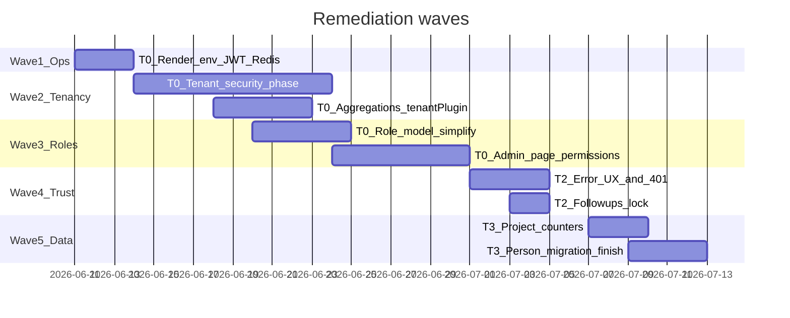

# Taskmaster Full Application Review — Answers & Remediation Backlog

**Created:** 2026-06-10  
**Source:** Jun 2026 full-app audit (47 findings) + project docs (`production-hosts.local.json`, `IMPROVEMENT_ROADMAP.md`, `DATA_MASTER_ARCHITECTURE.md`, `TENANT_SECURITY_PHASE.md`, `UX_ARCHITECTURE_1.0.0_ROADMAP.md`)

This document records **decisions** for each audit question and a **prioritized fix backlog** with effort tiers. Override any answer in the Decision Log when your intent differs.

---

## Decision Log (answers to audit questions)

### 1. Tenancy model

| Question | Answer | Source / rationale |
|----------|--------|-------------------|
| Single-tenant forever or multi-tenant SaaS? | **Multi-tenant-ready in code; single customer (TSC) in production today.** True SaaS + billing is **deferred**. | `docs/IMPROVEMENT_ROADMAP.md` Phase D — "True multi-tenant SaaS + Stripe billing: deferred"; runtime uses `"Default Tenant"` |
| Are aggregation / worker tenant gaps acceptable? | **Acceptable only while TSC is the sole tenant.** Must ship `TENANT_SECURITY_PHASE` before onboarding org #2. | `docs/TENANT_SECURITY_PHASE.md` — planned, not implemented |
| Global unique indexes (email, template name)? | **Block second org today.** Fix when SaaS is un-deferred, not urgent for TSC-only. | Schema audit |
| ~20 models without `tenantPlugin`? | **Incomplete migration**, not intentional global config. Treat as debt before second tenant. | `TENANT_SECURITY_PHASE.md` |
| Workers without tenant context? | **Assume Default Tenant** for now. Fail-fast when `tenantId` missing is planned. | `tenantPlugin.js` validate hook |

**CONFIRMED (2026-06-10):** Second org planned within 6 months → **Tier 1 security items elevated to Tier 0.**

---

### 2. Production hosts

| Question | Answer | Source / rationale |
|----------|--------|-------------------|
| Is `taskmaster-jfw0` in `vercel.json` wrong? | **No — it is the locked production API.** Banned host is `CoreKnot-jfw0.onrender.com` (different service name). | `.cursor/production-hosts.local.json` |
| Single canonical API URL? | `https://YOUR-PRODUCTION-API.onrender.com` | `production-hosts.local.json` → `productionApiUrl` |
| Source of truth for team? | **Gitignored** `.cursor/production-hosts.local.json` only. Committed docs/examples must use placeholders or point here. | `.cursor/rules/production-hosts-locked.mdc` |
| Render Blueprint missing `TRACKING_BASE_URL`, `FRONTEND_URL`, etc.? | **Gap remains.** Values must be set manually in Render Dashboard; Blueprint alone is insufficient. | `render.yaml` vs `production-hosts.local.json` `manualSetupStillRequired` |
| Keep-warm cron? | **N/A on Render free tier** (no Render cron). **Shipped:** GHA `.github/workflows/keep-warm.yml` every 10 min + `docs/EXTERNAL_KEEP_WARM.md` (UptimeRobot/cron-job.org backup). Target: `https://YOUR-PRODUCTION-API.onrender.com/api/health`. | `EXTERNAL_KEEP_WARM.md`, `MEMORY.md` |
| Staging + prod share `taskmaster-redis`? | **Cost shortcut, not intentional cross-env debugging.** Staging jobs can affect prod queues — **fix when staging is used seriously.** | `render.yaml` L37–41, L88–92 |

**[CONFIRM]** Is GitHub Actions enabled on the repo so `keep-warm.yml` runs on schedule? (Render cron keep-warm is N/A on free tier.)

---

### 3. CRM (Leads / Follow-ups)

| Question | Answer | Source / rationale |
|----------|--------|-------------------|
| Why lock only on LeadsPage? | **Incomplete Phase 3B UX work**, not intentional. FollowupsPage should get same lock + heartbeat. | `UX_ARCHITECTURE_1.0.0_ROADMAP.md` Phase 3B |
| Have concurrent edits happened on Followups? | **Unknown — risk is real** (same `FullScreenWorkspace` editor, no lock). | Code: lock only in `LeadsPage.jsx` |
| Why ~2000 lines duplicated? | **Historical split** (leads vs follow-up queue). Target: shared `LeadEditor` + `useLeadEditor` hook. | UX roadmap + audit |
| Follow-up dates as strings? | **Legacy schema.** Causes timezone/sort edge cases. Migrate to `Date` or normalized ISO date + time fields. | `Lead.js` schema |
| CSV import rep mapping broken? | **`importWorker` queries `User.role` which does not exist** — rep assignment on CSV import likely empty/wrong. | `importWorker.js` vs `User.js` |

**CONFIRMED:** CSV lead import **not used** in prod → `importWorker` fix deprioritized to Tier 4.

---

### 4. Person / Contact migration

| Question | Answer | Source / rationale |
|----------|--------|-------------------|
| Target end state? | **`Person` + `PersonIdentifier` + `PersonHubView`**. Deprecate `PersonIndex`. | `DATA_MASTER_ARCHITECTURE.md` |
| Why dual-write today? | **Migration bridge** — `ContactService` still updates `PersonIndex` until hub parity confirmed. | Architecture doc § Migration steps 4–5 |
| What breaks if dual-write stops now? | Data Hub fallback reads `PersonIndex` when hub empty; legacy integrations may show stale counts until backfill complete. | `DATA_MASTER_ARCHITECTURE.md` § Page boundaries |
| User-facing priority? | **Low** — product goal is a **simplified unified Data Hub list** (connections + activity + one table). Parity is an ops/integrity checkpoint, not a UI requirement. | `docs/DATA_HUB_PRODUCT_VISION.md` (Jun 2026) |
| Next step? | When convenient: run `checkPersonHubParity.js` → read-only `PersonIndex` → stop dual-write. **Do not block** Data Hub UI simplification on parity completion. | Migration plan step 4–5 |

**[CONFIRM]** Parity script optional before UI work — run when cutting over dual-write, not as a product gate.

---

### 5. Error UX policy

| Question | Answer | Source / rationale |
|----------|--------|-------------------|
| Preferred pattern when API fails? | **Inline error card + retry** on data pages; **toast** for mutation failures (already via axios interceptor). | Partial pattern in `DataHubPage`, `FinancePage`, `SystemHealthCard`; roadmap item "PageSkeleton on all data pages" |
| Blank page reports? | **Likely** on Dashboard, Leads, Projects, Todo — they check `isLoading` only, not `isError`. | Frontend audit |
| 401 / session expiry? | **Redirect to login with return URL** (not implemented). Auth poll every 5 min is too slow. | `ProtectedRoute.jsx`, `setupAxiosInterceptors.js` |
| Error vs 404 on ProjectDetail? | **Should differ** — show "Could not load" + retry vs "Project not found". | Audit finding |

**Default policy to implement:**

1. Data pages: `PageSkeleton` → `QueryErrorBanner` (message + Retry) → content  
2. Mutations: keep toast dedupe (`toastDedupe.js`)  
3. Global 401: axios interceptor → `forceLogout` + `Navigate` with `state.from`  
4. Login: restore `location.state.from` after success  

---

### 6. Refactor & platform appetite

| Question | Answer | Source / rationale |
|----------|--------|-------------------|
| Mega-files? | **Split incrementally** when touching a file; no dedicated refactor sprint unless blocked. | `IMPROVEMENT_ROADMAP.md` phased approach |
| NestJS strangler? | **Deferred / experimental** — Render deploys Express only; remove Vite `:5001` proxy unless NestJS revived. | `render.yaml`, `vite.config.js` |
| TypeScript? | **Deferred** — JS + Jest/Vitest sufficient for current velocity. | Phase D roadmap |
| Test confidence target? | **Targeted integration + E2E on critical paths** over blanket 60% coverage. | Existing CI: 15% server gate, Playwright smoke |
| First E2E page if one chosen? | **CRM Leads** (highest daily use + lock/423 paths). | Audit + QA lead-lock scenarios |

---

### 7. Security & misc (quick answers)

| # | Topic | Answer |
|---|-------|--------|
| 11 | Open unsubscribe | **Intentional CAN-SPAM simplicity**; add rate limit + audit log; signed links optional later |
| 12 | Weak webhooks in staging | **Risk if staging URL is public** — require secrets in staging too |
| 13 | SES webhooks | **Likely dead code** if Resend is primary — verify and remove or harden |
| 14 | Unguarded routes (`/settings`, `/office-assets`, `/features`, `/workflows`) | **Admin must customize per-user/per-role page access** from admin panel — not hardcoded open/closed. Extend `pagePermissions` + admin UI. |
| 15 | Self-serve department change | **Remove.** Roles simplified to: **admin, artist management, ops, sales, creative**. Admin can add/remove roles and assign page permissions. |
| 16 | DEBUG_BYPASS | **Local dev only** — add Render env guard: refuse start if `DEBUG_BYPASS=true` in production |
| 17 | Admin script runner | **Keep for now** — TSC admins only; document blast radius; consider SSH-only later |
| 35 | Lead delete `bypassTenant` | **Workaround debt** — scope delete to tenant unless super-admin role added |
| 37 | Attendance writes on GET | **Self-healing read** — acceptable if perf OK; batch or move to cron if slow |

---

## Prioritized remediation backlog

Effort: **S** (&lt;4h) · **M** (1–2d) · **L** (3–5d) · **XL** (1+ week)

### Wave 2 shipped (2026-06-10 — partial tenant security)

| ID | Status | Notes |
|----|--------|-------|
| T0-6 | **Partial** | Production fail-fast in `tenantPlugin` validate; `workerTenantContext.js` added; bypass allowlist + full grep audit still open |
| T0-7 | **Partial** | `aggregateWithTenant` in `dashboardController`, `dashboardMetricsController`, `notificationRoutes`; CRM/Data Hub/mail/worker aggregations remain |
| T0-8 | **Partial** | `tenantPlugin` on `TaskAssignment` only; `Attendance`, `MailTemplate`, preferences still open |
| T0-12 | **Done** | `leadWriteService.deleteLead` tenant-scoped (no unconditional `bypassTenant`) |
| T0-14 | **Done** | `isDebugBypassEnabled()` blocks `DEBUG_BYPASS` when `NODE_ENV=production` |

### Tier 0 — Urgent (second org + production ops)

*Elevated after product confirmation: second org within 6 months.*

| ID | Item | Effort | Why now | Status |
|----|------|--------|---------|--------|
| T0-1 | Verify Render Dashboard env: `TRACKING_BASE_URL`, `FRONTEND_URL`, `SERVER_URL` match `production-hosts.local.json`; keep-warm via external ping | S | Email/OAuth break if env missing; API cold start without ping | **Partial (2026-06-10)** — keep-warm **N/A Render cron (free tier)**; **shipped GHA** `keep-warm.yml` + `docs/EXTERNAL_KEEP_WARM.md`; **Dashboard env verify still manual** |
| T0-2 | Add missing env vars to `render.yaml` Blueprint (from `derived.*` in example JSON) | S | Prevents bad redeploy from Blueprint | **Shipped (2026-06-10)** — `TRACKING_BASE_URL`, `SERVER_URL`, `APP_BASE_URL`, `FRONTEND_URL`, `CLIENT_URL` on `CoreKnot-api` |
| T0-3 | Require `JWT_SECRET` in production Zod schema; remove `'fallback_secret'` | S | Security baseline | **Shipped (2026-06-10)** — Zod `superRefine` + `getJwtSecretForHmac()` in mail/unsubscribe paths |
| T0-4 | Split staging Redis — separate Key Value for `coreknot-api-staging` | M | Prevents staging mutating prod jobs | **Shipped (2026-06-10)** — `taskmaster-redis-staging` in Blueprint; **provision instance in Dashboard if not synced** |
| T0-5 | Purge committed docs referencing banned `CoreKnot-jfw0`; point to local hosts file | M | Onboarding confusion | **Shipped (2026-06-10)** — `client/.env.example`, `client/.env.production.example`, `server/.env.example`, `CONTRIBUTING.md`, `DEPLOY_ENV.md`, `MONITORING_ALERTS.md`, `LOCAL_DEV_DATABASE.md` |
| T0-6 | Implement `TENANT_SECURITY_PHASE` — fail fast without `tenantId`, bypass allowlist | L | Second org imminent | |
| T0-7 | Wrap aggregations with `aggregateWithTenant` (dashboard, CRM, notifications) | M | Cross-tenant data leak | |
| T0-8 | Add `tenantPlugin` to `TaskAssignment`, `Attendance`, `MailTemplate`, preferences | M | Incomplete tenancy | |
| T0-9 | Simplify roles: admin, artist management, ops, sales, creative + admin CRUD | L | Product decision | **Done (2026-06-10)** — 5 base roles in `departmentService`; `seedBaseRoles.js`; legacy `operations` → `ops` migration |
| T0-10 | Admin panel: per-role + per-user page permission editor (all routes) | L | Product decision | **Done (2026-06-10)** — `AdminRolesPage` + `DepartmentsPanel`; per-user override in `AdminUsers`; tool pages in registry |
| T0-11 | Remove non-admin `departmentId` self-change; wrap routes in `PageRoute` | M | After T0-9/10 | **Done (2026-06-10)** — profile API 403; Settings read-only role; `/settings`, `/office-assets`, `/features`, `/workflows` gated |
| T0-12 | Remove `bypassTenant` from `leadWriteService.deleteLead` unless super-admin | S | | |
| T0-13 | Require webhook secrets in staging; verify SNS/Resend signatures always | M | | |
| T0-14 | Block `DEBUG_BYPASS` when `NODE_ENV=production` | S | | |

### Tier 1 — Security polish (after Tier 0 core)

| ID | Item | Effort | Notes |
|----|------|--------|-------|
| T1-1 | Rate-limit public unsubscribe + meta deletion status | S | |
| T1-2 | Wrap async routes with `asyncHandler` or domain error wrapper | L | Incremental by domain OK |
| T1-3 | Compound unique indexes `{ tenantId, email }` etc. for second org | M | Schema migration |
| T1-4 | Fix `importWorker` rep mapping (`departmentId` not `role`) | S | **Deferred** — CSV import unused |

### Tier 2 — User-facing reliability

| ID | Item | Effort | Notes |
|----|------|--------|-------|
| T2-1 | Shared `QueryErrorBanner` + apply to Dashboard, Leads, Followups, Projects, Todo | M | **Shipped (2026-06-10)** — `QueryErrorBanner.jsx` + `getQueryErrorMessage`; applied on Dashboard, LeadsPage, FollowupsPage, ProjectsView, TodoPage; DataHubPage migrated to same component |
| T2-2 | Global 401 handler + login return URL (`ProtectedRoute` + `LoginPage`) | S | **Shipped (2026-06-10)** — axios 401 → `triggerUnauthorized` + `registerUnauthorizedHandler` in AuthContext; `ProtectedRoute` passes `state.from`; LoginPage `resolveReturnPath` + sessionStorage fallback |
| T2-3 | ProjectDetail: distinguish load error vs 404 | S | **Shipped (2026-06-10)** — `EmptyState` for 404; `QueryErrorBanner` + retry for load failures |
| T2-4 | Port lead lock + heartbeat to `FollowupsPage.jsx` | M | **Shipped (2026-06-10)** — unlock/heartbeat, 423 toasts, `LeadLockIndicator`, `closeLeadEditor` |
| T2-5 | Extract shared CRM lead editor (`LeadEditorWorkspace.jsx` + hook) | L | Removes ~2000 duplicate lines |
| T2-6 | Fix sidebar prefetch keys to match real React Query keys | S | |
| T2-7 | App shell 404 for unknown routes (not redirect to `/`) | S | **Shipped (2026-06-10)** — authenticated catch-all → `NotFoundPage` in `App.jsx` |
| T2-8 | Replace `window.alert` in `AdminPanel.jsx` with toast/confirm | S | **Shipped (2026-06-10)** — user/team mutation errors use `useToast`; destructive actions keep `useConfirm` |
| T2-9 | **Simplified Data Hub UI** — one table, no side columns; connection + activity columns; analytics strip (Phases A–C) | M | **Phase A shipped (2026-06-10):** full-width table, folder/sort/page-size toolbar, Data ops overflow, collapsible overview analytics. **Open:** Phase B (activity column) + Phase C (analytics strip merge). `docs/DATA_HUB_PRODUCT_VISION.md`. Independent of T3-2 parity. |

### Tier 3 — Data integrity

| ID | Item | Effort | Notes |
|----|------|--------|-------|
| T3-1 | Reconcile `Project` task counters — single source (aggregate or `$inc`, not both) | M | **partial (2026-06-10):** list APIs use live aggregation; `getProjects` + `getWorkspaceByName` return aligned `totalTasks`/`totalTasksCount`. Stored `$inc` counters unchanged — full reconcile script still open. |
| T3-2 | Person migration: parity check → read-only `PersonIndex` → stop dual-write | M | **partial (2026-06-10):** `checkPersonHubParity.js` added; dual-write still on. **Priority lowered (Jun 2026):** ops tool only — not user-facing. Reframed under **simplified Data Hub** (`docs/DATA_HUB_PRODUCT_VISION.md` Phases A–C). Finish migration when ops-ready; UI simplification does not depend on parity. |
| T3-3 | Migrate `Lead.nextFollowupDate` to `Date` + migration script | M | |
| T3-4 | Remove dead `followupCache` hooks in `Lead.js` | S | **done (2026-06-10)** — undefined `followupCache` post-delete hooks removed; cache lives in `LeadService.js`. |
| T3-5 | Archive legacy `Campaign` collection after MailCampaign parity | M | |
| T3-6 | Versioned migration ledger (`migrations/` + applied collection) | L | |
| T3-7 | Batch attendance metric refresh (stop write-on-read per row) | M | If list slow |

### Tier 4 — Maintainability

| ID | Item | Effort | Notes |
|----|------|--------|-------|
| T4-1 | Migrate `AssetsPage`, `ProjectCreate`, `ExlyDataContent` to React Query | L | Highest ROI: ExlyDataContent |
| T4-2 | ~~Add `PageRoute` gates~~ → covered by **T0-10/11** (admin-configurable permissions) | — | |
| T4-3 | Standardize API response envelope (`{ success, data, error }`) | XL | Domain-by-domain |
| T4-4 | Zod validation on CRM EMIs, task PUT/PATCH, contacts | M | Extend B14 pattern |
| T4-5 | Remove NestJS Vite proxy if NestJS abandoned | S | |
| T4-6 | Split mega-files when next bug touches them (Finance, Leads, Exly) | Ongoing | |
| T4-7 | Update email locked docs to match current file paths | S | `EMAIL_ENGINE_LOCKED.md`, cursor rule |

### Tier 5 — Quality gates

| ID | Item | Effort | Notes |
|----|------|--------|-------|
| T5-1 | E2E: CRM Leads load + lock 423 path | M | |
| T5-2 | E2E: Dashboard widgets load (or error banner) | M | |
| T5-3 | Add `eslint-plugin-jsx-a11y` to client | S | |
| T5-4 | Lighthouse CI on 1–2 authenticated routes (mock session) | M | |
| T5-5 | Raise server coverage on tenant + auth paths only (not blanket 60%) | M | |
| T5-6 | `PageSkeleton` on all data pages (roadmap Phase E) | M | |

---

## Suggested execution waves



**Wave 1 (days 1–3):** T0-1–5 — Render env, JWT, staging Redis, doc cleanup  
**Wave 2 (days 4–14):** T0-6–8, T0-12–14 — tenant security before second org  
**Wave 3 (days 15–24):** T0-9–11 — role simplification + admin permission UI  
**Wave 4 (week 4):** T2-* — error UX, Followups lock — **shipped 2026-06-10**  
**Wave 5 (week 5):** T3-* — project counters; T3-2 person migration **deferred** (ops); **Data Hub UI simplification** per `docs/DATA_HUB_PRODUCT_VISION.md` when scheduled  

---

## Corrections to original audit

These items from the Jun 2026 audit were **incorrect or overstated** given locked hosts:

| Audit claim | Reality |
|-------------|---------|
| `vercel.json` proxies to wrong/retired host | Proxies to **`taskmaster-jfw0`** — matches `production-hosts.local.json` |
| `taskmaster-jfw0` is banned | **Banned name is `CoreKnot-jfw0`**, not `taskmaster-jfw0` |
| Keep-warm definitely broken | **Correct URL documented** — verify Dashboard cron env only |

---

## Confirmed by product owner (2026-06-10)

| # | Decision |
|---|----------|
| 1 | **Second org within 6 months** — tenant hardening is urgent (Tier 1 → Tier 0) |
| 2 | **CSV import not used** — `importWorker` fix deferred |
| 3 | **Page access** — admin customizes which users/roles see each page via admin panel (not blanket open/closed) |
| 4 | **Roles** — remove self-serve dept switch; base roles: admin, artist management, ops, sales, creative; admin can add/remove roles + assign permissions |

**Still open:** `KEEP_WARM_URL` on Render cron?

**Data Hub product (Jun 2026):** Simplify list UI per `docs/DATA_HUB_PRODUCT_VISION.md` — one table, connection + activity columns, analytics above table. PersonIndex parity script (`checkPersonHubParity.js`) is an **optional ops tool** before cutting dual-write, not a user-facing requirement.

---

### Wave 3 shipped (2026-06-10 — roles & page permissions)

| ID | What shipped |
|----|----------------|
| T0-9 | Five base org roles (`admin`, `artist-management`, `ops`, `sales`, `creative`) seeded via `departmentService.seedDepartments` + `server/scripts/seedBaseRoles.js`; legacy `operations` slug migrates to `ops` |
| T0-10 | Role page editor on `AdminRolesPage` / `DepartmentsPanel`; per-user `pagePermissions` override on `User` model + `AdminUsers` panel; new page keys: `settings`, `office_assets`, `features`, `workflows` |
| T0-11 | Non-admin `PUT /api/users/profile` rejects `departmentId`; Settings profile shows read-only role; unguarded routes wrapped in `PageRoute` |

**Seed base roles (ops/local):**

```bash
node server/scripts/seedBaseRoles.js
```

**Tests:** `server/tests/wave3Permissions.test.js`

**Wave 3 remains (full, not MVP):** nav/sidebar links for tool pages still need permission-aware hiding; migrate users on legacy custom roles (editor/videographer/cg-artist) if any; server-side API guards for tool-page backends if added later; E2E for permission-denied redirect paths.

---

## Shipped notes (Wave 4 — Tier 2 UX, 2026-06-10)

| ID | What shipped |
|----|----------------|
| T2-1 | `QueryErrorBanner` + `getQueryErrorMessage` on Dashboard, LeadsPage, FollowupsPage, ProjectsView, TodoPage; DataHubPage uses same banner |
| T2-2 | Global 401: `setupAxiosInterceptors` → `triggerUnauthorized`; AuthContext handler clears session; login restores `location.state.from` or `AUTH_RETURN_KEY` |
| T2-3 | `ProjectDetail`: 404 → `EmptyState`; other errors → retry banner |
| T2-4 | `FollowupsPage`: lead lock heartbeat, unlock on close, 423 handling, `LeadLockIndicator` |
| T2-7 | Authenticated unknown routes render `NotFoundPage` (inside `MainLayout`) |
| T2-8 | `AdminPanel` mutation failures use toast instead of `window.alert` |

## Shipped notes (Wave 5 — Tier 3 data, 2026-06-10)

| ID | What shipped |
|----|----------------|
| T3-4 | Removed dead `followupCache` mongoose hooks from `Lead.js` (referenced undefined module; follow-up cache remains in `leadService.js`). |
| T3-1 (partial) | `projectController.getProjects` and `getWorkspaceByName` now attach task counts from live Task aggregation. API returns consistent `totalTasks`, `completedTasks`, `totalTasksCount`, `completedTasksCount`, and `progress`. Fixed `getWorkspaceByName` selecting nonexistent `totalTasks` schema field. |
| T3-2 (partial) | Added `server/scripts/checkPersonHubParity.js` — optional ops parity check before read-only PersonIndex / stopping dual-write. **Not** a product gate; see `docs/DATA_HUB_PRODUCT_VISION.md`. ContactService dual-write **not** disabled yet. |

**Optional parity check (ops only):**

```bash
node server/scripts/checkPersonHubParity.js              # local
node server/scripts/checkPersonHubParity.js --prod       # production
node server/scripts/checkPersonHubParity.js --verbose   # + folder counts
```

### New backlog items from confirmations

| ID | Item | Effort |
|----|------|--------|
| T0-6 | Implement `TENANT_SECURITY_PHASE` (fail-fast, bypass allowlist, aggregation tenant scope) | L |
| T0-7 | Simplify role model: 5 base roles + admin CRUD for roles | L |
| T0-8 | Admin panel: per-role + per-user page permission editor (all routes including `/office-assets`, `/features`, `/workflows`, `/settings`) | L |
| T0-9 | Remove non-admin `departmentId` self-change from profile API | S |
| T0-10 | Wrap unguarded `App.jsx` routes in `PageRoute` once permission matrix exists | M |

---

## How this ties to existing roadmap

- Shipped items stay in `docs/IMPROVEMENT_ROADMAP.md` Phase A–B  
- **This backlog = Phase F (Jun 2026 full review)** — new IDs `T0-*` through `T5-*`  
- When an item ships: mark done here + move summary line to IMPROVEMENT_ROADMAP Phase A  
