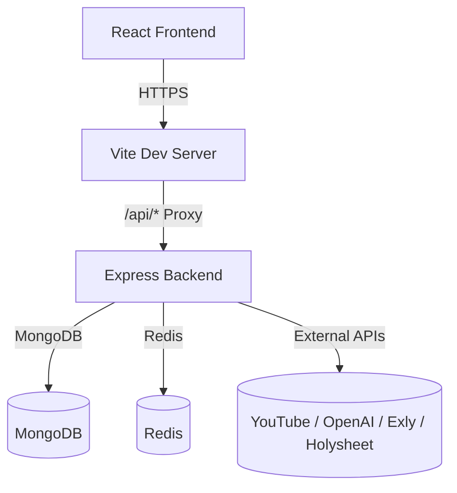
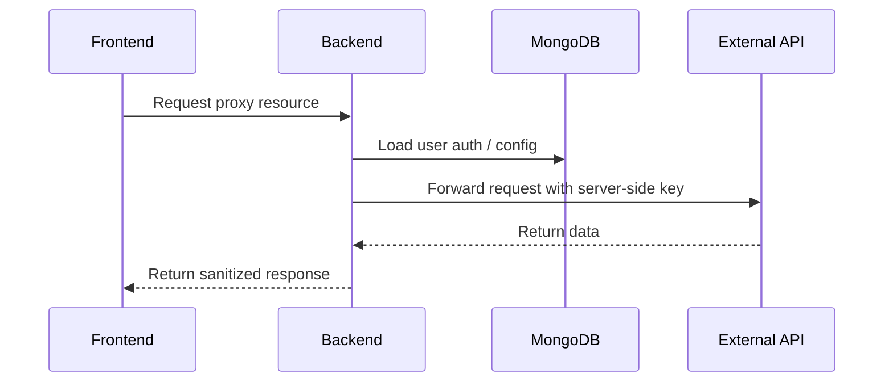
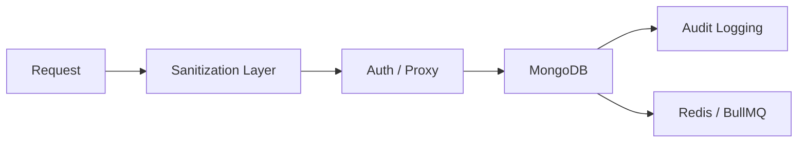

# Taskmaster: Unified Project Memory & Architecture

This document serves as the single source of truth for the Taskmaster project. It synthesizes infrastructure setup, backend logic, frontend design rules, and the multi-platform analytics engine into an AI-optimized format.

---

## 1. System Architecture & Local Runtime

Taskmaster is designed to run locally as a frontend/backed pair with a protected proxy interface for third-party APIs.

### Key Runtime Rules:
* **Local frontend proxy**: `client/vite.config.js` proxies `/api` to `http://localhost:5000`.
* **Backend auth**: All proxy calls require valid auth via `Authorization: Bearer <token>`.
* **Local bypass**: `DEBUG_BYPASS=true` and `Authorization: Bearer bypass_token` enables localhost API testing without a real login.
* **Build & static assets**: In production, `server/` serves `client/dist`.

---

## 2. Analytics & Proxy Integration

The backend integrates with external analytics services, but keeps keys safe on the server.

### Proxy rules:
* **Auth required**: `protect` middleware guards `/api/proxy/*`.
* **Allowed services**: `youtube`, `openai`, `exly`, `holysheet`.
* **HTTP verbs**: GET, POST, PATCH, PUT, DELETE are allowed as configured.
* **Header cleanup**: `host`, `cookie`, `authorization`, `content-length`, `origin`, and `referer` are stripped before forwarding.
* **Server key injection**: Keys are added by auth type: path, header, bearer, or query.

---

## 3. Backend Logic & Database Rules

* **Sanitization**: Trim whitespace, force lowercase emails, strip HTML, and normalize phone numbers using Mongoose hooks.
* **Deduplication**: Compound unique keys and upsert behavior prevent duplicate CRM records.
* **Query performance**: Read routes use `.lean()` and aggregation pipelines rather than repeated `countDocuments()`.
* **Audit tracing**: Mutation events are recorded into audit logs for CRM changes and user actions.

---

## 4. Frontend & UX Design Rules

* **4px hard grid** for spacing and layout.
* **High density** with compact cards, lists, and tables.
* **No mock states**: every page loads real server data.
* **Optimistic updates** with `react-query` to reduce loading states.
* **Semantic color palette**:
  * Success: `#E6F4EA`
  * Warning: `#FEF7E0`
  * Danger: `#FCE8E6`
  * Info: `#F1F3F4`
* **Dark mode**: low-glow UI surfaces, minimal shadows.
* **Row-first actions**: tables prefer row-click behavior over explicit action buttons.

---

## 5. Current Verified Local Behavior

- The backend is confirmed working on `http://localhost:5000`.
- The proxy server responds correctly when authenticated.
- Local bypass mode with `DEBUG_BYPASS=true` and `Authorization: Bearer bypass_token` works for proxy testing.
- The client uses `client/vite.config.js` to forward `/api` traffic to the backend.

## 6. Setup Checklist

* Ensure `server/.env` is populated with all required keys.
* Ensure `client/.env` has `VITE_API_URL` if explicit backend configuration is needed.
* Start MongoDB before launching the backend.
* Start Redis if you require queue and cache features.
* Start backend first, then frontend.
* Use the bypass token for direct proxy tests if real auth is not yet available.
