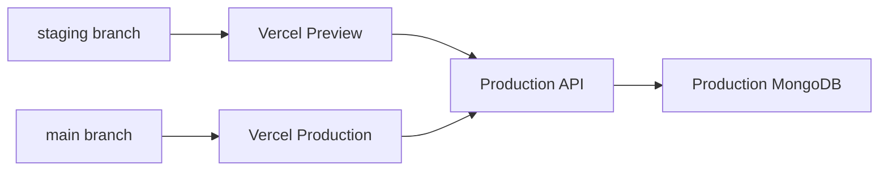

# Staging environment (Vercel branch → production API)

**Model:** `staging` branch deploys to **Vercel Preview**. Frontend hits **production Render API** (see `.cursor/production-hosts.local.json` → `productionApiUrl`) and **production MongoDB** — no separate Render staging stack.

## Vercel Preview env

```env
VITE_API_URL=<productionApiUrl from production-hosts.local.json>
RENDER_API_PROXY_URL=<same>
```

Push via: `npm run preview:vercel-env:push`

## Render production API

Ensure on **Taskmaster** / production API service:

| Variable | Value |
|----------|-------|
| `CORS_ALLOW_VERCEL_PREVIEWS` | `true` |
| `MONGODB_URI_PROD` | Production Atlas |

## Flow



## Verify

1. Push to `staging` → Vercel preview URL loads
2. Network tab → API calls hit `productionApiUrl`
3. `npm run staging:readiness`

## Retired

Separate Render services `coreknot-api-staging`, `coreknot-nest-staging`, `taskmaster-redis-staging` removed. Cleanup: `node scripts/delete-staging-render-services.mjs --apply`
