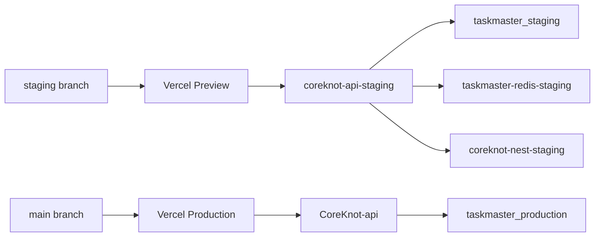

# Staging environment (Vercel branch → staging API)

**Model:** `staging` branch deploys to **Vercel Preview**. Frontend hits **staging Render API** (`coreknot-api-staging`) and **empty `taskmaster_staging` MongoDB** — separate from production.

## Topology

| Component | Staging |
|-----------|---------|
| API | `coreknot-api-staging` (Render, `staging` branch) |
| Nest | `coreknot-nest-staging` |
| Redis | `taskmaster-redis-staging` |
| DB | Atlas `taskmaster_staging` (empty — no prod clone) |
| Frontend | Vercel Preview (`staging` branch) |

## One-time setup

1. Create empty `taskmaster_staging` database in Atlas.
2. Add to gitignored `server/.env.render`:
   ```env
   MONGODB_URI_STAGING=mongodb+srv://.../taskmaster_staging
   ```
3. Provision Render services:
   ```bash
   npm run staging:create
   node scripts/restore-staging-render-env.mjs
   npm run staging:deploy -- --wait
   ```
4. Bootstrap DB:
   ```bash
   npm run migrate:up --prefix server
   node scripts/seed-staging-minimal.mjs   # optional admin + tenant
   ```
5. Wire Vercel Preview:
   ```bash
   npm run preview:vercel-env:push
   ```

## Vercel Preview env

```env
VITE_API_URL=https://coreknot-api-staging.onrender.com
RENDER_API_PROXY_URL=https://coreknot-api-staging.onrender.com
```

Update `.cursor/production-hosts.local.json` → `stagingApiUrl`, `stagingNestApiUrl` after first deploy.

## Render staging API (required)

| Variable | Value |
|----------|-------|
| `COREKNOT_DEPLOY_TIER` | `staging` |
| `MONGODB_URI` | `.../taskmaster_staging` |
| `REDIS_URL` | `taskmaster-redis-staging` internal URL |
| `CORS_ALLOW_VERCEL_PREVIEWS` | `true` |
| `NEST_SYNC_URL` | `https://coreknot-nest-staging.onrender.com` |

**Do not** set `MONGODB_URI_PROD` on staging.

## Flow



## Verify

1. `npm run staging:readiness`
2. Push to `staging` → Vercel preview URL loads
3. Network tab → API calls hit `coreknot-api-staging.onrender.com` (not production)
4. `GET /api/health` → `deployTier: staging`

## Notes

- Staging crons are **not** provisioned (avoids backup/reminder emails against empty DB).
- Free tier cold starts — first request after idle may be slow.
- Blueprint: `render.yaml` staging block documents the mirror.
